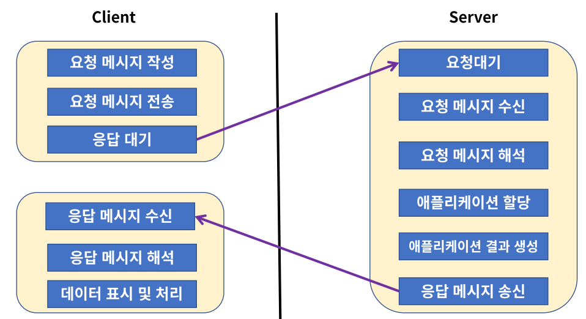
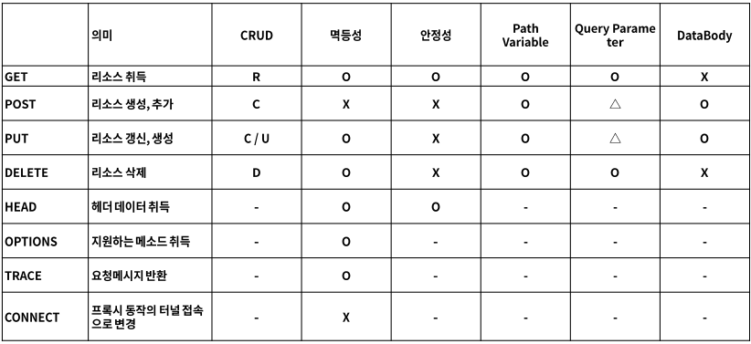

#### **Web이란?**

(World Wide Web, WWW, W3)는 인터넷에 연결된 컴퓨터를 통해 사람들이 정보를 공유할 수 있는 전 세계적인 정보 공간을 말한다.

**용도**

**Web Site** - google, naver, facebook 등 HTML로 구성된 여러 사이트들

**API (Application Programming Interface)** - Web Service, Kakao, Google, Naver Open API 등

**User Interface** - Chrome, Safari, Explorer, IP TV 등

**HTTP** (Hypertext Transfer Protocol)

- 애플리케이션 컨트롤 (GET, POST, PUT, DELETE, OPTION, HEAD, TRACE, CONNECT)

**URI** (Uniform Resource Identifier)

- 리소스 식별자 (특정 사이트, 쇼핑 목록, 동영상 목록 등 모든 정보에 접근할 수 있는 정보)

**HTML** (Hyper Text Markup Language)

- 하이퍼미디어 포맷 (xml을 바탕으로한 범용 문서 포맷, 사용자가 알아보기 쉬운 형태로 표현해줌)

---

#### **REST**

REST (Representational State Transfer : 자원의 상태 전달) - 네트워크 아키텍처

1. **Client, Server** : 클라이언트와 서버가 서로 독립적으로 분리 되어 있어야 한다.
2. **Stateless** : 요청에 대해서 클라이언트의 상태를 서버에 저장하지 않는다.
3. **Cache** : 클라이언트는 서버의 응답을 Cache(임시 저장) 할 수 있어야 한다.
4. **계층화 (Layered System)** : 서버와 클라이언트 사이에, 방화벽, 게이트웨이, Proxy 등 다양한 계층 형태로 구성이 가능해야 하며, 이를 확장할 수 있어야 한다.
5. **인터페이스 일관성** : 인터페이스의 일관성을 지키고, 아키텍처를 단순화시켜 작은 단위로 분리하여, 클라이언트, 서버가 독립적으로 개선될 수 있어야 한다.
6. **Code on Demand (Optional)** : 자바 애플릿, 자바스크립트, 플래시 등 특정한 기능을 서버로부터 클라이언트가 전달 받아 코드를 실행할 수 있어야 한다.

### 인터페이스 일관성

1. **자원의 식별**

웹 기반의 REST에서는 리소스에 접근할 때 URI를 사용한다.

1. **메시지를 통한 리소스 조작**

데이터를 전달하는 방식에는 HTML, XML, JSON, TEXT등이 존재하지만 리소스 조작을 위해 데이터 전체를 전달 하지 않고, 이를 메시지로 전달한다.

1. **자기 서술적 메시지**

요청하는 데이터가 어떻게 처리 되어져야 하는지 충분한 데이터를 포함할 수 있어야 한다.

1. **Application 상태에 대한 엔진으로써 하이퍼미디어**

REST API를 개발할 때 단순히 Client 요청에 대한 데이터만 응답해 주는 것이 아닌 관련된 리소스에 대한 Link 정보까지 같이 포함되어야 한다. (REST FUL API)

### URI 설계 패턴

**URI (Uniform Resource Identifier)**

- 인터넷에서 특정 자원을 나타내는 주소 값. 해당 값은 유일하다. (응답은 달라질 수 있다)

**URL (Uniform Resource Locator)**

- 인터넷 상에서 자원, 특정 파일이 어디에 위치하는지 식별 하는 주소

> URL은 URI의 하위 개념이다.

### HTTP Protocol

HTTP (Hyper Text Transfer Protocol)로 RFC 2616에서 규정된 Web에서 데이터를 주고 받는 프로토콜 이다.

- html, xml, json, image, pdf 등 다양한 형태로 전송할 수 있다.
- TCP를 기반으로 한 REST의 특징을 모두 구현하고 있는 Web기반의 프로토콜이다.
- **HTTP는 메시지를 주고(Request) 받는(Response) 형태의 통신 방법이다.**

- **HTTP의 요청을 특정하는 Method는 8가지가 있다.**

- **응답의 상태를 나타내는 코드** : 1xx(정보), 2xx(성공), 3xx(리다이렉션), 4xx(클라이언트 오류), 5xx(서버 오류)로 분류된다.

