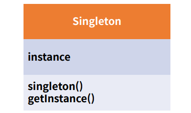
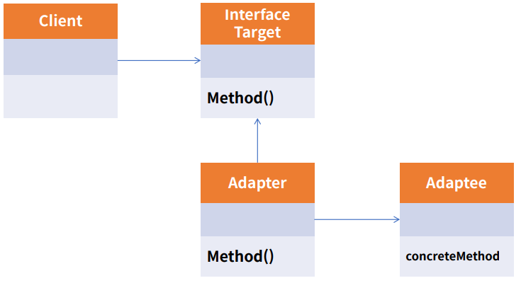
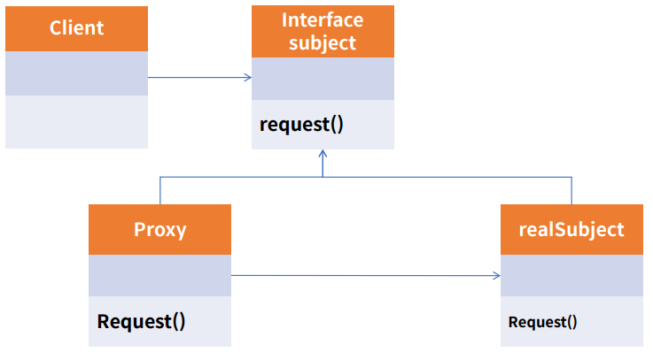
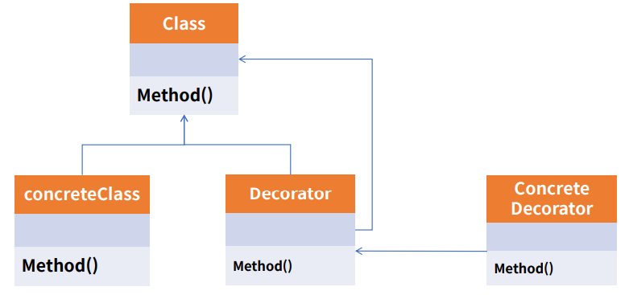
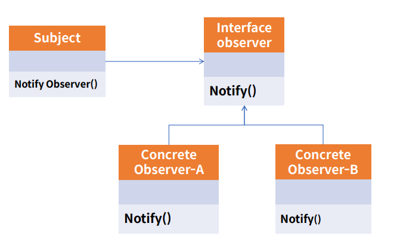
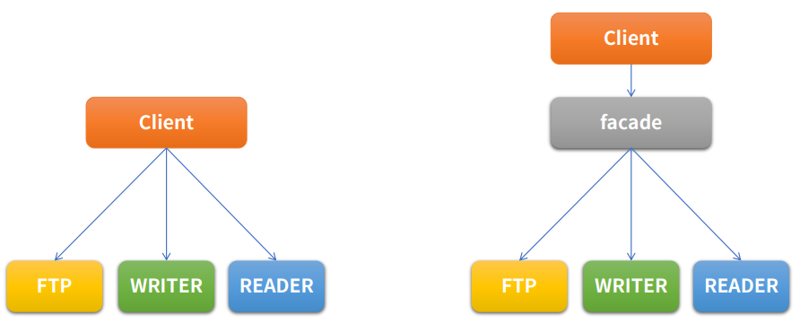
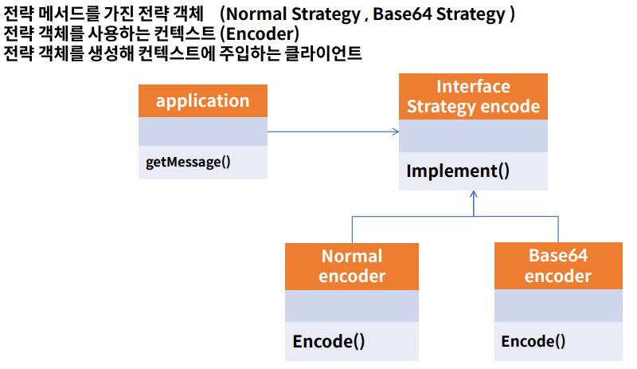

#### **디자인 패턴이란,,?**

자주 사용하는 설계 패턴을 정형화 해서 이를 유형별로 가장 최적의 방법으로 개발 할 수 있도록 정해둔 설계 알고리즘과 유사하다.

- **Gof (Gang of Four) 디자인 패턴** : 객체지향 개념에 따른 설계 중 재사용할 경우 유용한 설계를 23개의 디자인 패턴으로 정리 해둔 것이다.

### 장점

- 개발자(설계자) 간의 원활한 소통
- 소프트웨어 구조 파악 용이
- 재사용을 통한 개발 시간 단축
- 설계 변경 요청에 대한 유연한 대처

### 단점

- 객체 지향 설계 / 구현
- 초기 투자 비용 부담

### [생성 패턴]

객체를 생성하는 것과 관련된 패턴으로, 객체의 생성과 변경이 전체 시스템에 미치는 영향을 최소화 하고, 코드의 유연성을 높여 준다.

- Factory Method
- **Singleton**
- Prototype
- **Builder**
- Abstract Factory

### [구조 패턴]

프로그램 내의 자료구조나 인터페이스 구조 등 프로그램 구조를 설계하는데 활용 될 수 있는 패턴으로 클래스, 객체들의 구성을 통해서 더 큰 구조를 만들 수 있게 해준다.

- **Adapter**
- Composite
- Bridge
- **Decorator**
- **Facade**
- Flyweight
- **Proxy**

### [행위 패턴]

반복적으로 사용되는 객체들의 상호작용을 패턴화 한 것으로, 클래스나 객체들이 상호작용하는 방법과 책임을 분산하는 방법을 제공한다. (행위 관련 패턴을 사용한 독립적인 일 처리에 사용)

- Template Method
- Interpreter
- Iterator
- **Observer**
- **Strategy**
- Visitor
- Chain of responsibility
- Command
- Mediator
- State
- Memento

## Singleton Pattern

singleton 패턴은 어떠한 클래스(객체)가 유일하게 1개만 존재 할 때 사용한다.

## Adapter Pattern

Adapter 패턴은 호환성이 없는 기존 클래스의 인터페이스를 변환하여 재사용 할 수 있도록 한다.

SOLID의 개방 폐쇄 원칙(OCP)를 따른다.

## Proxy Pattern

Proxy는 대리인 이라는 뜻으로써, 무언가를 대신해서 처리하는 것이다.

Proxy Class를 통해서 대신 전달 하는 형태로 설계되며, 실제 Client는 Proxy로 부터 결과를 받는다.

SOLID의 개방 폐쇄 원칙(OCP) 과 의존 역전 원칙(DIP)를 따른다.

## Decorator Pattern

Decorator 패턴은 기존 뼈대 (클래스)는 유지하되, 이후 필요한 형태로 꾸밀 때 사용한다.

확장이 필요한 경우 상속의 대안으로도 활용 한다.

SOLID의 개방 폐쇄 원칙(OCP) 과 의존 역전 원칙(DIP)를 따른다.

## Observer Pattern

Observer(관찰자) 패턴은 변화가 일어 났을 때, 미리 등록된 다른 클래스에 통보해주는 패턴을 구현한 것이다.

Event Listener에서 해당 패턴을 사용한다.

## Facade Pattern

Facade는 건물의 앞쪽 정면 이라는 뜻이다.

여러 개의 객체와 실제 사용하는 서브 객체의 사이에 복잡한 의존관계가 있을 때, 중간에 facade라는 객체를 두고, 여기서 제공하는 interface만을 활용하여 기능을 사용하는 방식이다.

## Strategy Pattern

Strategy(전략) 패턴은 유사한 행위들을 캡슐화 하여, 객체의 행위를 바꾸고 싶은 경우 직접 변경하는 것이 아닌 전략만 변경 하여, 유연하게 확장하는 패턴이다.

SOLID의 개방 폐쇄 원칙(OCP) 과 의존 역전 원칙(DIP)를 따른다.

