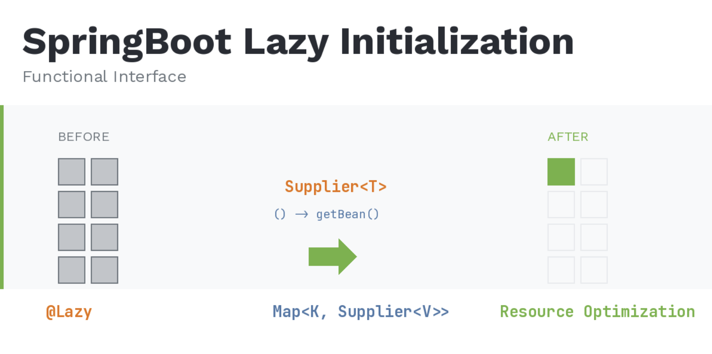
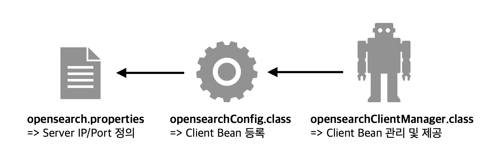

> Batch 애플리케이션에서 OpenSearch 클라이언트들의 불필요한 초기화를 방지하기 위해 Supplier를 활용한 Lazy 초기화 전략 적용 사례.



## 목차

> **1. 배경 지식**
> 1.1 Lazy 초기화란?
> 1.2 Functional Interface와 Supplier
> **2. 문제 상황**
> 2.1 기존 환경
> 2.2 문제점 인식
> 2.3 @Lazy 적용 시도
> **3. 해결 방법: Supplier를 활용한 Lazy 초기화**
> 3.1 핵심 아이디어
> 3.2 개선된 코드
> 3.3 동작 흐름 비교
> **4. 실제 사용 예시**
> **5. 추가 개선: 캐싱을 통한 중복 초기화 방지**
> **6. 정리**

## 1. 배경 지식

### **Lazy 초기화란?**

**Lazy 초기화(지연 초기화)**는 객체의 생성을 실제로 필요한 시점까지 미루는 기법이다. Spring에서는 기본적으로 애플리케이션 컨텍스트가 로드될 때 모든 싱글톤 빈을 즉시(Eager) 초기화한다.

```java
// Eager 초기화 - 애플리케이션 시작 시 즉시 생성
@Bean
public RestHighLevelClient opensearchClient() {
    return new RestHighLevelClient(...); // 시작과 동시에 연결 시도
}

// Lazy 초기화 - 실제 사용 시점에 생성
@Lazy
@Bean
public RestHighLevelClient opensearchClient() {
    return new RestHighLevelClient(...); // 처음 주입받을 때 연결
}
```

**✅ Lazy 초기화의 장점:**

- 애플리케이션 시작 시간 단축
- 사용하지 않는 리소스의 불필요한 할당 방지
- 메모리 및 네트워크 연결 등 리소스 절약

---

### **Functional Interface와 Supplier**

**Functional Interface**는 단 하나의 추상 메서드만 가지는 인터페이스로, 람다 표현식의 타입으로 사용된다. Java 8에서 도입된 java.util.function 패키지에는 다양한 Functional Interface가 제공된다.

```java
@FunctionalInterface
public interface Supplier<T> {
    T get();  // 매개변수 없이 값을 반환
}
```

`Supplier<T>`는 매개변수 없이 값을 제공(supply)하는 역할을 한다.

> **"지금 당장 값을 주는 게 아니라, 나중에 get()을 호출하면 그때 값을 만들어서 줄게"** 라는 개념이다.

```
// 즉시 실행 - 선언 시점에 계산
String value = expensiveOperation();

// 지연 실행 - get() 호출 시점에 계산
Supplier<String> lazyValue = () -> expensiveOperation();
String result = lazyValue.get(); // 이 시점에 실행
```

---

## 2. 문제 상황

### **기존 환경**

현재 운영 중인 Batch 애플리케이션은 여러 OpenSearch 서버와 통신해야 하기 때문에 각 서버별로 RestHighLevelClient 빈을 등록하여 사용하고 있다.



> OpensearchConfig : **클라이언트 Bean 등록**

```java
@Configuration
public class OpenSearchConfig {

    @Bean("clientA")
    public RestHighLevelClient clientA() {
        return createClient("opensearch-a.example.com", 9200);
    }

    @Bean("clientB")
    public RestHighLevelClient clientB() {
        return createClient("opensearch-b.example.com", 9200);
    }
    // ... clientC ~ clientH까지 총 8개의 클라이언트

    private RestHighLevelClient createClient(String host, int port) {
        RestClientBuilder builder = RestClient.builder(
            new HttpHost(host, port, "https")
        );
        // 인증, 타임아웃 등 설정...
        return new RestHighLevelClient(builder);
    }
}
```

> OpenSearchClientManager : **클라이언트들을 Map으로 묶어 관리하는 Bean**

```java
@Component
public class OpenSearchClientManager {

    private final Map<String, RestHighLevelClient> clients;

    public OpenSearchClientManager(ApplicationContext ctx) {
        this.clients = new HashMap<>();
        this.clients.put("A", ctx.getBean("clientA", RestHighLevelClient.class));
        this.clients.put("B", ctx.getBean("clientB", RestHighLevelClient.class));
        // ... 8개 모두 등록
    }

    public RestHighLevelClient getClient(String key) {
        return clients.get(key);
    }
}
```

---

### **문제점 인식**

Batch 애플리케이션의 특성상, 스케줄러가 특정 작업을 실행하고 종료된다. 하지만 <u>모든 스케줄이 8개의 클라이언트를 전부 사용하는 것이 아니다.</u>

| **스케줄** | **사용 클라이언트** |
| --- | --- |
| **일별 집계** | A, B |
| **로그 정리** | C |
| **리포트 생성** | A, D, E |
| **헬스체크** | 없음 |

**❌ 문제:** 헬스체크 스케줄처럼 OpenSearch 클라이언트가 전혀 필요 없는 작업에서도 애플리케이션 시작 시 8개의 클라이언트가 모두 초기화되고 있었다. 이는 불필요한 네트워크 연결과 리소스 낭비로 이어진다.

---

### **@Lazy 적용 시도**

지연 초기화를 위해 Spring의 @Lazy 어노테이션을 적용해보았지만 여전히 모든 클라이언트가 Spring 시작 시 초기화되었다..

```java
@Lazy
@Bean("clientA")
public RestHighLevelClient clientA() {
    log.info("clientA 초기화");
    return createClient("opensearch-a.example.com", 9200);
}
```

<u>원인은 OpenSearchClientManager에 있었다.</u> 이 빈이 초기화될 때 생성자에서 ctx.getBean()을 호출하면서 @Lazy로 등록된 빈들이 강제로 초기화되어 버린 것이다.

```
// OpenSearchClientManager 생성자가 호출되는 순간
this.clients.put("A", ctx.getBean("clientA", ...)); // clientA @Lazy 무시, 즉시 초기화
this.clients.put("B", ctx.getBean("clientB", ...)); // clientB @Lazy 무시, 즉시 초기화
// ... 모든 클라이언트가 이 시점에 초기화됨
```

> ⚠️ **@Lazy는 "주입받는 시점까지" 초기화를 미루는 것인데, getBean()을 호출하는 시점이 "주입받는 시점"이 되어버렸다.**

---

## 3. 해결 방법: Supplier를 활용한 Lazy 초기화

### **핵심 아이디어**

Map에 RestHighLevelClient를 직접 저장하는 대신, **`Supplier<RestHighLevelClient>`**를 저장한다. 실제 클라이언트가 필요한 시점에 get()을 호출하면 그때 빈이 초기화된다.

```
기존: Map<String, RestHighLevelClient>
     → Manager 초기화 시 모든 Client 초기화

변경: Map<String, Supplier<RestHighLevelClient>>
     → Manager 초기화 시에는 Supplier(람다)만 등록
     → 실제 get() 호출 시 해당 Client만 초기화
```

---

### **개선된 코드**

> OpenSearchConfig

```java
@Configuration
public class OpenSearchClientConfig {

    @Lazy
    @Bean("clientA")
    public RestHighLevelClient clientA() { // client A 초기화
        return createClient("opensearch-a.example.com", 9200);
    }

    @Lazy
    @Bean("clientB")
    public RestHighLevelClient clientB() { // client B 초기화
        return createClient("opensearch-b.example.com", 9200);
    }
    // ... 나머지 클라이언트들도 @Lazy 적용

    private RestHighLevelClient createClient(String host, int port) {
        RestClientBuilder builder = RestClient.builder(
            new HttpHost(host, port, "https")
        );
        // ...
        return new RestHighLevelClient(builder);
    }
}
```

> OpenSearchClientManager

```java
@Component
public class OpenSearchClientManager {

    private final Map<String, Supplier<RestHighLevelClient>> clientSuppliers;

    public OpenSearchClientManager(ApplicationContext ctx) { // 생성자 초기화
        this.clientSuppliers = new HashMap<>();
        
        // Supplier로 감싸서 등록 - 이 시점에는 클라이언트가 생성되지 않음
        this.clientSuppliers.put("A", () -> ctx.getBean("clientA", RestHighLevelClient.class));
        this.clientSuppliers.put("B", () -> ctx.getBean("clientB", RestHighLevelClient.class));
        // C, D, E, F...
    }

    /**
     * 클라이언트 조회 - 이 시점에 해당 클라이언트가 초기화됨
     */
    public RestHighLevelClient getClient(String key) {
        Supplier<RestHighLevelClient> supplier = clientSuppliers.get(key);
        if (supplier == null) {
            throw new IllegalArgumentException("Unknown client key: " + key);
        }
        return supplier.get();  // 이 순간 @Lazy 빈이 초기화됨
    }
}
```

---

### **동작 흐름 비교**

#### ❌ 기존 방식

```
애플리케이션 시작
    ↓
OpenSearchClientManager 빈 생성
    ↓
ctx.getBean("clientA") → clientA 초기화
ctx.getBean("clientB") → clientB 초기화
... (8개 모두 초기화)
    ↓
스케줄 실행 (clientA만 필요)
    ↓
종료 (7개 클라이언트는 사용되지 않음)
```

#### ✅ Supplier 적용 후

```
애플리케이션 시작
    ↓
OpenSearchClientManager 빈 생성
    ↓
Supplier 람다만 Map에 등록 (클라이언트 초기화 없음)
    ↓
스케줄 실행 (clientA만 필요)
    ↓
getClient("A") 호출 → supplier.get() → clientA 초기화
    ↓
종료 (clientA만 초기화됨, 나머지 7개는 초기화되지 않음)
```

---

## 4. 실제 사용 예시

### **Batch Job에서의 활용**

```java
@Component
@RequiredArgsConstructor
public class DailyAggregationJob {

    private final OpenSearchClientManager clientManager;

    @Scheduled(cron = "0 0 2 * * *")
    public void execute() {
        // 이 시점에 clientA가 초기화됨
        RestHighLevelClient clientA = clientManager.getClient("A");
        
        // clientA를 사용한 조회.. 
    }
}
```

### **로그 확인**

```
2024-01-15 02:00:00.001 INFO  - 일별 집계 작업 시작
2024-01-15 02:00:00.015 INFO  - ========== clientA 초기화 ==========
2024-01-15 02:00:00.234 INFO  - 집계 쿼리 실행 완료
2024-01-15 02:00:00.250 INFO  - 일별 집계 작업 완료
```

**clientB ~ clientH는 초기화 로그가 출력되지 않는다. 실제로 필요한 clientA만 초기화된 것이다.**

---

## 5. 추가 개선: 캐싱을 통한 중복 초기화 방지

현재 구조에서 getClient("A")를 여러 번 호출하면 매번 ctx.getBean()이 호출된다. Spring의 싱글톤 빈이므로 새 인스턴스가 생성되지는 않지만, 불필요한 빈 조회가 발생한다.

이를 개선하기 위해 **한 번 초기화된 클라이언트를 캐싱**할 수 있다.

```java
@Component
public class OpenSearchClientManager {

    private final Map<String, Supplier<RestHighLevelClient>> clientSuppliers;
    private final Map<String, RestHighLevelClient> clientCache;

    public OpenSearchClientManager(ApplicationContext ctx) {
        this.clientSuppliers = new HashMap<>();
        this.clientCache = new ConcurrentHashMap<>();
        
        clientSuppliers.put("A", () -> ctx.getBean("clientA", RestHighLevelClient.class));
        clientSuppliers.put("B", () -> ctx.getBean("clientB", RestHighLevelClient.class));
        // ... other client
    }

    public RestHighLevelClient getClient(String key) {
        
        // 캐시에 있으면 반환, 없으면 Supplier에서 가져와서 캐싱
        return clientCache.computeIfAbsent(key, k -> {
            Supplier<RestHighLevelClient> supplier = clientSuppliers.get(k);
            return supplier.get();
        });
    }
}
```

---

## 6. 정리

### **핵심 포인트**

| **구분** | **설명** |
| --- | --- |
| **문제** | @Lazy 빈을 Map으로 관리할 때 getBean() 호출로 인한 즉시 초기화 |
| **해결** | `Supplier<T>`로 감싸서 실제 사용 시점까지 초기화 지연 |
| **효과** | 필요한 클라이언트만 초기화하여 리소스 절약 |

### **✅ 언제 이 패턴을 사용할까?**

- 여러 외부 시스템 연결을 관리하는 경우 (DB, 메시지큐, 검색엔진 등)
- Batch/스케줄러처럼 실행마다 사용하는 리소스가 다른 경우
- 초기화 비용이 큰 객체를 조건부로 사용하는 경우
- @Lazy만으로는 해결되지 않는 복잡한 빈 관계가 있는 경우

### **⚠️ 주의사항**

- Supplier.get() 호출 시 예외가 발생할 수 있으므로 적절한 예외 처리 필요
- 멀티스레드 환경에서는 ConcurrentHashMap과 computeIfAbsent() 활용
- 클라이언트 종료(close) 처리도 함께 고려해야 함

## 마무리

Spring의 @Lazy가 만능이 아니라는 것을 실무에서 경험하였다. 빈을 직접 조회하는 구조에서는 @Lazy가 무력화될 수 있고, 이때 Functional Interface인 Supplier를 활용하면 진정한 의미의 Lazy 초기화를 구현할 수 있다.

이는 단순해 보이는 해결책이지만, **"값을 직접 저장하는 대신 값을 제공하는 함수를 저장한다"**는 함수형 프로그래밍의 주요 사용 사례이다.
