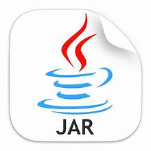
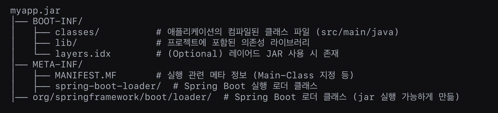

> 애플리케이션 설치(배포) 환경에서 jar 파일의 코드를 확인, 수정하는 방법



현재 배포되어 있는 애플리케이션의 코드를 확인해야 하거나 고객사 등 외부 환경에서 간단한 로직을 빠르게 수정해야 하는 경우가 종종 있다.

> Linux 기반으로 작성되었다.

### 압축 풀어서 내용 확인하기

우선 SpringBoot의 jar 파일 구조는 크게 BOOT-INF와 META-INF로 나뉘는데 **META-INF**는 jar 파일을 실행하는데 필요한 메타 데이터가 들어있고, **BOOT-INF**에는 애플리케이션 코드와 의존성(라이브러리)이 있으므로 보통 BOOT-INF를 보면 된다.



압축 풀기

```
jar xf myapp.jar
```

파일 구조 확인

```
jar tf myapp.jar
```

클래스 내용 확인 (바이트코드 역어셈블)

```
javap -c BOOT-INF/classes/com/example/MyClass.class
```

- `javap`은 JDK에 기본 포함된 도구지만, 결과물이 **바이트코드 명령어**라서 로직을 눈으로 확인하는 용도로만 쓰기 좋다.
- 실제로 로직을 고쳐서 다시 컴파일하고 싶다면 `javap`으로는 안 되고, CFR·Vineflower 같은 **디컴파일러**로 `.class`를 사람이 읽고 고칠 수 있는 `.java` 소스로 복원해야 한다.

```
# CFR로 실제 편집 가능한 java 소스 복원
java -jar cfr.jar BOOT-INF/classes/com/example/MyClass.class > MyClass.java

# 수정 후 다시 컴파일
javac -d BOOT-INF/classes MyClass.java
```

### 다시 jar 패키징하기

압축을 풀었던 디렉터리로 이동해서, 원래 있던 MANIFEST.MF를 그대로 지정해 다시 묶어주면 된다.

```
cd myapp-extracted
jar cfm ../myapp-modified.jar META-INF/MANIFEST.MF .
```

MANIFEST.MF에는 Spring Boot 실행에 필요한 `Main-Class`, `Start-Class` 정보가 들어있기 때문에, 이 파일을 빠뜨리면 재패키징한 jar이 정상적으로 실행되지 않는다.

### Spring Boot JAR 실행 원리

META-INF/MANIFEST.MF 파일에서 Main-Class는 org.springframework.boot.loader.JarLauncher를 가리킴.

JarLauncher가 BOOT-INF/classes/의 애플리케이션 코드와 BOOT-INF/lib/의 라이브러리를 로드하여 실행.

### 외부에서 설정 파일 수정하기

jar 파일의 압축을 풀면 다시 패키징 해야하기 때문에 외부에서 config 파일을 수정하여 적용시킬 수 있다.

**정리 (외부에서 설정 적용하는 방법)**

| 방법 | 우선순위 | 적용 방식 |
| --- | --- | --- |
| application.yml / application.properties | 낮음 | JAR과 같은 경로에 위치 |
| application-{profile}.yml | 중간 | --spring.profiles.active=prod |
| 명령줄 옵션 (--key=value) | 높음 | --server.port=8081 |
| 환경 변수 (export VAR=value) | 높음 | export SPRING\_PROFILES\_ACTIVE=prod |
| -D 옵션 (JVM 속성) | 높음 | -Dserver.port=8082 |
| Spring Config Server | 유동적 | 설정을 중앙에서 관리 |
