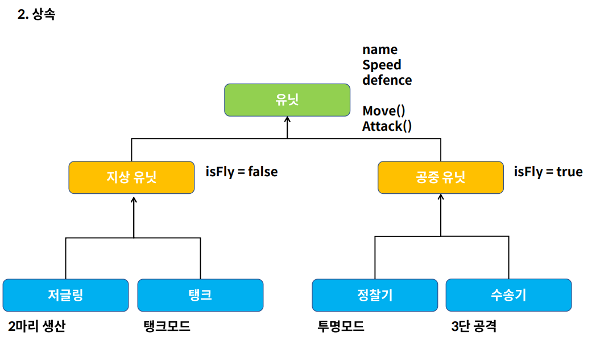
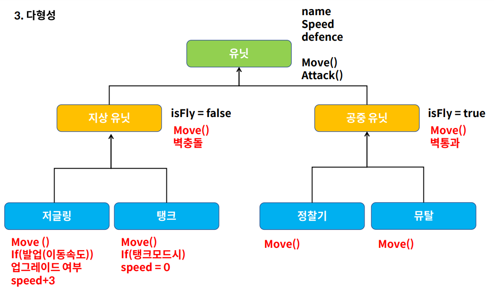
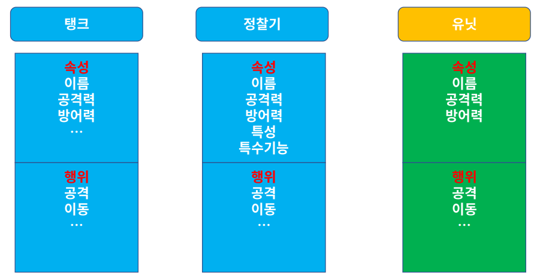
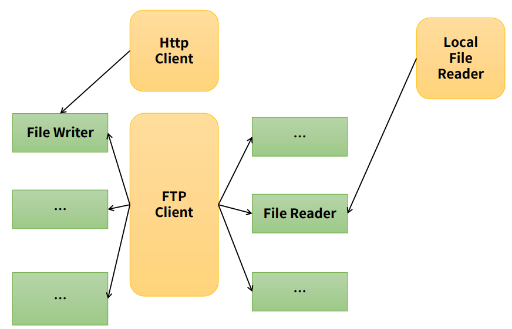
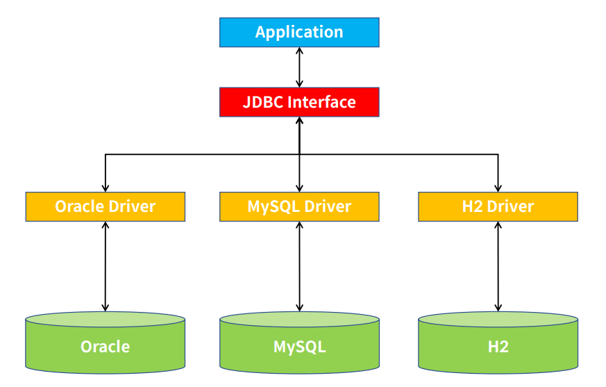
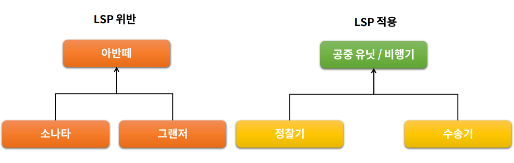
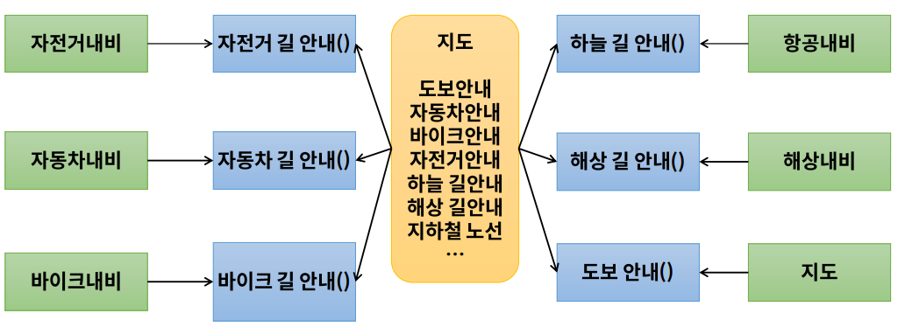
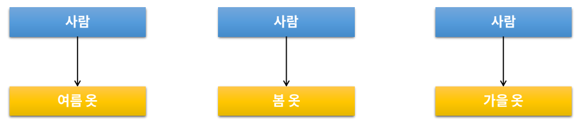
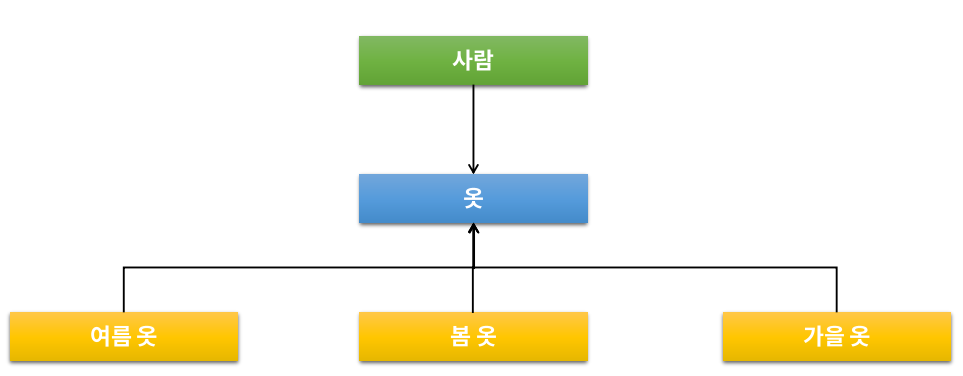

#### **객체 지향이란..?**

1970년대에 나오기 시작했으며, C언어와 같은 ‘**절차 지향**’ 프로그래밍이 컴퓨터의 발전으로 인해 프로그램 복잡도가 증가하면서 유지보수, 개발기간 등 비효율적인 부분이 발생하여 [추상화, 상속, 은닉, 재사용, 인터페이스] 등의 특성을 가진 **객체 지향**으로 개발하기 시작.

- 현실에 존재하는 사물을 있는 그대로 모델링 하여, 이들의 행위와 속성을 정의하고, 절차가 아닌 객체가 중심이 되어 실제 사물이 동작하는 방식의 설계.
- 사물은 객체(Object), 사물이 하는 행위는(Method), 사물이 가지는 속성을 변수(Variable)이라고 정의한다.

### 객체의 3가지 요소

**상태 유지** (객체의 상태)

- 객체는 상태 정보를 저장하고, 유지되어져야 하며 이러한 속성은 변수로 정의되어야 한다 또한 객체의 상태가 변경될 수 있어야 한다.

**기능 제공** (객체의 책임)

- 객체는 기능을 제공해야 한다. 이 부분은 Method의 제공으로 이루어진다. 외부에서 직접 접근하는 것이 아닌 객체가 제공하는 Method로 기능이 제공되어야 한다. (캡슐화)

**고유 식별자 제공** (객체의 유일성)

- 각각의 객체는 고유한 식별자를 가져야 한다.

> **물리 객체** : 물리적 객체는 실제로 사물이 존재하며, 이를 클래스로 정의한 객체를 의미한다.

> **개념 객체** : Service 부분의 business logic을 처리하는 부분을 의미하며, 여러 객체를 서로 상호작용 하도록 한다.

## 객체 지향의 4대 특성

### 1. **캡슐화**

캡슐화는 객체의 속성(Variable) 을 보호하기 위해 사용한다.

- 속성의 상태를 변경하는 method가 있어야 하며, 각각의 method는 서로 관련성이 있어야 한다.
- 외부에서 속성에 직접 접근하는 것이 아닌 Getter/Setter Method를 통해서 접근한다. (변수는 private, 메서드는 public으로 선언)
- CRUD, BusinessLogic, 객체 생명 주기 처리, 객체 영구성 관리 Method를 제공한다.

**장점** - 추상화 제공, 재 사용성 향상, 유지 보수 효율성 향상

### **2 . 상속**

하위(자식) 으로 내려가 수록 구체화 되는 것.

**효과**

- 프로그램 구조에 대한 이해도 향상

최상위 클래스의 구조를 보고, 하위 클래스의 동작을 이해 할 수 있다.

- 재사용성 향상

상속을 이용하여, 해당 클래스에 필요한 속성 및 메소드를 모두 정의 하지 않고, 상속을 받아서 사용할 수 있다.

- 확장성 향상

일관된 형태의 클래스 객체를 추가 할 수 있어, 간단하게 프로그램 확장이 가능하다.

- 유지보수성 향상

각 객체마다, 자신의 메소드를 정의하고 있다면, 코드 수정에 많은 작업이 필요 하지만, 상속을 사용한 경우 일관된 형태로 작성이 가능하다.

### **3. 다형성**

다형성은 하나의 개체가 여러 개의 형태로 변화 하는 것을 말한다.

- 오버라이딩을 통해 다형성 구현 가능.

### **4. 추상화**

- 객체 지향에서 추상화는 모델링이다.
- 구체적으로 공통적인 부분, 또는 특정 특성을 분리해서 재조합 하는 부분이 추상화 이다. (다형성, 상속 등이 추상화에 해당)

#### **객체지향 설계 5원칙 SOLID**

좋은 소프트웨어 설계를 위해서는 결합도(coupling)는 낮추고 응집도(cohesion)는 높여야 한다.

### 1. SRP (Single Responsibility Principle) 단일 책임 원칙

- 어떠한 클래스를 변경하는 이유는 한가지 뿐 이여야 한다.

### 2. OCP (Open Closed Principle) 개방 폐쇄 원칙

- 자신의 확장에는 열려 있고, 주변의 변화에 대해서는 닫혀 있어야 한다.
- 상위 클래스 또는 인터페이스를 중간에 둠으로써, 자신은 변화에 대해서는 폐쇄적이지만, 인터페이스는 외부의 변화에 대해서 확장을 개방해 줄 수 있다.

### 3. LSP ( Liskov Substitution Principle) 리스코프 치환 원칙

- 서브 타입은 언제나 자신의 기반(상위) 타입으로 교체 할 수 있어야 한다.

### 4. ISP (Interface Segregation Principle) 인터페이스 분리 원칙

- 클라이언트는 자신이 사용하지 않는 메서드에 의존 관계를 맺으면 안된다.
- 프로젝트의 요구 사항, 설계를 고려하여 SRP(단일책임원칙) or ISP(인터페이스분리원칙)를 선택 한다.

### 5. DIP (Dependency Inversion Principle) 의존 역전 원칙

- 자신보다 변하기 쉬운 것에 의존하지 말아야 한다.

#### **POJO ( Plain Old Java Object ) JAVA**

순수한 자바 오브젝트를 뜻한다.

### 특징

1. **특정 규약에 종속 되지 않는다.**

- 특정 Library, Module에서 정의된 클래스를 상속 받아서 구현하지 않아도 된다.
- POJO가 되기 위해서는 외부의 의존성을 두지 않고, 순수한 JAVA로 구성이 가능해야 한다.

1. **특정 환경에 종속 되지 않는다.**

- 특정 비즈니스 로직을 처리 하는 부분에 외부 종속적인 http request, session 등은 POJO를 위배한 것으로 간주한다.
- @Annotation 기반으로 설정하는 부분도 엄연히는 POJO라고 볼 수는 없다.

