> SpringMVC를 사용하여 웹 API개발 중 세션이 없는 요청에 대해 로그인 페이지로 Redirect 시키는 서비스 로직을 작성하였는데 화면 이동등에 대한 요청은 문제없이 Redirect 처리 되었지만 데이터 조회와 같은 Api요청에서는 에러가 발생하였다.

> 우선 원인은 Redirect처리 시 발생한 ClassCastException 때문인데, Spring의 Redirect의 처리 과정에 대해 자세히 알아보자.

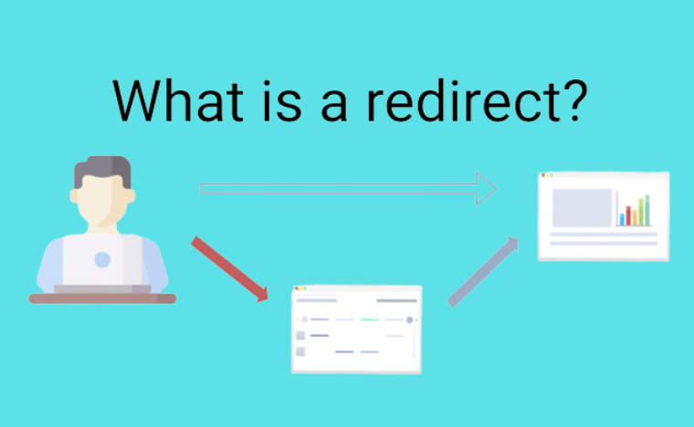

Spring에서 Redirection은 클라이언트에게 새로운 URL로 이동하라고 알려주는 프로세스를 의미한다. 리다이렉션은 주로 사용자를 다른 페이지로 이동시키거나, 요청을 다른 컨트롤러 또는 URL로 보내는 데 사용된다.

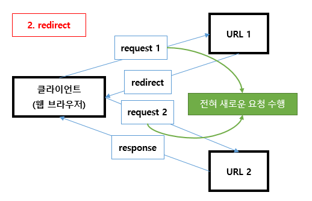

## Redirect Processing Logic (Debugging)

#### **1. SessionInterceptor.java**

- response.sendRedirect(contextPath+"/expired")

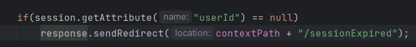

#### **2. ServletInvocableHandlerMethod.java**

- invokeAndHandle() 메서드에서 invokeForRequest()로 반환(redirect:/)값 가져옴

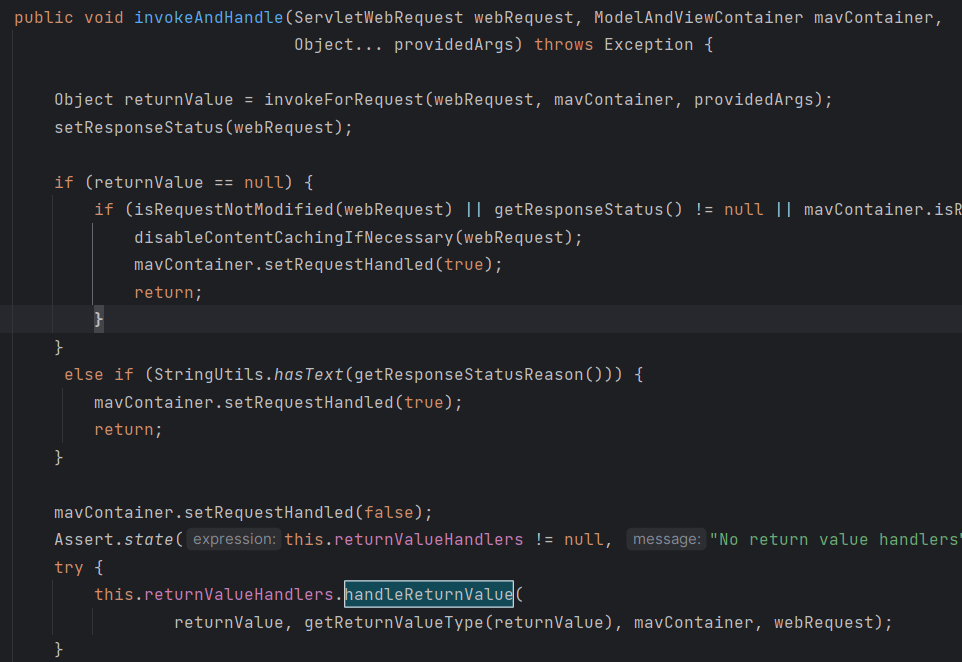

- handleReturnValue() returnValue를 토대로 handler를 결정 한 뒤에, handleReturnValue를 해준다.

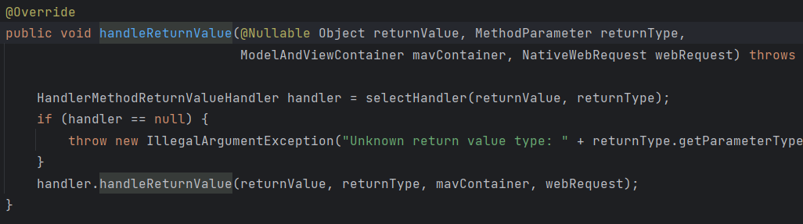

#### **3. ViewNameMethodReturnValueHandler.java**

- 해당 클래스를 핸들러로 결정하여 handleReturnValue()에서 isRedirectViewName()로 redirect에 관련된 문자열인지 체크 후 mavContainer를 true로 변경

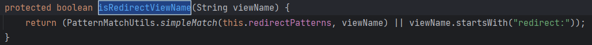

#### **4. RequestMappingHandlerAdapter.java**

- invokeHandlerMethod()에서 invokeAndHandle 작업을 마치고, ModelAndView를 생성하여 반환하기 위해 getModelAndView() 호출

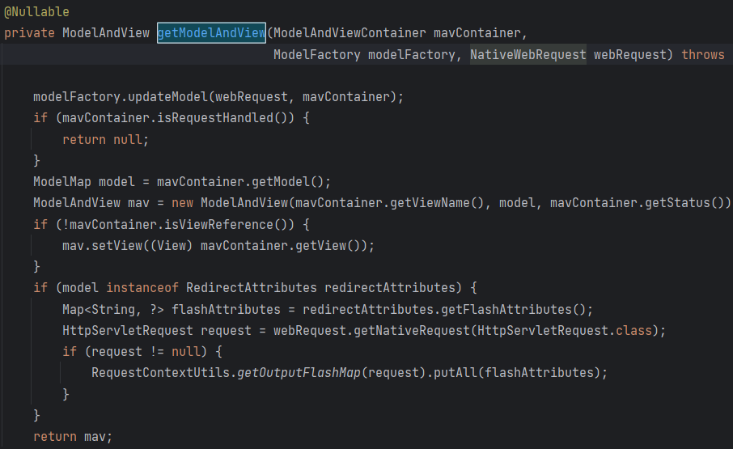

- getModelAndView()에서 isRequestHandled()를 통해 검사 후 ModelAndView 객체 생성 + isViewReference()를 통해 view가 String타입인지 검사하여 아니라면 mav객체에 view 세팅

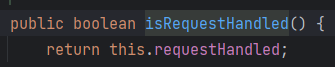

> *restController, responseBody가 붙은 메서드들은 isRequestHandled()에 걸려 null반환.

- 마지막으로 ModelAndView객체를 반환

#### **5. DispatcherServlet.java**

- 다시 진행중이던 DispatcherServlet의 doDispatch()로 돌아와서 현재 ModelAndView를 획득한 상태이므로 마지막으로 ViewResolver에서 View를 획득해 뿌려주면 된다.

- processDispatchResult() exception 체크 후 render()함수로 렌더링 시도 - resolveViewName()

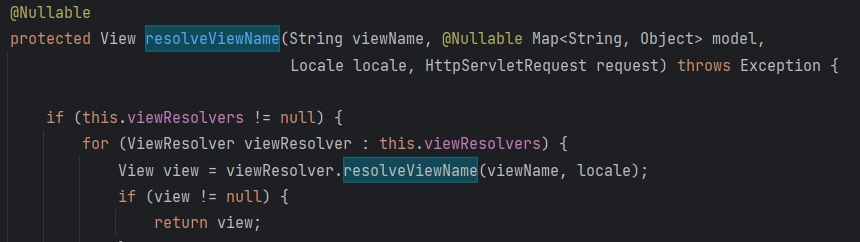

> * rendering이란 View와 Model의 상호작용으로 view가 model의 데이터를 활용하여 템플릿 엔진 등을 사용하여 실제 문서로 변환하고 최종적으로 클라이언트에게 제공되는 결과를 생성하는 프로세스를 의미한다.

#### **6. ContentNegotiatingViewResolver.java**

- getCandidateViews() 여기에서 ViewResolver들을 반복하며 viewName, mediaType, locale 등의 정보를 활용하여 어떤 View가 사용될지를 결정한다.

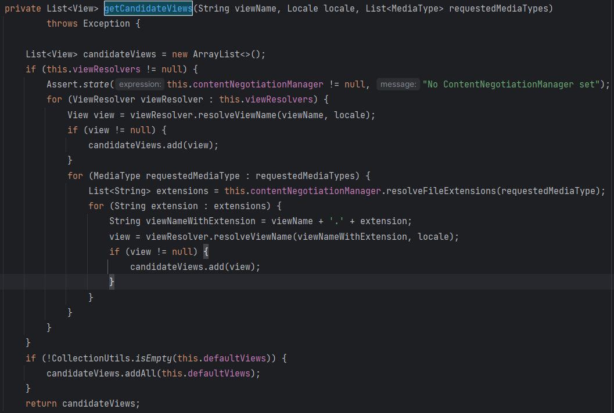

#### **7. AbstractCachingViewResolver.java**

- resolveViewName() 에서 view를 생성하기 위해 createView()호출.

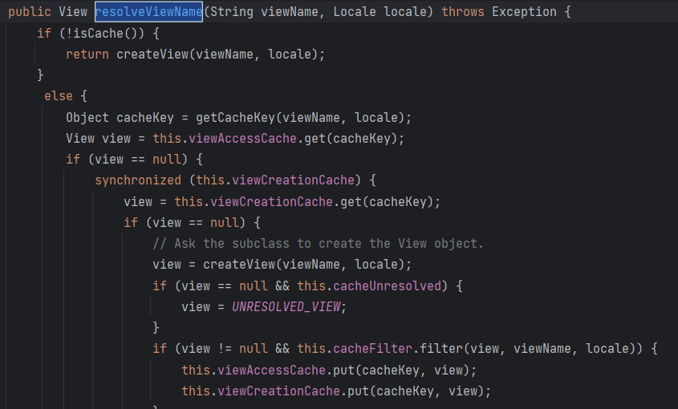

#### **8. UrlBasedViewResolver.java**

- createView()에서 넘어온 viewName이 'redirect:' 형식이 맞는지 확인하고 RedirectView 객체를 생성해 반환한다.

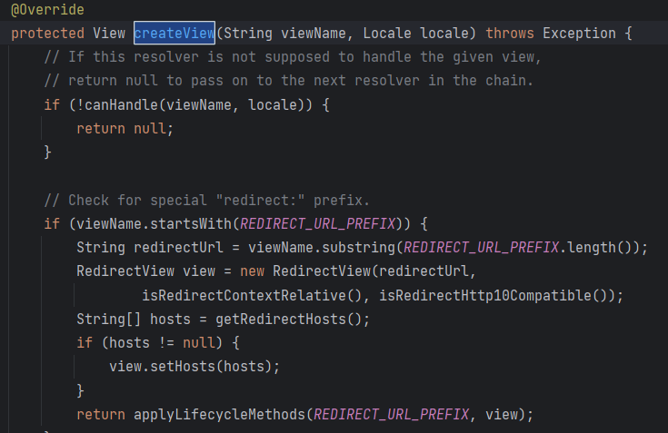

#### **9. AbstractCachingViewResolver.java**

- 다시 resolveViewName() 으로 돌아와서 getBestView()를 호출하여 최종 bestView를 선택하게 된다.

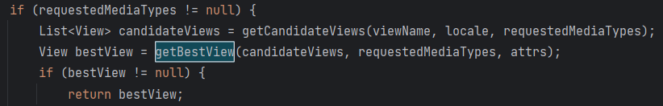

- 이때 RedirectView 타입이 가장 우선순위를 가지게 된다.

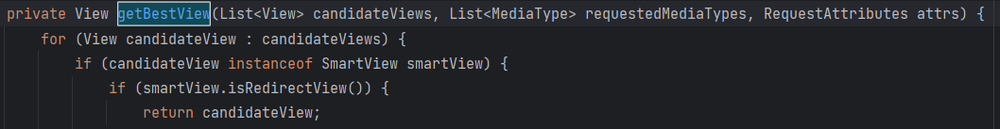

#### **10. DispatcherServlet.java**

- 마지막으로 DispatcherServlet으로 돌아와 최종 선택된 SmartView를 rendering 하여 반환하면 끝이 난다..!

---

**※주의사항**

> **@RestController나 @ResponseBody가 붙은 메서드를 호출 시 Redirect처리를 하면 dispatcherservlet에서 반환타입이 String이 아니라 ClassCastException발생한다.**

**# 결과 (해결 방법)**

**1**. @Controller를 사용하고 필요한 곳에만 <u>@ResponseBody</u> 어노테이션 사용

```java
@RequestMapping("/hello")
@ResponseBody
public String hello() {
    return "Hello, World!";
}
```

**2**. 리턴타입으로 <u>ResponseEntity<></u> 사용하여 반환

```java
@GetMapping("/hello")
 public ResponseEntity<String> hello() {
    String message = "Hello, World!";
    return new ResponseEntity<>(message, HttpStatus.OK);
}
```

**3**. 위의 2가지 방법이 불가능하다면 ResponseBody 체크하여 따로 Json값으로 처리

1) 세션 만료 시 반환값을 처리할 ExpiredController를 추가로 생성한다.

2) HandlerMethod 객체 생성하여 ResponseBody 어노테이션을 사용하는 Controller에 대한 요청인지 검사

3) api 요청이면 ExpiredController에서 Json타입 반환

> *aop와 interceptor를 사용하여 처리하는 2가지 로직 사용 가능

#### **Interceptor**

```
HandlerMethod hm = (HandlerMethod) handler;
		ResponseBody rb = hm.getMethodAnnotation(ResponseBody.class);

		if(isAPICall(request, rb, contextUri)) {
			logger.debug("api call by option setting(API.xxx)");
			return true;
		}

		SessionObject so = SessionManager.authentication(request);

		if(so == null){
			logger.warn("authentication fail");
			response.reset();
			if(rb == null) { // view call
				String popYn = "N";
				if(contextUri.startsWith("/pop/") || contextUri.startsWith("/dashboard/popup")){
					popYn = "Y";
				}
				String returnUri = URLEncoder.encode(contextUri, "UTF-8");
				response.sendRedirect(contextPath + "/auth-fail?errorType=authentication&return=" + returnUri + "&popYn=" + popYn);
			} else { // api call
				response.sendRedirect(contextPath + "/expired");
			}

			return false;
		}else{
			if(!SessionManager.authorization(request, so)){
				logger.warn("unauthorizated uri");
				response.reset();

				if(rb == null) { // view call
					String popYn = "N";
					if(contextUri.startsWith("/pop/") || contextUri.startsWith("/dashboard/popup")){
						popYn = "Y";
					}
					response.sendRedirect(contextPath + "/auth-fail?errorType=authorization&popYn=" + popYn);
				} else { // api call
					response.sendRedirect(contextPath + "/expired");
				}
				return false;
			}
		}
```

#### **(AOP)**

```
                        MethodSignature methodSignature = (MethodSignature) point.getSignature();
                        Method method = methodSignature.getMethod();

                        if (method.getDeclaringClass().isAnnotationPresent(RestController.class)) {
                            // @RestController인 경우 Expired Controller을 거쳐 Response
                            log.debug("RestController.. :"+ method.getName());
                            //response.sendRedirect("/expired");
                            return expiredController.main(request); // ExpiredController를 빈으로 주입받아 사용

                        } else if (method.getDeclaringClass().isAnnotationPresent(Controller.class)) {
                            // @Controller인 경우 직접적으로 Redirect
                            log.debug("Controller.. :"+ method.getName());
                            response.sendRedirect("login?sessionExpired");
                            return false;
                        }

                        response.sendRedirect("login?sessionExpired");
                        return false;
```

#### **Controller**

```java
@Controller
@RequestMapping(value="/expired")
public class ExpiredController {

	public static final String URI = "/expired";
	@ResponseBody
	@RequestMapping(value="", method=RequestMethod.GET)
	public BaseResult main(HttpServletRequest request) throws Exception{
		BaseResult result = new BaseResult();
		result.header.expired = true;
		result.header.resultCode = BaseResult.RESULT_CODE_ACCESS_DENIED;
		return result;
	}
	
}
```

#### **Front**

> *replace를 사용하면 현재 페이지에 그대로 덮어씌우기 때문에 이전 페이지로 돌아가는 것을 방지할 수 있다.

```
axios.post('/vindication/detail', {"id": id}, {
        headers: defaultHeader
      }).then(function (response) {
        if (response == false) {
          return;
        } else if (response && response.data && response.data.sessionExpired){
          // session fail => login
          location.replace('/login?sessionExpired');
          return;
        }
```

reference.

[https://shanepark.tistory.com/370](https://shanepark.tistory.com/370)
