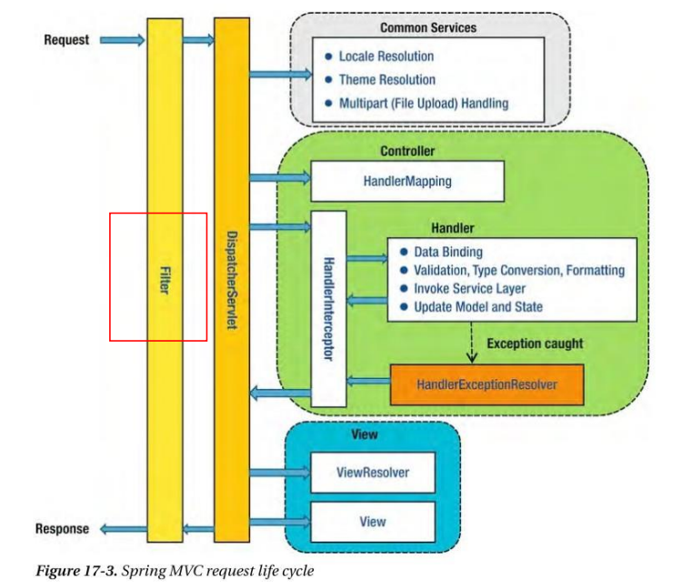
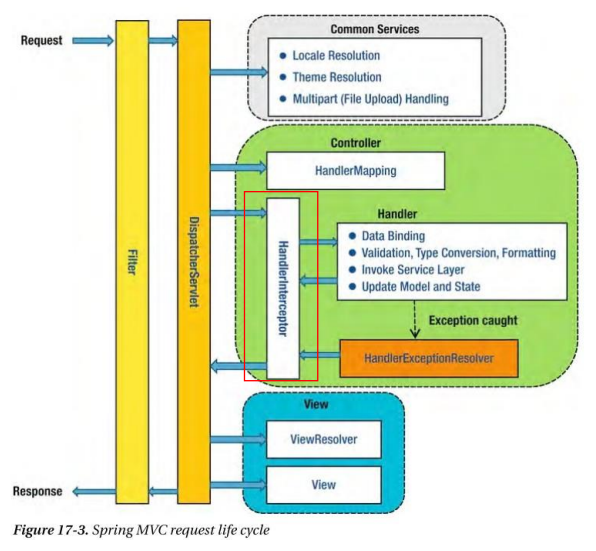

#### **Validation**

Validation 이란 null값에 의한 null pointer exception등과 같은 에러 발생을 방지하기 위해 값을 미리 검증하는 과정이다.

```
if(account == null || pw == null) {
	return;
}
if(age == 0) {
	return;
}
```

### Validation의 사용 이유

1. 검증해야 할 값이 많은 경우 코드의 길이가 길어진다.
2. 구현에 따라 달라질 수 있지만 Service Logic과의 분리가 필요하다.
3. 흩어져 있는 경우 어디에서 검증을 하는지 알기 어려우며, 재사용의 한계가 있다.
4. 구현에 따라 달라질 수 있지만, 검증 Logic이 변경 되는 경우 테스트 코드 등 참조하는 클래스에서 Logic이 변경되어야 하는 부분이 발생할 수 있다.

> implementation("org.springframework.boot:spring-boot-starter-validation")

### 주요 Annotation

**@Size**

- 문자 길이 측정

**@NotNull**

- null 불가

**@NotEmpty**

- null, “”불가

**@NotBlank**

- null, “”, “ “불가

**@Past**

- 과거 날짜

**@PastOrPresent**

- 오늘 / 과거 날짜

**@Future**

- 미래 날짜

**@FutureOrPresent**

- 오늘 / 미래 날짜

**@Pattern**

- 정규식 적용 ex> "^\\d{2,3}-\\d{3,4}-\\d{4}$"

**@Max**

- 최대값

**@Min**

- 최소값

**@AssertTrue / False**

- 별도 Logic적용

**@Valid**

- 해당 object validation 실행

### Custom Validation

1. AssertTrue / False 와 같은 method 지정을 통해서 Custom Logic 적용 가능
2. ConstraintValidator 를 적용하여 재사용이 가능한 Custom Logic 적용 가능

```java
@Email  // email 형식 지정
private String email;

// 정규식 지정
@Pattern(regexp = "^\\d{2,3}-\\d{3,4}-\\d{4}$", message = "핸드폰 번호의 양식과 맞지 않습니다. 01x-xxx(x)-xxxx")
private String phoneNumber;

@YearMonth  // CustomAnnotation 을 만들어 처리
private String reqYearMonth;    // yyyyMM

@Max(value = 90, message = "최대 나이는 90살 입니다.")
private int age;
```

#### **Exception**

Web Application의 에러 처리 방법

1. **에러 페이지**
2. **4xx Error / 5xx Error**
3. **Client가 200외에 처리 하지 못할 경우 200을 내려주고 별도의 에러 Message전달**

**@ControllerAdvice**

- Global 예외 처리 및 특정 package / Controller 예외 처리

**@ExceptionHandler**

- 특정 Controller의 예외 처리

```java
@ExceptionHandler(value = Exception.class)
public ResponseEntity exception(Exception e) {
	System.out.println(e.getClass().getName());

	return ResponseEntity.status(HttpStatus.INTERNAL_SERVER_ERROR).body("");
}
```

#### **Filter & Interceptor**

### Filter

- Web Application 에서 관리되는 영역이다.
- Client로 부터 오는 **요청/응답**에 대해 **최초/최종** 단계에 위치한다.
- 이를 통해 요청/응답의 정보를 변경하거나, Spring에 의해 데이터가 변환되기 전의 순수한 Client의 요청/응답 값을 확인 할 수 있다.
- 유일하게 ServletRequest, ServletResponse의 객체를 변환 할 수 있다.
- 주로 request / response의 Logging 이나 인증과 관련된 Logic들을 선/후 처리함으로 써 business log과 분리 시킨다.



Ex>

```java
@Component
@Slf4j
public class GlobalFilter implements Filter {
	@Override
	public void doFilter(ServletRequest request, ServletResponse response, FilterChain chain) throws IOException, ServletException {
	// 전처리
	HttpServletRequest httpServletRequest = (HttpServletRequest) request;
	HttpServletResponse httpServletResponse = (HttpServletResponse) response;
	String url = httpServletRequest.getRequestURI();
	BufferedReader br = httpServletRequest.getReader();
	br.lines().forEach(line -> {
		log.info("line : {}, line : {}", url, line);
	});
	chain.doFilter(httpServletRequest, httpServletResponse);
	}
}
```

---

### Interceptor

- Filter와 매우 유사하지만, Spring Context에 등록 된다는 차이점이 있다.
- AOP와 유사한 기능을 제공 할 수 있으며, 주로 인증 처리 / Logging에 사용된다.



Ex>

```java
@Component
public class AuthInterceptor implements HandlerInterceptor {
	// 주로 인증에 사용 (권한이 있는지)
	@Override
	public boolean preHandle(HttpServletRequest request, HttpServletResponse response, Object handler) throws Exception {
	boolean validAuthUser = checkValidAccessAnnotation(handler, AuthUser.class);
	System.out.println("annotation check : "+validAuthUser);
	if(validAuthUser){
		return true;
	}
	return false;
	}
	private boolean checkValidAccessAnnotation(Object handler, Class clazz) {
	// Resource에 대한 요청이면 무조건 넘김
	if(handler instanceof ResourceHttpRequestHandler){
		System.out.println("리소스 요청 class "+clazz.getName());
		return true;
	}
	// Auth 어노테이션이 붙어있으면 검사
	HandlerMethod handlerMethod = (HandlerMethod) handler;
	if(null != handlerMethod.getMethodAnnotation(clazz) || null != handlerMethod.getBeanType().getAnnotation(clazz)){
		System.out.println("어노테이션 체크 class "+clazz.getName());
		return true;
	}
	return false;
	}
}
```
