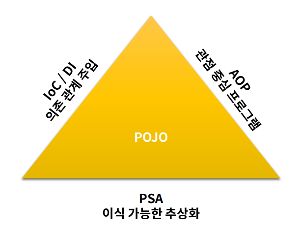
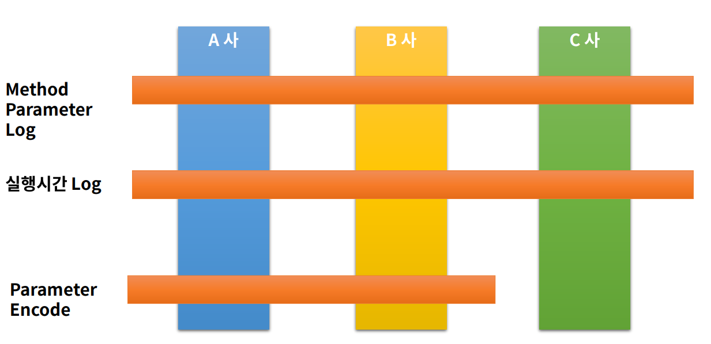

#### **Spring의 핵심**

- Spring의 첫 1.0 version은 2004년 3월 출시.
- 20년 동안 자바 엔터프라이즈 어플리케이션 개발의 최고의 자리 차지
- 스프링 프레임워크의 20여가지 구성은 핵심 기능인 (DI, AOP, etc)를 제공.
- 스프링의 여러 모듈 중 (Boot, Cloud, Data, Batch, Security)가 자주 쓰임.
- ‘테스트의 용이성’, ‘느슨한 결합’에 중점을 두고 개발.

#### **IoC / DI**

### IoC (Inversion Of Control)

<u>제어 역전</u>

- Java객체를 new로 생성하여 개발자가 관리하는 것이 아닌 Spring Container에 모두 맡긴다.
- 즉, 개발자에서 > 프레임워크로 객체 관리 권한(제어)이 넘어갔음으로 “**제어의 역전**”이라고 한다.

### DI (Dependency Injection)

<u>의존성 주입</u>

- 의존성으로부터 격리 시켜 코드 테스트에 용이하다.
- DI를 통하여, 불가능한 상황을 Mock와 같은 기술을 통하여, 안정적으로 테스트 가능하다.
- 코드를 확장하거나 변경할 때 영향을 최소화 한다. (추상화)
- 순환 참조를 막을 수 있다.

#### **AOP**

**관점지향 프로그래밍** - 3개의 관심사로 분류

**Web Layer**

- REST API를 제공하며, Client 중심의 로직 적용

**Business Layer**

- 내부 정책에 따른 logic을 개발하며, 주로 해당 부분을 개발

**Data Layer**

- 데이터 베이스 및 외부와의 연동을 처리

### 주요 Annotation

**@Aspect**

- 자바에서 널리 사용하는 AOP 프레임워크에 포함되며, AOP를 정의하는 Class에 할당

**@Pointcut**

- 기능을 어디에 적용시킬지, method / annotation등의 AOP를 적용 시킬 지점을 설정

**@Before**

- 메서드 실행하기 이전

**@After**

- 메서드가 성공적으로 실행 후, 예외가 발생 되더라도 실행

**@AfterReturning**

- 메서드 호출 성공 실행 시 (Not Throws)

**@AfterThrowing**

- 메서드 호출 실패 예외 발생 (Throws)

**@Around**

- Before / after 모두 제어

**횡단 관심**

#### **여러 Annotation..!**

**@SpringBootApplication**

- Spring Boot Application으로 설정

**@Controller**

- View를 제공하는 controller로 설정

**@RestController**

- REST API를 제공하는 controller로 설정

**@RequestMapping**

- URL 주소를 맵핑

**@GetMapping**

- Get메서드 URL 주소 맵핑

**@PostMapping**

- Post메서드 URL 주소 맵핑

**@PutMapping**

- Put메서드 URL 주소 맵핑

**@DeleteMapping**

- Delete메서드 URL 주소 맵핑

**@RequestParam**

- URL Query Parameter Parsing

**@RequestBody**

- Http Body를 Parsing

**@Valid**

- POJO java Class의 검증

**@Configuration**

- 1개 이상의 bean을 등록할 때 설정

**@Component**

- 1개 이상의 class단위로 등록할 때 사용

**@Bean**

- 1개의 외부 Library로 부터 생성한 객체를 등록 시 사용

**@Autowired**

- DI를 위한 곳에 사용

**@Qualifier**

- @Autowired 사용 시 bean이 2개 이상일 때 명시적 사용

**@Resource**

- @Autowired + @Qualifier의 개념으로 이해

**@Aspect**

- aop적용 시 사용

**@Before**

- aop 메서드 이전 호출 지정

**@After**

- aop 메서드 호출 이후 지정. 예외 발생 포함

**@Around**

- aop 이전/이후 모두 포함. 예외 발생 포함

**@AfterReturning**

- aop 메서드의 호출이 정상일 때 실행

**@AfterThrowing**

- aop 해당 메서드가 예외 발생 시 지정
