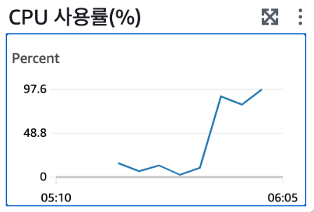

> Spring을 위해 열일하는 우리의 작고 귀여운 EC2가 자주 죽는 이유인 <u>쓰레드 기아</u> 현상이란?

제목에 있는 <u>Thread starvation or clock leap detected</u> 해당 에러가 어떤 에러이며, 왜 발생하는지 또 해당 에러로 인한 문제와 해결 방법에 대해 알아보자.

우선 EC2 서버가 갑자기 다운되는 상황은 자원 부족, 예외 처리 미흡, 서버 설정 문제 등 이 외에도 매우 다양한 원인들로 인해 갑작스럽게 돌연사 해버릴 수 있는 개복치 같은 서버의 사망 원인을 파악하기 위해서는 가장 쉬우면서도 중요한 서버의 로그를 확인해보면 서버의 상태나 죽었다면 죽은 이유를 파악할 수 있다.

서버가 이런 로그를 계속하여 뱉어냈다면 이 글에서 다루는 쓰레드 기아 문제이다.

```
WARN 23318 --- [l-1 housekeeper] com.zaxxer.hikari.pool.HikariPool : HikariPool-1 - Thread starvation or clock leap detected (housekeeper delta=???)
```

Thread starvation or clock leap detected 이 에러는 **결론**부터 말하면 <u>Thread가 작업을 하려면 Connection이 필요한데 Connection이 부족해 Thread에 할당해주지 못하는 상황이 지속되어 Thread들이 작업을 끝내지 못하고 계속해서 작업만 쌓여 CPU 사용량이 99.9%로 최대치에 도달해 자원 부족 문제로 서버가 죽어(터져) 버리는 것이다.</u>



위의 내용을 쉽게 풀어보면 Thread는 알다시피 서버에서 작업을 처리하는 일꾼이다. 서버에서 데이터베이스에 영향을 주는 작업은 하나의 Transaction 내에서 처리하는데, 그럼 <u>Transaction은 Service 로직과 Repository에 접근할 때 시작</u>되고 해당 작업이 끝나면 종료된다. 이때 <u>Thread가 Transaction을 시작(DB에 접근)하기 위해서는 Connection이 필요</u>하다.

이 내용들을 종합해 보면 보통 Service로직 내에서 Repository를 접근하기 때문에 <u>일반적으로 하나의 Thread는 작업하며 2개 이상의 Connection을 필요</u>로 하게 된다.

그렇게 Thread는 작업 중 DataSource에 Connection을 달라고 요청하지만 할당해 줄 Connection이 부족하여 할당해주지 못하는 상황이 발생하면 <u>Thread는 Connection을 받지 못해 작업을 처리하지 못하게 되고 계속해서 대기하는 상태(Dead Lock)가 된다</u>.

그럼 서버에서는 작업을 처리해야 하는데 일을 할 수 있는 상태인 Thread가 남지 않아 계속하여 생성하게 되는데 <u>새로운 Thread에 할당해 줄 남은 Connection이 없기 때문에 스레드 기아(Thread Starvation) 현상이 발생</u>하는 것이다.

### 원인 및 해결 방법

> 결론적으로 원인은 Thread가 작업 중 Connection을 정상적으로 할당 받지 못해 발생하는 문제이기 때문에 Connection 개수를 충분히 늘려주면 된다.!

HikariCP에서 제공하는 최적의 Maximum Pool Size를 구하는 공식은 *Tn \* (Cn - 1) + 1*라고 한다.

그럼 Thread 수를 100개, Connection 수를 2개라고 가정했을때 *100 \* (2 - 1) + 1* => **101**이다. 즉, Connection을 101개 이상 제공하면 해당 문제가 발생하지 않는다.

> application.yml 파일에서 Connection 개수 설정

```
spring:
  datasource:
    hikari:
      maximum-pool-size: 110
```

> 최대 Thread 개수 설정 방법

```
#Thread 최대 개수 설정 (Default - 200)
server:
  tomcat:
    threads:
      max: 100
```

- 끝 -

reference.

[https://velog.io/@mbsik6082/Thread-starvation-or-clock-leap-detected-Dead-Lock-hikari-%EC%98%A4%EB%A5%98](https://velog.io/@mbsik6082/Thread-starvation-or-clock-leap-detected-Dead-Lock-hikari-%EC%98%A4%EB%A5%98)
