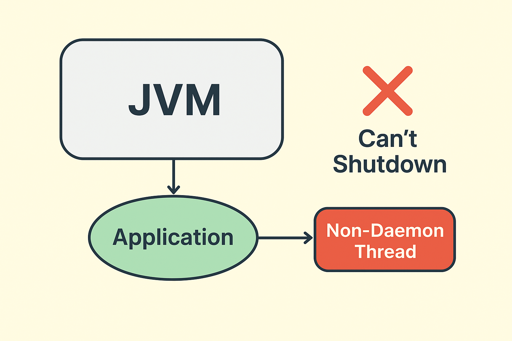

> Batch 작업이 끝났는데 왜 Application이 정상적으로 종료되지 못할까..?

SpringBoot를 사용해 배치 애플리케이션을 개발하는 도중 분명 배치 작업이 끝났는데 애플리케이션(프로세스)가 종료되지 않는 현상이 발생하였다. 왜 애플리케이션이 종료되지 않은 것일까?



**Elasticsearch Client의 Connection pool이 살아있어 jvm이 종료되지 못한 것 이었다.**

우선 애플리케이션이 정상적으로 종료되지 않는 이슈가 발생할 때 확인하는 방법에 대해 알아보자.

작업이 끝났는데 종료되지 않으면 대부분 스레드가 문제다.. 특히 **Non-daemon 스레드**는 jvm이 강제로 종료시킬 수 없기 때문에 jvm이 종료되지 못하는 원인이 된다.

✅ jvm 프로세스에 의해 실행중인 스레드 확인하기

```
jps          # 실행 중인 JVM PID 확인
jstack <PID> # 해당 프로세스의 스레드 덤프 출력
```

스레드를 확인하기 위한 여러 방법이 있지만 가장 빠르고 쉬운 방법은 해당 서버의 Shell에 접속하여 직접 확인하는 것이다.

***jps*** 명령어를 사용하여 실행중인 jvm 프로세스들을 확인할 수 있고, 그 중 이슈가 있는 애플리케이션 프로세스의 PID를 확인하여 ***jstack** **<PID>*** 명령을 입력하면 jvm 프로세스가 관리하는 스레드들의 상태를 확인할 수 있다.

여기서 main 같은 non-daemon 스레드를 제외하고 elasticsearch, httpclient, pool 같은 <u>non-daemon 스레드가 RUNNABLE / WAITING 등의 상태로 살아있다면 JVM 프로세스가 종료되지 못하는 원인이 된다</u>.

---

## ⚠️ 그렇다면 GC는 왜 커넥션 풀을 회수하지 못할까?

자바의 GC(Garbage Collector)는 단순히 “더 이상 참조되지 않는 객체”만 치운다. 하지만 커넥션 풀은 단순 객체가 아니며 내부에서 **스레드**(keep-alive, connection-cleaner..)를 만들고 계속 돌린다.

- GC 입장에서는 “아직 살아 있는 스레드를 가진 객체”니까 수거 대상으로 인지하지 못한다.
- 그렇기 때문에 Client 객체의 참조를 끊어도 GC는 커넥션 풀을 정리하지 않는다.

> 즉, 커넥션 풀은 직접 close 해줘야 JVM의 안전한 종료를 보장할 수 있다.

## Daemon 스레드 & Non-Daemon 스레드의 차이점

JVM이 종료되지 않는 핵심 원인이 **Non-Daemon 스레드** 때문이라면 non-daemon 스레드는 일반 스레드와 뭐가 다른걸까?

#### **Non-Daemon Thread**

- 개발자가 작업을 위해 생성하는 스레드
- 하나라도 살아 있으면 JVM이 종료되지 못함
- 예) <u>DB 커넥션 풀, HTTP 클라이언트 풀, 엘라스틱 RestHighLevelClient의 내부 스레드</u> 등

#### **Daemon Thread**

- JVM / JAVA의 백그라운드 작업용 스레드
- JVM이 종료되면 OS가 강제로 정리함
- 예) <u>GC 스레드, 모니터링 스레드 등</u>

non-daemon 스레드는 일반적으로 개발자가 중요 작업 수행을 위해 생성하기 때문에 JVM에 의해 중간에 작업이 끊기면 <u>데이터 손상, 커넥션 문제</u> 등의 위험한 상황이 발생할 수 있기 때문에 **JVM은 non-daemon 스레드가 완료될 때 까지 종료를 지연시키도록 설계**되어 있고, 애플리케이션 책임으로 안전하게 종료하도록 요구하는 구조이다.

---

## ConnectionPool (non-daemon 스레드) 종료하기

가장 쉬운 방법은 try-with-resource로 close()를 보장하면 된다.

이렇게 하면 블록이 끝나자마자 close()가 호출되어 리소스는 안전하게 회수할 수 있다.

```
try (RestHighLevelClient client = new RestHighLevelClient(...)) {
    // API 호출
}
```

하지만 블록이 종료되면서 커넥션풀을 종료해버리면 반복 작업이나 새로운 요청에 대해서 매번 새로운 Client를 생성하고 종료하여 <u>커넥션 풀을 재사용할 수 없기 때문에 커넥션 풀을 사용하는 의미가 사라져</u> 성능에 큰 영향을 미치게 된다.

그래서 “**언제 닫을 것인가**”가 중요하다.

개발자가 커넥션 풀이 더이상 사용되지 않을 것을 판단해 클라이언트를 close 하도록 처리해도 되지만 고려해야 할 요소도 많고, close 할 클래스에서 클라이언트 Bean 의존성을 주입받지 않은 상황이라면 굳이 추가적으로 Bean을 주입받아 처리해야 한다.

Spring에서는 Bean의 LifeCycle을 통해 이러한 고민을 쉽게 해결할 수 있다.

Bean의 **destroyMethod** 속성을 사용하면 해당 <u>Bean의 소멸 시점에 특정 메서드를 호출할 수 있으니 close 메서드를 호출하도록 하면 커넥션 풀 종료 문제가 해결</u>된다.

```java
@Configuration
public class EsConfig {

    @Bean(destroyMethod = "close")
    public RestHighLevelClient restHighLevelClient() {
        return new RestHighLevelClient(
            RestClient.builder(new HttpHost("localhost", 9200, "http"))
        );
    }
}
```

## ✏️ 결론

- GC는 커넥션 풀을 회수하지 않는다. (스레드가 살아 있기 때문)
- Non-Daemon 스레드가 남아 있으면 JVM은 종료되지 않는다.
- Daemon 스레드는 JVM이 끝날 때 OS가 알아서 정리한다.
- try-with-resource는 안전하지만 풀을 쓰는 의미가 없어진다.
- Spring에서는 destroyMethod를 활용해 종료 시점을 맞춰 정리하는 게 깔끔하다.

> **리소스는 반드시 생명주기에 맞춰 직접 정리하자.**
> 특히 배치 애플리케이션처럼 “작업이 끝나면 종료되는 구조”라면, 더더욱 커넥션 풀 같은 리소스를 정확히 닫아줘야 한다.!!
