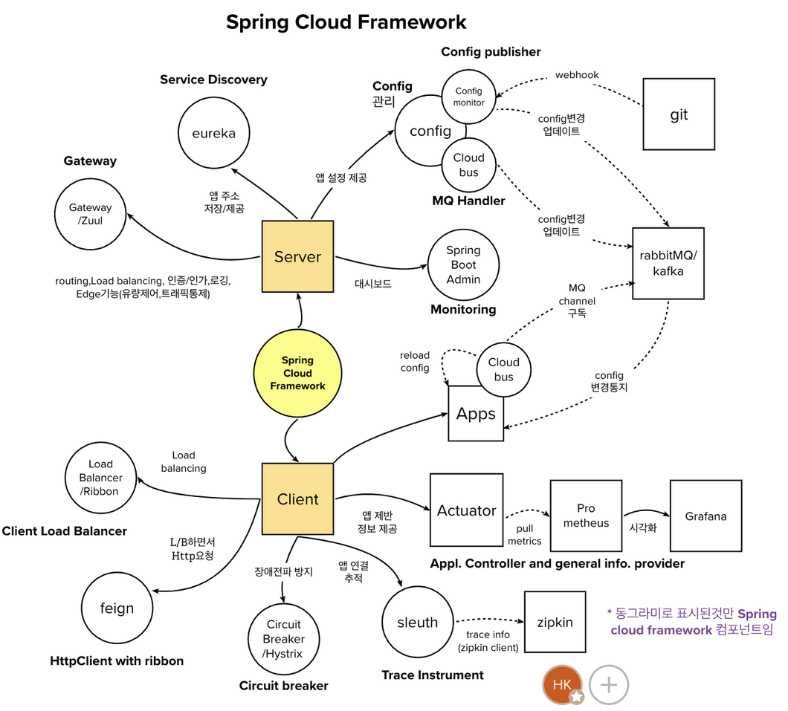

#### **Spring Cloud**

분산 시스템 개발에 효과적인 기능을 제공해주는 Spring Boot 기반의 프레임워크이다.

- 분산 시스템 : circuit breakers, routing, proxy, load balancing



### **Spring Cloud Config Server**

- 환경 설정을 독립적으로 관리할 수 있다. 위의 예시 이미지처럼 환경 설정을 Spring Cloud Config Server를 통해 외부 저장소(Git, S3 등)에 저장할 수 있다.

- 그렇게되면, 각 애플리케이션의 환경 설정을 따로 배포하지 않아도 되는 효과가 있다. 다시 말해 모든 서비스에 **공통된 환경 설정을** Spring Cloud Config Server를 통해 한번에 할 수 있는 것이다.

각 서비스는 이렇게 Config Server 위치만 바라보면, 실제 설정값은 Git 저장소에서 내려받아 온다.

```yaml
# 각 마이크로서비스의 application.yml
spring:
  config:
    import: "configserver:http://localhost:8888"
  application:
    name: order-service # 이 이름으로 Git 저장소의 order-service.yml을 찾아온다
```

### **Naming Server (Eureka) & Spring Cloud Gateway**

- 외부 또는 내부의 서비스에서 오는 요청이 스프링 클라우드 게이트웨이를 통해서 원하는 서비스를 찾아갈 수 있게 해준다. 여기서 말하는 Naming Server는 찾고자 하는 서비스의 위치를 저장하는 것을 말한다.
- 따라서 Spring Cloud Gateway를 사용하여 서버의 요청 정보를 분산 할 수 있게 해준다.

각 서비스는 자신의 위치(IP, 포트)를 Eureka에 등록하고, Gateway는 서비스 이름만으로 실제 인스턴스를 찾아 라우팅한다.

```yaml
# 개별 서비스: Eureka에 자신을 등록
eureka:
  client:
    service-url:
      defaultZone: http://localhost:8761/eureka
```

```yaml
# Gateway: 서비스 이름 기반으로 라우팅
spring:
  cloud:
    gateway:
      routes:
        - id: order-service
          uri: lb://order-service # lb:// = Eureka에 등록된 인스턴스로 로드밸런싱
          predicates:
            - Path=/orders/**
```

이렇게 IP를 직접 하드코딩하지 않고 서비스 이름(`order-service`)으로만 라우팅하기 때문에, 인스턴스가 늘어나거나 줄어들거나 IP가 바뀌어도 Gateway 설정을 건드릴 필요가 없다.
