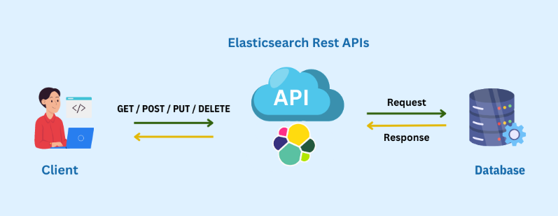
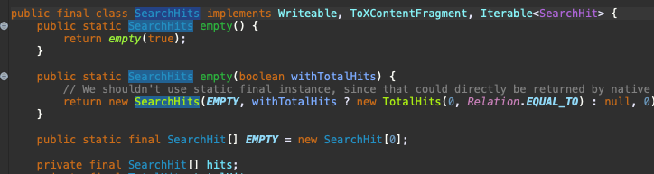

> Spring Data Elasticsearch는 여러 인터페이스를 사용하여 Elasticsearch 인덱스에 대해 호출할 수 있는 작업을 정의한다.



인터페이스는 Elasticsearch API 구조로 되어 있으며 인덱스 관리, 도메인 유형에 대한 읽기/쓰기 매핑 지원, 풍부한 쿼리 및 기준 API, 자원 관리 및 예외 번역 등의 기능 사용할 수 있게 해준다.

#### 1. IndexOperations (인덱스 작업)

IndexOperations는 인덱스 수준에서 동작하는 작업을 정의하는 인터페이스이다.

주로 인덱스를 생성하거나 삭제하는 등의 관리 작업을 수행한다.

```
IndexOperations indexOps = elasticsearchRestTemplate.indexOps(MyEntity.class);
indexOps.create();
```

> 생성될 인덱스의 세부 정보는 @Setting 어노테이션을 사용하여 설정할 수 있다.
> 참조 -> https://docs.spring.io/spring-data/elasticsearch/reference/elasticsearch/misc.html#elasticsearc.misc.index.settings

#### 2. DocumentOperations (문서 작업)

DocumentOperations는 문서 수준에서 엔티티를 저장, 업데이트 및 검색하는 작업을 정의하는 인터페이스이다.

엔티티는 고유한 ID를 기반으로 저장 및 관리된다.

```
MyEntity entity = new MyEntity("1", "John Doe");
documentOperations.save(entity);
```

#### 3. SearchOperations (검색 작업)

SearchOperations는 쿼리를 사용하여 여러 엔티티를 검색하는 작업을 정의하는 인터페이스이다.

Elasticsearch의 강력한 검색 기능을 활용하여 데이터를 쿼리하고 검색한다.

```
Criteria criteria = new Criteria("name").is("John Doe");
SearchHits<MyEntity> searchHits = searchOperations.search(Query.query(criteria), MyEntity.class);
```

#### 4. ElasticsearchOperations (Elasticsearch 작업)

ElasticsearchOperations는 DocumentOperations와 SearchOperations 인터페이스를 통합한 인터페이스이다.

문서 저장 및 검색과 관련된 다양한 작업을 한 곳에서 수행할 수 있도록 지원 한다.

```
MyEntity entity = new MyEntity("1", "John Doe");
elasticsearchOperations.save(entity);

Criteria criteria = new Criteria("name").is("John Doe");
SearchHits<MyEntity> searchHits = elasticsearchOperations.search(Query.query(criteria), MyEntity.class);
```

---

### 검색 결과 유형

DocumentOperations 인터페이스의 메서드로 문서를 검색할 때는 <u>찾은 엔티티만 반환</u>된다.

그러나 SearchOperations 인터페이스의 메서드를 사용하여 검색할 때는 각 엔티티에 대한 점수(score)나 정렬 값(sortValues)과 같은 추가 정보가 포함된다.



이러한 정보를 반환하기 위해 각 엔티티는 해당 엔티티에 대한 추가 정보를 포함하는 SearchHit 객체로 래핑된다.

이 SearchHit 객체는 또한 전체 검색에 대한 정보(maxScore, aggregations)를 추가로 포함하는 SearchHits 객체 내에서 반환된다.

*사용 가능한 클래스 (인터페이스)*

SearchHit<T>

- 엔티티의 ID, 점수, 정렬 값, 강조 표시 필드, 내부 히트 등을 포함하는 객체

SearchHits<T>

- 전체 검색에 대한 정보와 <u>SearchHit<T> 객체 목록을 포함하는 객체</u>

SearchPage<T>

- SpringDataPage를 정의하며, SearchHits<T> 요소를 포함하고 레포지토리 메서드를 사용하여 <u>페이징 엑세스</u>에 사용할 수 있다.

SearchScrollHits<T>

- ElasticsearchRestTemplate의 낮은 수준 스크롤 API 함수에서 반환되며, Elasticsearch 스크롤 ID로 SearchHits<T>를 확장한다.

SearchHitsIterator<T>

- SearchOperations 인터페이스의 스트리밍 함수에서 반환되는 <u>Iterator</u>.

ReactiveSearchHits

- ReactiveSearchOperations에는 Mono<ReactiveSearchHits<T>>를 반환하는 메서드가 있으며, 이는 SearchHits<T> 객체와 동일한 정보를 포함하지만 포함된 <u>SearchHit<T> 객체를 리스트가 아니라 Flux<SearchHit<T>>로 제공</u>한다.

---

### 쿼리 (Queries)

**SearchOperations** 및 **ReactiveSearchOperations** 인터페이스에 정의된 대부분의 메서드는 <u>검색을 위해 실행할 쿼리를 정의하는 Query 매개변수</u>를 사용한다.

Query는 인터페이스이며, SpringDataElasticsearch에서는 CriteriaQuery, StringQuery, NativeQuery 세 가지 형식을 지원한다.

**CriteriaQuery** (기준 쿼리)

CriteriaQuery는 Elasticsearch 쿼리 작성에 필요한 기본 지식이나 구문과 상관 없이 데이터를 검색하기 위한 쿼리를 생성할 수 있다. 즉, 검색하고자 하는 문서의 조건(기준)을 정하는 Criteria 객체를 연결하고 결합하여 쿼리를 작성할 수 있다.

```
// price가 34 ~ 42원인 데이터 조회하기
Criteria cri = new Criteria("price").greaterThan(34.0).lessThan(42.0)
Query query = new CriteriaQuery(cri);

// and 조건 사용하여 firstname이 James이면서 lastname이 Miller인 사람 조회하기
Criteria cri = new Criteria("lastname").is("Miller")
                             .and("firstname").is("James")
Query query = new CriteriaQuery(cri);

// 중첩 쿼리 사용하여 lastname이 Miller이고 firstname이 John또는 Jack인 사람 조회하기
Criteria miller = new Criteria("lastName").is("Miller")  
  .subCriteria(                                          
    new Criteria().or("firstName").is("John")            
      .or("firstName").is("Jack")                        
  );
Query query = new CriteriaQuery(miller);
```

**StringQuery** (문자열 쿼리)

StringQuery는 JSON 문자열을 사용하여 쿼리를 작성한다.

```
// firstname이 Jack인 사람 조회하기
Query query = new StringQuery("{ \"match\": { \"firstname\": { \"query\": \"Jack\" } } } ");
SearchHits<Person> searchHits = operations.search(query, Person.class);
```

**NativeQuery** (네이티브 쿼리)

NativeQuery는 복잡하거나 Criteria API를 사용하여 표현할 수 없는 쿼리를 처리할 때 사용하는 클래스이다.

*Elasticsearch 라이브러리의 co.elastic.clients.elasticsearch.\_types.query\_dsl.Query 사용*

```
// firstName이 입력값과 일치하는 사람을 조회하며, 각 사람의 lastName을 기반으로 집계를 수행하는 쿼리
Query query = NativeQuery.builder()
	.withAggregation("lastNames", Aggregation.of(a -> a
		.terms(ta -> ta.field("lastName").size(10))))
	.withQuery(q -> q
		.match(m -> m
			.field("firstName")
			.query(firstName)
		)
	)
	.withPageable(pageable)
	.build();

SearchHits<Person> searchHits = operations.search(query, Person.class);
```

---

### Reactive Elasticsearch Operations (반응형 작업)

Elasticsearch에서 Reactive(반응형) 작업을 통해 대용량의 데이터와 다양한 요청에 대응하기 위해 <u>비동기적이고 효과적인 방식으로 작업을 수행</u>하고, 실시간 검색 및 업데이트와 같은 작업을 처리하기 위해 사용한다.

- ReactiveElasticsearchOperations는 ReactiveElasticsearchClient를 사용하여 Elasticsearch 클러스터에 대한 고수준 명령을 실행하기 위한 게이트웨이이다.
- ReactiveElasticsearchTemplate은 ReactiveElasticsearchOperations의 기본 구현체이다.

> 클라이언트 및 구성 방법에 대한 내용 참조.
> [https://docs.spring.io/spring-data/elasticsearch/reference/elasticsearch/clients.html#elasticsearch.clients.reactiverestclient](https://docs.spring.io/spring-data/elasticsearch/reference/elasticsearch/clients.html#elasticsearch.clients.reactiverestclient)

#### Reactive Operations 사용 방법

ReactiveElasticsearchOperations를 사용하면 도메인 객체를 저장, 검색, 삭제 할 수 있으며, 이러한 객체를 Elasticsearch에 저장된 문서와 매핑할 수 있다.

*사용 예시 >*

```java
@Document(indexName = "marvel")
public class Person {

  private @Id String id;
  private String name;
  private int age;
  // Getter/Setter omitted...
}
```

```
ReactiveElasticsearchOperations operations;

operations.save(new Person("Bruce Banner", 42))
  .doOnNext(System.out::println)
  .flatMap(person -> operations.get(person.id, Person.class))
  .doOnNext(System.out::println)
  .flatMap(person -> operations.delete(person))
  .doOnNext(System.out::println)
  .flatMap(id -> operations.count(Person.class))
  .doOnNext(System.out::println)
  .subscribe();
```

> **결과**
> > Person(id=QjWCWWcBXiLAnp77ksfR, name=Bruce Banner, age=42)
> > Person(id=QjWCWWcBXiLAnp77ksfR, name=Bruce Banner, age=42)
> > QjWCWWcBXiLAnp77ksfR
> > 0

-끝-

reference.

[https://docs.spring.io/spring-data/elasticsearch/reference/elasticsearch/template.html](https://docs.spring.io/spring-data/elasticsearch/reference/elasticsearch/template.html)

[https://shanepark.tistory.com/141#google\_vignette](https://shanepark.tistory.com/141#google_vignette)
