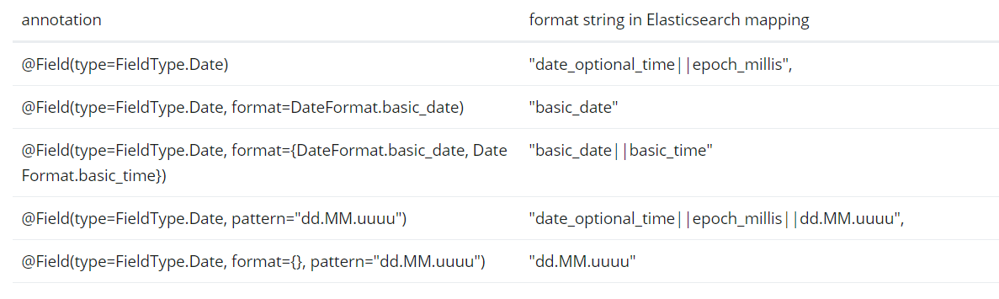

### Object Mapping

Java 객체(DomainEntity)를 Elasticsearch에 저장된 JSON 타입의 데이터에 매핑하고, 또 그 반대로 매핑하는 방법.

https://www.devkuma.com/docs/elasticsearch/intro/

## Meta Model Object Mapping (메타 모델 객체 매핑)

메타모델(Metamodel) 기반 접근 방식은 Elasticsearch와의 데이터 읽기/쓰기를 위해 도메인 유형 정보를 사용한다.

이는 특정 도메인 유형 매핑을 위해 <u>Converter</u> 인스턴스를 등록하는 것을 허용한다.

### 1. Mapping Annotation Overview (매핑 주석 개요)

MappingElasticsearchConverter는 메타데이터를 사용하여 객체를 문서로 매핑한다.

이 메타데이터는 Entity의 속성에서 가져오며, 이를 위해 다양한 주석을 사용할 수 있다.

1. **@Document**: 클래스 수준에서 사용되며 해당 클래스가 데이터베이스에 매핑될 후보임을 나타낸다.
2. **@Id**: 필드 레벨에서 사용되며 식별 목적으로 사용되는 필드를 표시한다.
3. **@Transient, @ReadOnlyProperty, @WriteOnlyProperty**: 속성이 Elasticsearch에 쓰여지거나 읽혀지는 방식을 제어하기 위한 주석이다.
4. **@PersistenceConstructor**: 특정 생성자를 표시하여 데이터베이스에서 객체를 인스턴스화할 때 사용된다.
5. **@Field**: 필드 레벨에서 사용되며 Elasticsearch 문서에서 필드의 속성을 정의한다.
6. **@GeoPoint**: 필드를 geo\_point 데이터 타입으로 표시한다.
7. **@ValueConverter**: 주어진 속성을 변환하는데 사용될 클래스를 정의한다.

> 이러한 주석을 사용하여 Elasticsearch에 대한 매핑 및 동작을 세밀하게 제어할 수 있다.

**Date format mapping**

날짜 형식을 매핑하기 위한 방법.



**Range Types**

@Field 어노테이션의 type을 ~\_Range 유형으로 지정한 경우, 해당 필드는 Elasticsearch Range에 매핑될 클래스의 인스턴스여야 한다.

```java
class SomePersonData {
    @Field(type = FieldType.Integer_Range)
    private ValidAge validAge;
    
    //대안으로 Range<T> 클래스를 사용할 수 있다.
    @Field(type = FieldType.Integer_Range)
    private Range<Integer> validAge2;
}

class ValidAge {
    @Field(name="gte")
    private Integer from;

    @Field(name="lte")
    private Integer to;
}
```

**Non-Field-Backed Properties (필드를 백업하지 않는 속성)**

일반적으로 Entity에서 사용되는 속성은 Entity 클래스의 Field이다. 하지만 속성 값이 Entity에서 계산되고 Elasticsearch에 저장되어야 하는 경우가 있다.

이 경우 getter 메서드에 @Field 주석을 사용할 수 있다.

```java
@Field(type = Keyword)
@WriteOnlyProperty
@AccessType(AccessType.Type.PROPERTY)
public String getProperty() {
	return "some value that is calculated here";
}
```

> @IndexedIndexName: 엔티티의 String 속성에 설정할 수 있다. 해당 어노테이션을 달은 속성은 읽기, 쓰기, 저장 되지 않는다.

---

### 2. Mapping Rules (매핑 규칙)

**Type Hints (힌트 입력)**

Mapping은 서버로 전송된 문서에 내장된 타입 힌트를 사용하여 일반적인 타입 매핑을 허용한다.

이러한 type hints는 문서 내에서 *\_class* 속성으로 표현되며, 각 집계 루트에 대해 작성된다.

```java
public class Person {
  @Id String id;
  String firstname;
  String lastname;
}

// --- JSON ---
{
  "_class" : "com.example.Person",
  "id" : "cb7bef",
  "firstname" : "Sarah",
  "lastname" : "Connor"
}

// TypeAlias로 _class의 별칭을 지정할 수 있다. 
@TypeAlias("human")
public class Person {

  @Id String id;
  // ...
}
```

> Elasticsearch 인덱스에 이미 존재하거나 해당 매핑에 type hints가 정의되어 있지 않은 경우에 type hints를 사용하지 않도록 비활성화할 필요가 있을 수 있다.
> <u>writeTypeHints()</u> 메서드를 override하여 비활성화 할 수 있지만 대안으로 @Document 주석을 사용할 수 있다.

```
@Document(indexName = "index", writeTypeHint = WriteTypeHint.FALSE)
```

> Spring Data Elasticsearch는 다양한 형상에 대한 인터페이스와 구현을 제공한다.

**Geospatial Types (지리공간 유형)**

Point, GeoPoint 와 같은 지리공간 유형은 위도(lat) / 경도(lon) 쌍으로 변환된다.

```java
public class Address {
  String city, street;
  Point location;
}

// --- JSON ----
{
  "city" : "Los Angeles",
  "street" : "2800 East Observatory Road",
  "location" : { "lat" : 34.118347, "lon" : -118.3026284 }
}
```

**GeoJson Type**

city, street, location 등 주소 정보로 변환된다.

```java
public class Address {
  String city, street;
  GeoJsonPoint location;
}

// --- JSON ---
{
  "city": "Los Angeles",
  "street": "2800 East Observatory Road",
  "location": {
    "type": "Point",
    "coordinates": [-118.3026284, 34.118347]
  }
}
```

**Collection (컬렉션)**

컬렉션의 경우 집계 루트와 동일한 매핑 규칙을 적용한다.

```java
public class Person {
  List<Person> friends;
}

// --- JSON ---
{
  "friends" : [ { "firstname" : "Kyle", "lastname" : "Reese" } ]
}
```

**Map (지도)**

지도의 경우 집계 루트와 동일한 매핑 규칙을 적용한다.

```java
public class Person {
  Map<String, Address> knownLocations;
}

// --- JSON --- 
{
  "knownLocations" : {
    "arrivedAt" : {
       "city" : "Los Angeles",
       "street" : "2800 East Observatory Road",
       "location" : { "lat" : 34.118347, "lon" : -118.3026284 }
     }
  }
}
```

---

### 3. Custom Conversions (커스텀 변환)

Elasticsearch Custom Converstions를 사용하면 데이터 매핑(변환) 방법을 사용자 정의할 수 있다.

```java
@Configuration
public class Config extends ElasticsearchConfiguration  {
	@NonNull
	@Override
	public ClientConfiguration clientConfiguration() {
		return ClientConfiguration.builder() //
				.connectedTo("localhost:9200") //
				.build();
	}

// ElasticsearchCustomConverstions 오버라이드
  @Bean
  @Override
  public ElasticsearchCustomConversions elasticsearchCustomConversions() {
    return new ElasticsearchCustomConversions(
      Arrays.asList(new AddressToMap(), new MapToAddress()));
  }

// 쓰기(write)에 사용되는 항목 설정
  @WritingConverter
  static class AddressToMap implements Converter<Address, Map<String, Object>> {
    @Override
    public Map<String, Object> convert(Address source) {
      LinkedHashMap<String, Object> target = new LinkedHashMap<>();
      target.put("ciudad", source.getCity());
      return target;
    }
  }

// 읽기(read)에 사용되는 항목 설정
  @ReadingConverter
  static class MapToAddress implements Converter<Map<String, Object>, Address> {
    @Override
    public Address convert(Map<String, Object> source) {
      String city = (String) source.get("ciudad");
      return new Address(city);
    }
  }
}

// --- JSON ---
{
  "ciudad" : "Los Angeles"
}
```

- 끝 -

reference.

[https://docs.spring.io/spring-data/elasticsearch/reference/elasticsearch/object-mapping.html](https://docs.spring.io/spring-data/elasticsearch/reference/elasticsearch/object-mapping.html)
