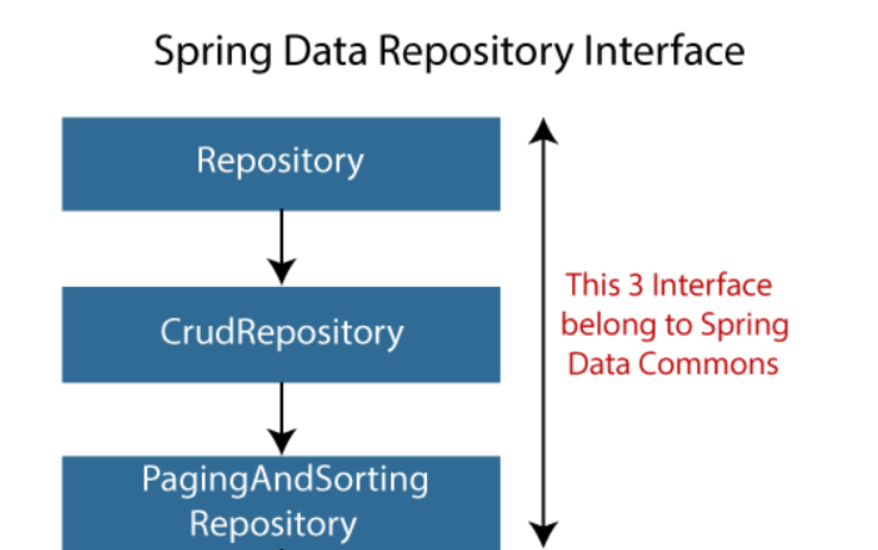

### Data Repositories

Spring Data Repository의 기본과 Elasticsearch 세부 사항 설명.



#### [1. 핵심 개념 (feat. Entity 상태 감지 전략)](https://docs.spring.io/spring-data/elasticsearch/reference/repositories.html)

Spring Data의 Repository는 인터페이스만 정의하면 구현체를 직접 안 만들어도 CRUD가 동작하는 게 핵심이다. `save()`를 호출했을 때 insert를 할지 update를 할지는, Entity가 "새로운 객체인지"를 판단하는 전략에 달려있다.

- `@Id` 필드가 `null`이면 새 객체로 보고 insert.
- `@Version` 필드가 있는 경우, 그 값이 0이거나 null이면 새 객체로 판단.
- `Persistable` 인터페이스를 직접 구현해서 `isNew()` 로직을 커스터마이징할 수도 있다.

#### [2. Repository Interface 정의](https://docs.spring.io/spring-data/elasticsearch/reference/repositories/definition.html)

```java
public interface MemberRepository extends ElasticsearchRepository<Member, String> {
}
```

- `ElasticsearchRepository<T, ID>`를 상속하는 순간 `save()`, `findById()`, `findAll()`, `deleteById()` 같은 기본 CRUD가 전부 자동으로 생긴다.
- 필요하면 `Repository`, `CrudRepository` 같은 더 상위/하위 인터페이스로 세밀하게 범위를 조정(fine-tuning)할 수 있다.

#### [3. Elasticsearch Repositories](https://docs.spring.io/spring-data/elasticsearch/reference/elasticsearch/repositories/elasticsearch-repositories.html)

Entity 클래스에는 `@Document`로 인덱스를 지정하고, 필드에는 `@Field`로 매핑 타입을 지정한다.

```java
@Document(indexName = "member")
public class Member {
    @Id
    private String id;

    @Field(type = FieldType.Text)
    private String name;
}
```

#### [4. Reactive Elasticsearch Repository (반응형)](https://docs.spring.io/spring-data/elasticsearch/reference/elasticsearch/repositories/reactive-elasticsearch-repositories.html)

WebFlux 기반 프로젝트에서는 `ReactiveElasticsearchRepository`를 상속하면 `Mono`/`Flux`를 반환하는 non-blocking 저장소를 쓸 수 있다. 설정은 일반 Repository와 거의 같고, 반환 타입만 리액티브 타입으로 바뀐다고 보면 된다.

#### [5. Repository Instances 생성 (Instance & Bean)](https://docs.spring.io/spring-data/elasticsearch/reference/repositories/create-instances.html)

`@EnableElasticsearchRepositories`를 Java Config 클래스에 붙이면 해당 패키지 하위의 Repository 인터페이스들이 자동으로 빈으로 등록된다. XML 기반 설정도 가능하지만, 실무에서는 대부분 Java Config + 애너테이션 방식을 쓴다.

#### [6~7. Query Method 정의 / Query Methods](https://docs.spring.io/spring-data/elasticsearch/reference/elasticsearch/repositories/elasticsearch-repository-queries.html)

메서드 이름 규칙으로 쿼리를 자동 생성하거나, `@Query`로 직접 DSL을 지정할 수 있다.

```java
public interface MemberRepository extends ElasticsearchRepository<Member, String> {

    // 메서드 이름으로 쿼리 자동 생성
    List<Member> findByName(String name);

    // 필요하면 Elasticsearch DSL을 직접 작성
    @Query("{\"match\": {\"name\": \"?0\"}}")
    List<Member> searchByName(String name);
}
```

- 반환 타입은 `List<T>`, `Optional<T>`, 페이징이 필요하면 `Page<T>`/`Slice<T>`까지 지원한다.

#### [8. Projections (투영)](https://docs.spring.io/spring-data/elasticsearch/reference/repositories/projections.html)

Entity 전체가 아니라 일부 필드만 조회하고 싶을 때 쓴다.

```java
public interface MemberNameOnly {
    String getName(); // Interface 기반 Projection: 필요한 getter만 선언
}

public interface MemberRepository extends ElasticsearchRepository<Member, String> {
    List<MemberNameOnly> findByName(String name);
}
```

인터페이스 기반 외에도, DTO 클래스를 그대로 반환 타입으로 쓰는 **Class 기반 Projection**, 호출 시점에 반환 타입을 파라미터로 넘기는 **Dynamic Projection**도 지원한다.

#### [9. Custom Repository 구현](https://docs.spring.io/spring-data/elasticsearch/reference/repositories/custom-implementations.html)

메서드 이름 규칙만으로 표현이 안 되는 복잡한 쿼리는, 커스텀 인터페이스 + 구현체를 따로 만들어서 기존 Repository에 끼워넣을 수 있다.

```java
public interface MemberRepositoryCustom {
    List<Member> searchComplex(String keyword);
}

public class MemberRepositoryImpl implements MemberRepositoryCustom {
    // ElasticsearchOperations 등을 직접 써서 복잡한 쿼리 구현
}

public interface MemberRepository extends ElasticsearchRepository<Member, String>, MemberRepositoryCustom {
}
```

- 구현체 클래스 이름을 `{Repository이름}Impl`로 맞춰야 Spring Data가 자동으로 인식해서 조립해준다.

#### [10. Aggregate(집계) Root 이벤트](https://docs.spring.io/spring-data/elasticsearch/reference/repositories/core-domain-events.html)

Repository가 `save()`, `delete()` 등을 수행할 때 `@DomainEvents`로 표시된 메서드를 통해 도메인 이벤트를 발행하고, 저장이 끝나면 `@AfterDomainEventPublication`으로 이벤트 목록을 비워줄 수 있다.

#### [11. Repository Method의 Null 처리](https://docs.spring.io/spring-data/elasticsearch/reference/repositories/null-handling.html)

`findById()`처럼 결과가 없을 수 있는 메서드는 기본적으로 `Optional<T>`을 반환하도록 정의하는 게 안전하다. `@Nullable`, `@NonNull` 애너테이션으로 파라미터/반환값의 null 허용 여부를 명시적으로 표시할 수도 있다.

#### [12. CDI (Contexts and Dependency Injection) 통합](https://docs.spring.io/spring-data/elasticsearch/reference/elasticsearch/repositories/cdi-integration.html)

Spring 컨테이너 대신 CDI 환경(Jakarta EE 등)에서도 Repository를 빈으로 등록해 쓸 수 있게 지원한다. Spring Boot 프로젝트에서는 거의 쓸 일이 없다.

#### [13. Repository Query 키워드](https://docs.spring.io/spring-data/elasticsearch/reference/repositories/query-keywords-reference.html)

`findBy`, `And`, `Or`, `Between`, `LessThan`, `Like`, `OrderBy` 등 메서드 이름에 쓸 수 있는 예약 키워드 목록. JPA의 Query Method 키워드와 상당 부분 겹친다.

#### [14. Repository Query 반환 타입](https://docs.spring.io/spring-data/elasticsearch/reference/repositories/query-return-types-reference.html)

`List`, `Optional`, `Page`, `Slice`, `Stream`까지 메서드 반환 타입으로 지정할 수 있고, 상황에 맞게 골라 쓰면 된다. 대량 데이터를 스트리밍으로 처리해야 한다면 `Stream<T>`을, 페이지네이션 UI가 필요하다면 `Page<T>`를 쓰는 식이다.

*- 끝 -*

reference.

[https://docs.spring.io/spring-data/elasticsearch/reference/repositories.html](https://docs.spring.io/spring-data/elasticsearch/reference/repositories.html)
