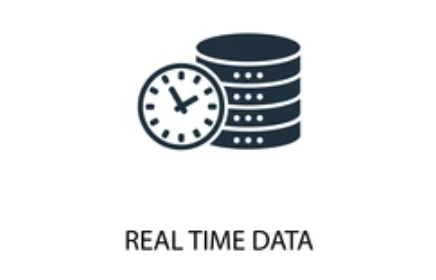
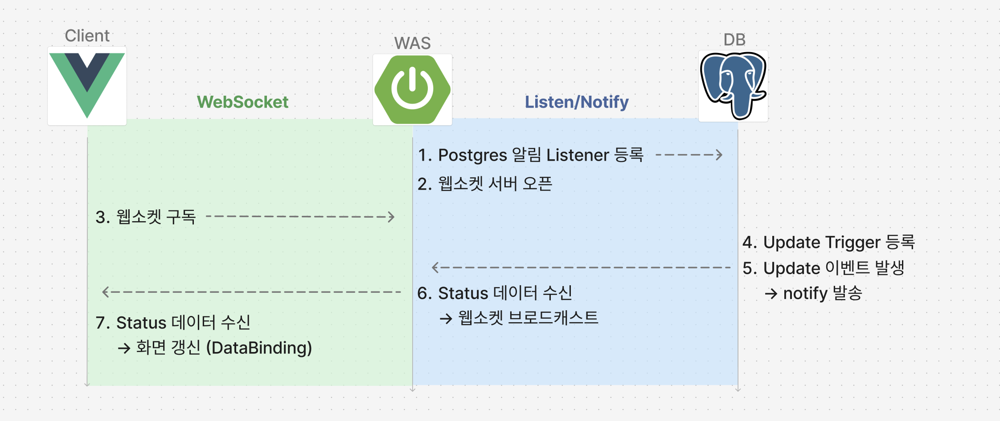

> 사용자에게 실시간 정보를 제공하기 위해서는 어떤 방법들이 있을까?



시간에 따라 데이터가 빠르게 변화하는 현대 사회에서는 다양한 분야에서 최신 데이터를 빠르게 확인하는 것이 매우 중요해졌다. 주식 거래, 채팅, 금융 서비스 등의 서비스에서 데이터 갱신은 꼭 필요한 기능이며, 구현 방식에 따라 사용자 경험에 많은 영향을 끼칠 수 있다.

사용자가 데이터의 변경사항을 최대한 빠르게 확인할 수 있는것이 가장 좋겠지만.. 무조건 실시간으로 빨리 처리하는게 좋다고 할 수는 없다. 서비스 유형에 따라 약간의 지연도 있으면 안되는 주식 거래 같은 기능일 수도 있고, 어느정도의 데이터 지연은 감수할 수 있지만 시스템 리소스가 더 중요한 기능일 수도 있기 때문이다.

데이터 지연 시간과 처리 방법에 따라 **실시간(Real time), 준실시간(Near real time), 서버 푸쉬(Push), 폴링(Polling)** 4가지 방법으로 나눠볼 수 있다.

| **구분** | **트리거 주체** | **구현 방식** | **지연 시간** | **주요 특징** | **서비스 유형** |
| --- | --- | --- | --- | --- | --- |
| **실시간** | 이벤트 (서버/클라이언트) | WebSocket, TCP Socket, MQTT 등 | 수 ms ~ 수백 ms | - 즉시 반응 필요 - 고빈도 이벤트 처리 - 복잡한 구현 | 실시간 채팅, 주식 매매, 온라인 게임, 원격 제어 |
| **준실시간** | 서버 스케줄러 | @Scheduled + WebSocket 등 | 수 초 (1~10초) | - 주기 기반 - 실시간 수준 체감 - 구현 간단 | IoT 모니터링, 시스템 대시보드, 로그 알림 |
| **서버 푸시** | 이벤트 (서버) | WebSocket, SSE, Pusher 등 | 수 ms ~ 수 초 | - 이벤트 기반 - 불필요한 요청 없음 - 효율적 | 실시간 알림, 채팅 수신, Firebase Realtime DB |
| **폴링** | 클라이언트 | setInterval, Ajax 등 | 요청 주기 | - 단순 구현 - 서버 부하 발생 - 실시간성 낮음 | 새 알림 확인, 채팅방 메시지 새로 고침, 상태 확인 UI |

제공하고자 하는 서비스의 유형에 따라 적합한 처리 방식을 선택하는 것이 중요할 것 같다.

## 데이터 갱신 주요 기술

**WebSocket**

<u>클라이언트와 서버 간 양방향 실시간 통신</u>을 지원하는 프로토콜로 초기 HTTP 연결 후 TCP로 업그레이드하여 지속적인 데이터 송수신이 가능하다.

장점: TCP 연결을 통한 안정적인 통신

단점: Socket 연결을 유지하기 위한 리소스 사용 및 구현 복잡

**SSE(Server-Sent Event)**

서버가 클라이언트로 <u>단방향 실시간 데이터 전송</u>을 할 수 있는 HTTP 기반 기술이다.

장점: WebSocket에 비해 간단한 구현

단점: IE 지원 불가

**Interval**

JavaScript에서 <u>일정 간격으로 서버에 반복적으로 요청</u>을 보내는 방식이다. (폴링 기반)

장점: javascript 고유 기능으로 간단한 구현

단점: 반복적인 Http 요청으로 시스템 리소스 사용

## 상황에 따른 구현 방법

데이터를 갱신하기 위한 다양한 기술과 구현 방법들이 있지만 현재 개발중인 서비스에서는 화면에서 특정 모듈의 상태를 표시하여 모듈이 사용 가능한 상태인지 사용자가 확인할 수 있도록 하기 위해 화면의 데이터 갱신이 필요하였기 때문에 *준실시간 / 서버푸쉬* 방식으로 처리하는 것이 효율적이라고 판단했다.

> 리소스 사용을 최소화하기 위해 Interval을 제외하고, SSE는 IE를 지원하지 않는 문제로 **WebSocket** 사용이 적합하였다.

모듈의 상태가 변경될 때 데이터베이스의 특정 테이블에 모듈의 동작 내역을 기록하는 데이터가 Insert(Update) 되는데 이 시점에 웹서비스에 접속중인 사용자의 화면에서 모듈의 상태를 갱신해주기 위해 <u>WebSocket과 PostgreSQL의 Trigger, Listen/Notify 기능을 활용</u>하여 구현할 수 있다.

## WebSocket과 Trigger(notify)를 활용한 준실시간 처리

> Vue.js + Spring + Postgres 아키텍처를 사용하는 경우 활용할 수 있는 데이터 갱신 방법이다.



1. Spring(WAS)**: PostgreSQL Listener 등록**

```
stmt.execute("LISTEN data_channel");
while (true) {
  PGNotification[] notifs = pgConn.getNotifications(1000);
  if (notifs != null)
    messagingTemplate.convertAndSend("/topic/data-update", notifs[0].getParameter());
}
```

- Spring 애플리케이션이 실행되면 PostgreSQL 커넥션을 통해 LISTEN some\_channel 등록.
- PostgreSQL에서 NOTIFY some\_channel, 'payload'가 발생하면 Spring이 이벤트를 수신할 수 있다.

2. Spring(WAS)**: WebSocket (STOMP) 서버 오픈**

```java
@EnableWebSocketMessageBroker
public class WebSocketConfig implements WebSocketMessageBrokerConfigurer {
  public void registerStompEndpoints(StompEndpointRegistry r) {
    r.addEndpoint("/ws").withSockJS();
  }
  public void configureMessageBroker(MessageBrokerRegistry c) {
    c.enableSimpleBroker("/topic"); c.setApplicationDestinationPrefixes("/app");
  }
}
```

- Spring에서 @EnableWebSocketMessageBroker를 사용하여 STOMP 기반 WebSocket 서버 활성화.
- 클라이언트는 SockJS를 통해 서버와 연결한다.

3. Vue.js(Client)**: WebSocket 구독**

```
const socket = new SockJS("http://localhost:8080/ws");
const stomp = Stomp.over(socket);
stomp.connect({}, () =>
  stomp.subscribe("/topic/data-update", msg => console.log(msg.body))
);
```

- Vue.js 앱에서는 SockJS + Stomp.js 라이브러리를 사용해 서버에 연결.
- 특정 토픽(/topic/data-update)을 구독하여 데이터 변경 이벤트를 기다린다.

4. PostgreSQL**: Trigger 등록**

- 데이터 변경(UPDATE) 발생 시 NOTIFY를 실행하는 Trigger 생성.
- 예:

```
CREATE OR REPLACE FUNCTION notify_data_change() 
RETURNS trigger AS $$ 
  BEGIN PERFORM pg_notify('data_channel', 'changed'); 
  RETURN NEW; 
END; 
$$ LANGUAGE plpgsql; 

CREATE TRIGGER data_change_trigger 
AFTER UPDATE ON your_table 
FOR EACH ROW 
EXECUTE FUNCTION notify_data_change();
```

5. PostgreSQL**: UPDATE 이벤트 발생 시 NOTIFY 발송**

```sql
-- 트리거가 실행되면 자동으로 NOTIFY 발송됨
UPDATE your_table SET column1 = 'new_value' WHERE id = 1;
-- 실행 결과 → pg_notify('data_channel','changed') 발생
```

- 테이블의 데이터가 변경되면 Trigger가 실행되어 NOTIFY data\_channel 이벤트 발생.

6. Spring(WAS)**: Listener가 알림 수신 → WebSocket 브로드캐스트**

```
// Listener 내부에서 실행되는 핵심 부분
PGNotification[] notifs = pgConn.getNotifications(1000);
if (notifs != null) {
  messagingTemplate.convertAndSend("/topic/data-update", notifs[0].getParameter());
}
```

- Spring의 백그라운드 스레드가 NOTIFY 메시지 수신.
- 수신 즉시, STOMP를 통해 /topic/data-update 구독자(모든 연결된 클라이언트)에게 메시지를 브로드캐스트한다.

7. Vue.js(Client)**: 메시지 수신 → 컴포넌트 갱신 & 화면 업데이트**

```
stomp.subscribe("/topic/data-update", msg => {
  this.dataList.push(msg.body);   // 상태 갱신
  // Vue의 반응형 시스템에 의해 화면 자동 업데이트
});
```

- 클라이언트(Vue.js)는 STOMP 메시지를 수신하면 컴포넌트 상태 갱신.
- Vue의 <u>반응형 시스템(Reactivity)</u> 덕분에 화면은 자동으로 최신 상태로 렌더링된다.

## 실시간 처리 기대 효과

- **실시간성 보장**: DB 변경 → 즉시 클라이언트 반영
- **효율성**: 폴링(Polling) 방식 대비 불필요한 DB 부하 감소
- **확장성**: STOMP를 통해 여러 클라이언트에게 손쉽게 브로드캐스팅 가능
- **사용자 경험(UX) 개선**: 새로고침 없이 데이터 변경사항 확인 가능

> 이런 구조는 Kafka 메시지큐를 사용해서 처리할 수도 있고,, 알림(Notification) 시스템, 대시보드, 실시간 모니터링 화면 등에 활용하기 적합하다.
