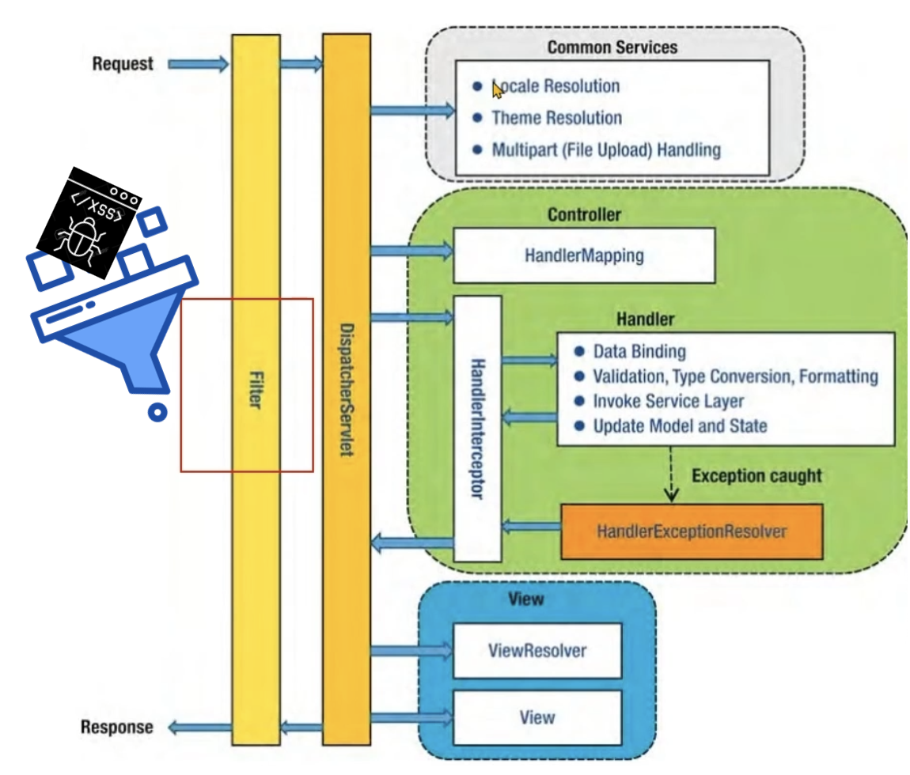
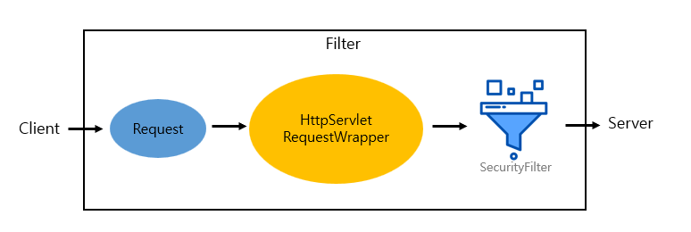

> Servlet Filter를 등록하여 서버로의 HTTP 요청(request)에 대한 XSS 필터링 적용

#### XSS란?

교차 사이트 스크립팅(XSS, Cross-Site Scripting)은 웹 애플리케이션 보안 취약점 중 하나로, 공격자가 악성 스크립트를 다른 사용자의 브라우저에서 실행하도록 만드는 공격 기법이다. 주로 웹 페이지에서 사용자 입력을 제대로 검증하지 않거나 필터링하지 않을 때 발생한다.

> XSS 공격은 사용자의 세션 쿠키, 개인 정보, 인증서 등을 탈취하거나, 악성 사이트로 리디렉션하거나, 피싱 공격을 수행할 수 있다.

그럼 XSS 공격을 막기 위해 어떻게 해야 할까?

XSS는 주요 정보(session, cookie, 개인정보) 탈취, 사용자 리다이렉션, 사이트 조작 등 다양한 공격 방법이 있지만 결국은 <u>악성 스크립트를 삽입</u>하여 실행시키는 것이다. 즉, 악성 스크립트를 막거나 치환하는 등 사용자의 요청에 대한 Filtering을 해주면 쉽게 막을 수 있다.

## Spring Servlet Filter

Spring Framework에서 제공하는 기능으로, 웹 애플리케이션의 HTTP 요청과 응답을 가로채어 처리하는 인터셉터이다.



### 구현 방법

1. 모든 HTTP 요청이 Filter를 거쳐 DispatcherServlet으로 전달될 수 있도록 ServletFilter(doFilter)를 등록
2. HttpServletRequestWrapper를 상속받아 HttpServletRequest를 조작할 수 있는 메서드 오버라이딩
3. HttpservletRequest에 대한 XSS 필터링 수행

### Filtering 흐름

XSS는 환경에 따라 Front에서 필터링 해도 되고 Back에서 필터링 해도 되지만 Spring의 doFilter와 HttpServletRequestWrapper 클래스를 활용해서 필터링 하는 방법을 사용했다.



### 코드 작성 및 설명

#### ApiFilter

- Filter 인터페이스를 상속받아 doFilter 메서드를 구현하여 필터링을 수행할 수 있도록 한다.
- ServletRequest를 잡아서 HttpServletRequest 타입으로 변환(casting)한 다음 XSSRequestWrapper 타입으로 래핑하여 XSSRequestWrapper 클래스의 메서드를 사용할 수 있도록 한다.

```java
@Service("ApiFilter")
public class ApiFilter implements Filter {

	@Override
	public void doFilter(ServletRequest request, ServletResponse response, FilterChain chain) throws IOException, ServletException {
		HttpServletRequest httpRequest = (HttpServletRequest)request;

		// XSS 필터링 적용
		HttpServletRequest xssRequestWrapper = new XSSRequestWrapper(httpRequest);
	        chain.doFilter(xssRequestWrapper, response);
	}
}
```

#### XSSRequestWrapper

- HttpServletRequest를 감싸주는 HttpServletRequestWrapper을 상속받아 getParameter(Header) 메서드가 호출될 때 SecurityFilter.cleanXSS() 메서드를 호출하도록 오버라이딩 한다.
- HttpServletRequestWrapper 클래스는 HttpServletRequest 인터페이스를 구현하는 클래스를 확장할 때 사용하며, Servlet의 요청 객체를 래핑(wrapping)하여 요청 데이터를 변환하거나 추가적인 기능을 제공할 수 있다.

```java
public class XSSRequestWrapper extends HttpServletRequestWrapper {

    public XSSRequestWrapper(HttpServletRequest request) {
        super(request);
    }

    @Override
    public String getParameter(String name) {
        String value = super.getParameter(name);
        return SecurityFilter.cleanXSS(value);
    }

    @Override
    public String[] getParameterValues(String name) {
        String[] values = super.getParameterValues(name);
        if (values != null) {
            int count = values.length;
            String[] encodedValues = new String[count];
            for (int i = 0; i < count; i++) {
                encodedValues[i] = SecurityFilter.cleanXSS(values[i]);
            }
            return encodedValues;
        }
        return super.getParameterValues(name);
    }

    @Override
    public String getHeader(String name) {
        String value = super.getHeader(name);
        return SecurityFilter.cleanXSS(value);
    }
}
```

#### SecurityFilter

- XSS 공격 문자를 다른 문자로 치환하여 반환한다.

```java
public class SecurityFilter {

	// XSS Filtering
	public static String cleanXSS(String value) {
		if (value != null) {
			value = value.replaceAll("<", "&lt;").replaceAll(">", "&gt;");
			value = value.replaceAll("\\(", "&#40;").replaceAll("\\)", "&#41;");
			value = value.replaceAll("'", "&#39;");
			value = value.replaceAll("eval\\((.*)\\)", "");
			value = value.replaceAll("[\\\"\\\'][\\s]*javascript:(.*)[\\\"\\\']", "\"\"");
			value = value.replaceAll("script", "");
		}
		return value;
	}
    
    // XSS 외 CRLF 등 Filter ~ 	
}
```

#### FilterConfig

- FilterRegistrationBean으로 ApiFilter를 등록

```java
@Configuration
public class FilterConfig {

    @Bean
    public FilterRegistrationBean xssFilterRegistration() {
        FilterRegistrationBean registrationBean = new FilterRegistrationBean();
        registrationBean.setFilter(new ApiFilter());
        registrationBean.addUrlPatterns("/*");
        registrationBean.setName("ApiFilter");
        registrationBean.setOrder(1);
        return registrationBean;
    }
}
```

*- 끝 -*
