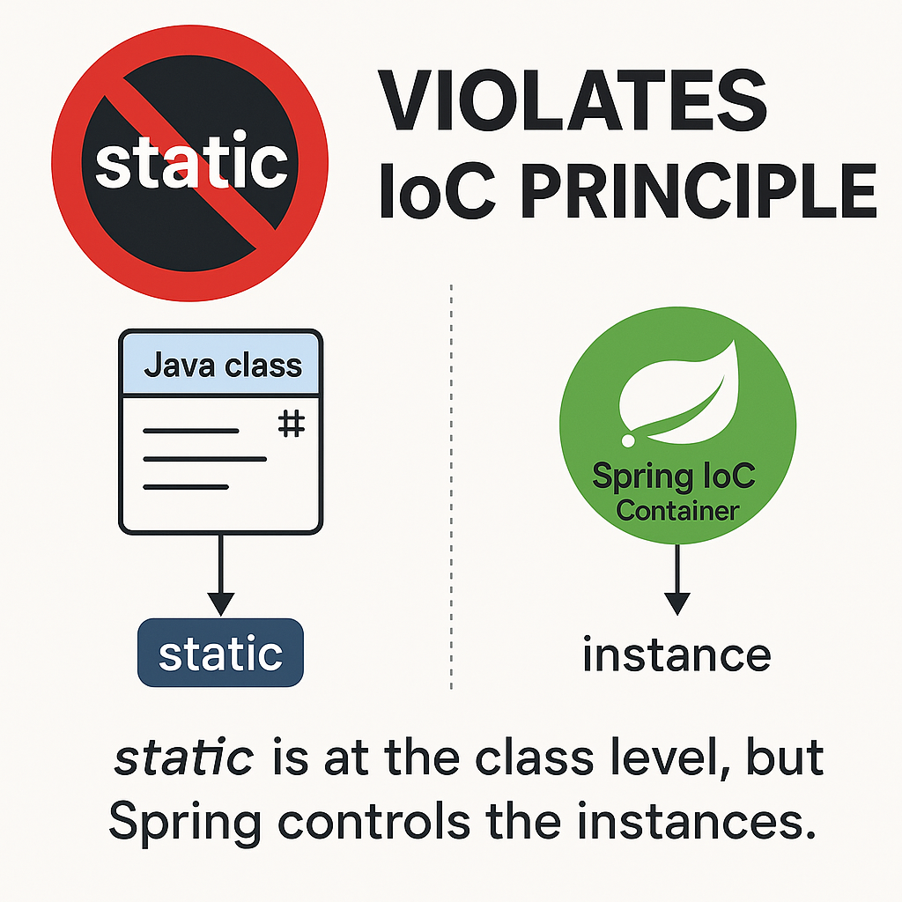

## **Spring에서 static 키워드를 지양해야 하는 이유**

Java를 사용할 때 static 키워드는 클래스 레벨에서 공유되는 변수 또는 메서드를 정의할 때 자주 사용된다. 대표적으로 static 메서드는 객체 생성 없이 호출할 수 있고, static 변수는 클래스 로딩 시 메모리에 올라가 하나의 값만을 공유하게 된다.

하지만 Spring Framework에서는 이러한 static 사용이 <u>프레임워크의 철학 및 동작 방식과 충돌</u>하며, 불필요하거나 문제가 될 수 있다.



**1. Spring은 IoC 기반 프레임워크**

• 객체 생성, 생명주기 관리, 의존성 연결 등을 <u>개발자가 아닌 Spring 컨테이너가 제어</u>한다.

• 즉, 객체 인스턴스는 컨테이너가 주입하고 관리해야 하며, 필요한 구성은 모두 빈 단위로 주입 가능한 형태여야 한다.

**2. static은 클래스 자체가 제어 주체가 됨**

• static 필드나 메서드는 객체 인스턴스와 무관하게 <u>클래스 로딩 시점</u>에 메모리에 올라간다.

• 이는 Spring이 개입하거나 제어할 수 없기 때문에, IoC의 통제를 벗어난 구조가 된다.

> 즉, Spring은 인스턴스 단위의 제어를 기본으로 하고, static은 클래스 단위의 제어이므로 철학과 구조가 충돌한다.

---

### **1. Spring Bean은 싱글톤으로 관리된다?**

Spring에서는 기본적으로 Bean이 싱글톤 범위 @Scope("singleton")로 관리된다. 즉, 서비스 클래스의 인스턴스는 애플리케이션 시작 시 한 번 생성되며, 그 인스턴스를 모든 요청에서 공유하게 된다.

```java
@Service
public class MyService {
    private final Map<String, Object> cache = new ConcurrentHashMap<>();
}
```

처럼 클래스 내 인스턴스 필드를 사용해도, 이는 사실상 애플리케이션 전체에서 공유되는 상태로 작동한다.

굳이 <u>static으로 선언하지 않아도 캐시 등 공유 상태 관리</u>가 가능하다.

---

### **2. `static`은 의존성 주입(Dependency Injection)에 제약을 준다 ⚠️**

Spring은 <u>의존성 주입(DI)</u> 을 통해 객체 간의 결합도를 낮추고 유연한 아키텍처를 제공한다.

하지만 static 필드는 클래스 로딩 시점에 초기화되므로 Spring의 라이프사이클과 맞지 않아 다음과 같은 의존성 주입이 불가능하다.

```java
// 값 주입 불가
@Value("${custom.value}")
private static String configValue;
// 의존성 주입 불가
@Autowired
private static SomeDependency someDependency;
```

이러한 경우 NullPointerException 혹은 주입되지 않은 상태로 운영 중 예외가 발생할 수 있다.

<u>Spring의 DI 컨테이너와 static은 근본적으로 상호 운용이 어렵다.</u>

---

### **3. 테스트 및 확장성에 불리하다?**

static 필드나 메서드는 전역 상태를 가지므로 <u>단위 테스트에서 상태 격리가 어렵고</u>, 테스트 간 side effect가 발생할 수 있다.

또한 @MockBean, @SpyBean 등을 통한 주입도 어렵기 때문에 <u>확장성과 테스트 가능성(Testability)</u> 이 크게 저하된다.

---

### **4. 공식 권장 사항: `static` 사용 자제?**

Spring 공식 문서에서도 직접적으로 “static을 사용하지 말라”고 표현하지는 않지만, 다음과 같은 원칙을 강조한다.

> Spring은 객체 지향 기반 설계를 전제로 한 프레임워크이며, 객체 간의 관계를 IoC 컨테이너를 통해 구성한다.
> 정적 접근 방식보다 의존성 주입을 통한 유연한 구조가 권장된다.

즉, static을 사용한 전역 접근 방식은 Spring의 핵심 철학인 **IoC(Inversion of Control)**, **DI(Dependency Injection)** 과 어긋난다.

---

### **결론: Spring에서는 static 대신 DI와 Bean의 특성을 활용하자 ✅**

| **구분** | **static 사용** | **Spring Bean 사용** |
| --- | --- | --- |
| 라이프사이클 | JVM 클래스 로딩 시점 | Spring Context 시작 시 |
| 주입 가능 여부 | 불가능 | @Autowired, @Value 등 가능 |
| 테스트 용이성 | 낮음 | 높음 (@MockBean, @SpyBean) |
| 공유 상태 관리 | 가능 | 가능 (싱글톤 특성 이용) |

Spring에서는 객체 중심의 설계가 기본이며, 전역 상태를 관리하고 싶다면 Spring Bean 싱글톤 범위, ApplicationContext, 캐시 컴포넌트(ex. @Cacheable), 스레드로컬 등의 방법을 고려하는 것이 적절하다.

**상수** 정의나 **공용 유틸리티 메서드**처럼 <u>상태를 저장하지 않고 객체 주입이 필요 없는 경우</u>에는 static 사용이 가능하다.

> Spring에서 static을 사용하지 않아도 Bean 간 상태 공유가 가능하다는 점을 잘 이해하면 유용하게 사용할 수 있다.
> 특히 Map<String, Object> 같은 자료구조를 서비스 클래스 내부에서 필드로 선언하고 애플리케이션 전반에 걸쳐 캐시처럼 사용할 수 있다는 점은 Spring의 싱글톤 Bean 특성을 잘 보여주는 사례이다.
