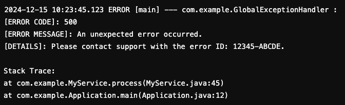
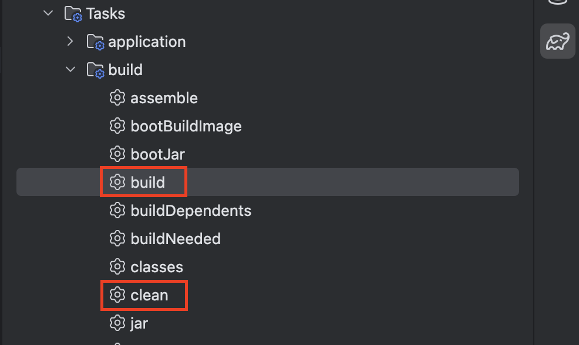
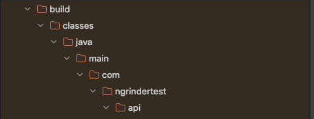

> WAS에서 에러가 발생하는데 GlobalException으로 잡히거나 Elastic의 HighLevel 클라이언트를 쓰는 경우 정확한 에러 파악이 어려울 수 있다



서버에서 발생한 에러 로그를 보고 파악하는 것이 가장 빠르고 간단한 방법이지만 에러 로그만으로 파악이 어려운 상황이 많고, 서버와의 환경이 달라 로컬(IDE)에서는 에러가 재현되지 않는 경우도 있다.

### 서버 에러 확인 방법

1. 에러가 발생하는 메서드의 에러 처리 (try/catch)를 제거한다.

```
try {}
catch(Exception e) {}
```

2. log.info()로 에러 발생이 의심되는 (Http 호출 등) 지점들에 로그를 찍는다

```
log.info("호출 전 카운트 값 : {}", count);
// 에러 의심 지점
log.info("호출 후 카운트 값 : {}", count);
```

3. 로그 레벨을 DEBUG로 변경한다.

```html
<!-- Application Loggers -->
<logger name="kr.co.app">
<level value="debug" />
</logger>
```

*Ex) C:\Users\USER\IdeaProjects\app\src\main\resources\log4j.xml*

4. Gradle: clean -> build 하여 빌드한다.



5. 위에서 변경한 파일을 build 밑의 컴파일된 .class 파일에서 찾아 서버의 class파일과 교체한다 (FileZilla 활용)



6. ~project/bin/ 디렉터리에서 tomcat을 재기동 한다.

```
cd 톰캣설치경로/bin
./shutdown.sh
./startup.sh
```

7. 로그를 확인하여 원인 파악하여 수정한다.

위와 같은 방법으로 빠르게 확인하여 원인을 파악하고 수정할 수 있다.

원인 : Elasticsearch SSL 에러

- 끝 -
