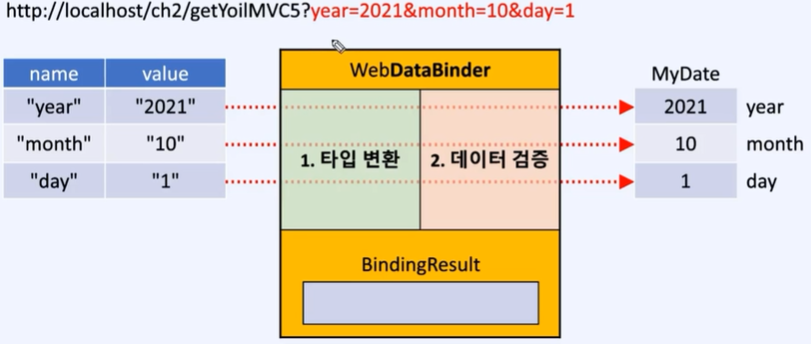
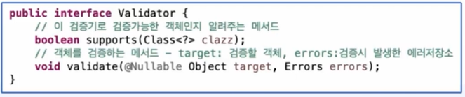

#### **WebDataBinder**

요청으로 넘어온 값들을 실제 객체에 binding하는 과정의 중간 역할



#### **1. 타입 변환**

ex. sns=kakao&sns=daum&sns=insta는 String[]타입으로 저장되는데

binding된 파라미터가 String타입이면, “kakao, daum, insta”로 Spring이 자동 변환한다.

#### **2. 데이터 검증(Validation)**

사용자 또는 서버의 요청(http request) 에서 잘못된 내용이 있는지 유효성 검사하는 단계

- 객체를 검증하기 위한 인터페이스. 객체 검증기(validator)



#### **BindingResult**

- 타입 변환, 데이터 검증의 결과와 에러를 저장하여 에러가 발생하더라도 Controller에서 처리하도록 함.
- 매핑된 메서드의 파라미터 중, binding한 객체 바로 뒤에 선언해야 한다.
- 에러 발생 시 에러가 발생한(=변환실패한) 파라미터의 값은 null. 에러는 발생하지만, 에러페이지에 넘어가지 않았을 뿐이다.

**@InitBinder란?**

- WebDataBinder를 초기화하기 위한 메서드에 붙는 애노테이션으로 @RequestMapping과 같은 에너테이션이 붙은 요청 처리 메서드에 명령어나 form으로 넘어온 인자들을 채우기 위해 사용된다

### 실제 코드로 보면

```java
public class MemberForm {
    @NotBlank
    private String username;

    @Email
    private String email;

    // getter, setter 생략
}
```

```java
@PostMapping("/members/new")
public String create(@Valid MemberForm form, BindingResult bindingResult) {
    // form 바로 뒤에 BindingResult를 선언해야 검증 실패 시 예외 대신 에러가 여기로 담긴다

    if (bindingResult.hasErrors()) {
        return "members/createForm"; // 에러가 있으면 다시 입력 폼으로
    }

    memberService.join(form);
    return "redirect:/members";
}
```

- `@Valid`가 `MemberForm`의 `@NotBlank`, `@Email` 같은 검증 애너테이션을 실행시키고, 그 결과(성공/실패, 에러 메시지)를 `BindingResult`에 담아준다.
- `BindingResult`가 없으면 검증 실패 시 400 에러 페이지로 바로 넘어가지만, 있으면 컨트롤러 안에서 에러를 직접 확인하고 사용자에게 다시 폼을 보여주는 식으로 흐름을 제어할 수 있다.

```java
@InitBinder
public void initBinder(WebDataBinder binder) {
    binder.addValidators(new MemberFormValidator()); // 커스텀 Validator 등록
}
```

- 이렇게 등록해두면 `@RequestMapping`이 붙은 메서드가 호출되기 전에, 해당 컨트롤러의 모든 요청에 대해 이 WebDataBinder 설정(커스텀 Validator 등)이 적용된다.
