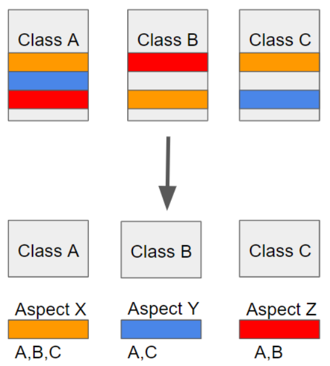

#### **AOP란?**

- Aspect Oriented Programming의 약자로 관점 지향 프로그래밍이라고 불린다.
- 관점 지향은 쉽게 말해 **어떤 로직을 기준으로 핵심적인 관점, 부가적인 관점으로 나누어서 보고 그 관점을 기준으로 각각 모듈화하겠다는 것이다.**
- 여기서 모듈화란 어떤 공통된 로직이나 기능을 하나의 단위로 묶는 것을 말한다.



- 예시 >

```
**class A {**
    method a() {
        AAAA
        method a가 하는 일들
        BBBB
     }
    method b() {
        AAAA
        method b가 하는 일들
        BBBB
     }
**}**
**class B {**
     method c() {
        AAAA
        method c가 하는 일들
        BBBB
     }
**}**
```

> AOP는 여러군데서 사용되는 중복되는 코드를 떼어내서 분리하고, method a, b, c는 자신이 해야할 작업만 갖고있자는 개념이다.

#### **| AOP 주요 개념**

- **Aspect** : 위에서 설명한 흩어진 관심사를 모듈화 한 것. 주로 부가기능을 모듈화함.
- **Target** : Aspect를 적용하는 곳 (클래스, 메서드.. )
- **Advice** : 실질적으로 어떤 일을 해야할 지에 대한 것, 실질적인 부가기능을 담은 구현체
- **JointPoint** : Advice가 적용될 위치, 끼어들 수 있는 지점. 메서드 진입 지점, 생성자 호출 시점, 필드에서 값을 꺼내올 때 등 다양한 시점에 적용가능
- **PointCut** : JointPoint의 상세한 스펙을 정의한 것. 'A란 메서드의 진입 시점에 호출할 것'과 같이 더욱 구체적으로 Advice가 실행될 지점을 정할 수 있음

#### **| 스프링 AOP 특징**

- 프록시 패턴 기반의 AOP 구현체, 프록시 객체를 쓰는 이유는 접근 제어 및 부가기능을 추가하기 위해서임
- 스프링 빈에만 AOP를 적용 가능
- 모든 AOP 기능을 제공하는 것이 아닌 스프링 IoC와 연동하여 엔터프라이즈 애플리케이션에서 가장 흔한 문제(중복코드, 프록시 클래스 작성의 번거로움, 객체들 간 관계 복잡도 증가...)에 대한 해결책을 지원하는 것이 목적

> **프록시 객체**는 실제 객체의 대한 참조를 보관한다. 그리고 프록시 객체의 메소드를 호출하면 프록시 객체는 실제 객체의 메소드를 호출한다.

### 실제 코드로 보면

메서드 실행 시간을 로깅하는 부가기능을 AOP로 분리하면 이런 모양이 된다. (앞서 나온 @Transactional, @PreAuthorize도 결국 스프링이 미리 만들어둔 Aspect일 뿐이다.)

```java
@Slf4j
@Aspect
@Component
public class LogTraceAspect {

    @Around("execution(* com.example.service..*(..))") // PointCut: service 패키지의 모든 메서드
    public Object doTrace(ProceedingJoinPoint joinPoint) throws Throwable {
        long start = System.currentTimeMillis();
        try {
            Object result = joinPoint.proceed(); // Target의 실제 메서드 호출
            return result;
        } finally {
            long timeMs = System.currentTimeMillis() - start;
            log.info("{} 실행시간={}ms", joinPoint.getSignature(), timeMs);
        }
    }
}
```

- `@Around`가 적용된 `doTrace()` 메서드 자체가 **Advice**다.
- `"execution(* com.example.service..*(..))"`가 **PointCut**이고, 이 조건에 맞는 `com.example.service` 패키지 하위 모든 메서드가 **JoinPoint**가 된다.
- `joinPoint.proceed()`를 호출하는 시점에 실제 **Target** 객체의 메서드가 실행된다. 이 호출 앞뒤로 시간 측정 코드를 넣었기 때문에, Target 클래스의 코드는 하나도 건드리지 않고 모든 서비스 메서드에 실행시간 로깅을 붙일 수 있다.
