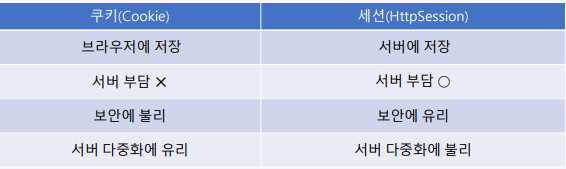
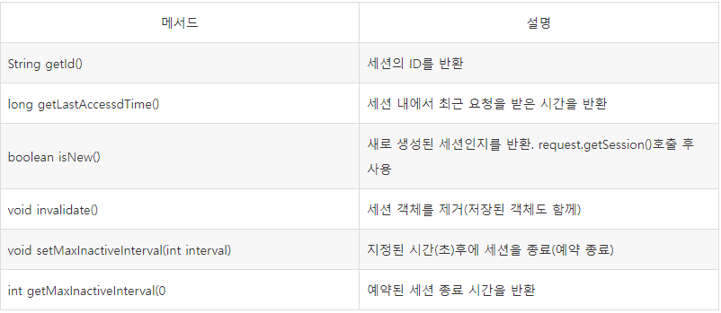

### **| 세션과 쿠키(Session, Cookie)**

- 웹 서비스는 **HTTP 프로토콜**을 기반으로 사용자와 통신한다. **HTTP 프로토콜**은 클라이언트와 서버와의 관계를 유지하지 않는 특징인 **Stateless** 기반인 프로토콜이다.
- 이런 **Stateless** 상태를 해결하는 두 가지 방식이 있는데 세션(Session)과 쿠키(Cookie)다.
- 두 방식 모두 사용자와 서버의 연결 상태를 유지해주는 방법으로, **세션**은 서버에서 연결 정보를 관리하는 반면 **쿠키**는 사용자에 측에서 연결 정보를 관리하는 데 차이가 있다.



### 쿠키(Cookie)란?

- 클라이언트를 식별할 때 사용. 클라이언트(브라우저) 로컬에 저장되는 이름과 값의 쌍으로 구성된 작은 정보
- 기본적으로 아스키 문자만 저장 가능하다. (한글은 URL인코딩 필요) 이외에도 도메인 정보, path정보, 유효기간 등을 지정할 수 있다.
- 서버에서 생성 후 응답과 함께 클라이언트에 전송. 브라우저에 저장되며 유효기간 이후에는 자동으로 삭제 된다. 서버에서 요청 시 (도메인, path)가 일치하는 경우에만 자동으로 전송한다.

```
Cookie cookie = new Cookie("id", ""); // 변경할 쿠키와 같은 이름 쿠키 생성
cookie.setMaxAge(0); // 유효기간을 0으로 설정(삭제)
response.addCookie(cookie); // 응답에 쿠키 추가
cookie.setValue(URLEncoder.encode("남궁성")); // 값의 변경
cookie.setDomain("www.fastcampus.co.kr"); // 도메인의 변경
cookie.setPath("/ch2"); // 경로의 변경
cookie.setMaxAge(60*60*24*7); // 유효기간의 변경
response.addCookie(cookie); // 응답에 쿠키 추가
```

### 세션(Session)이란?

- 서로 관련된 요청과 응답을 하나로 묶은 것 - 쿠키를 이용한다.
- 브라우저의 요청들은 서로 독립적이다. 서로 관련된 요청들을 하나로 모아서 브라우저마다 개별 저장소(session객체)를 서버에서 제공한다.
- 세션은 쿠키를 기반하고 있지만, 사용자 정보 파일을 브라우저에 저장하는 쿠키와 달리 서버 측에서 저장되고 관리한다.

```
// 1. 즉시 종료
HttpSession session = request.getSession();
session.invalidate();   // 세션을 즉시 종료
```

```
// 2. 유휴 시간 기준 자동 종료 (30분간 요청이 없으면 만료)
HttpSession session = request.getSession();
session.setMaxInactiveInterval(30*60);
```

```
// 자동 종료(web.xml)
<session-config>
		<session-timeout>30</session-timeout>  <!-- 분단위 -->
</session-config>
```


