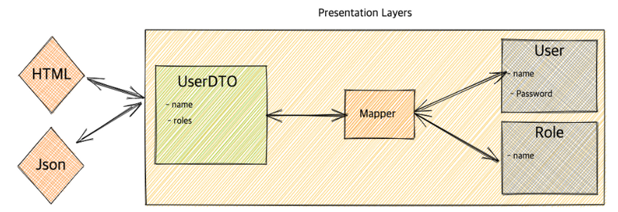
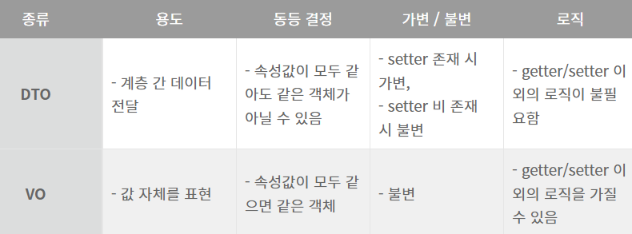

#### **1. DAO(Data Access Object)**

**DAO**는 실제로 **DB의 data**에 **접근하기 위한 객체**입니다.

- 실제로 DB에 접근하여 data를 삽입, 삭제, 조회, 수정 등 CRUD 기능을 수행합니다.
- Service와 DB를 연결하는 고리 역할을 합니다.
- Repository package가 바로 DAO입니다.

```java
@Repository
@RequiredArgsConstructor
public class MemberRepository {

private final EntityManager em;

public void save(Member member) {
	em.persist(member);
}
public Member findOne(Long id) {
	return em.find(Member.class, id);
}
public List<Member> findAll() {
	return em.createQuery("select m from Member m", Member.class).getResultList();
}
public List<Member> findByName(String name) {
	return em.createQuery("select m from Member m where m.name = :name", Member.class)
		.setParameter("name", name)
		.getResultList();
	}
}
```

#### **2. DTO(Data Transfer Object)**

**DTO는 계층 간 데이터 교환을 하기 위해 사용하는 객체**로, **DTO는 로직을 가지지 않는 순수한 데이터 객체(Java Beans)**입니다.

- DTO는 즉, getter/setter 메서드만 가진 클래스를 의미합니다.
- DB에서 데이터를 얻어서 Service나 Controller 등으로 보낼 때 사용합니다.
- 즉 엔티티를 DTO 형태로 변환한 후 사용합니다.



#### **3. VO(value Object)**

**VO는 DTO와 달리 Read-Only속성을 지닌 값 오브젝트**입니다.

- DTO는 setter를 가지고 있어서 값이 변할 수 있지만 VO의 경우에**는 getter만 가지고 있어서 수정이 불가능**합니다.
- **DTO와 VO의 차이점**은 **DTO는 인스턴스 개념**이고, **VO는 리터럴 값 개념**입니다.
- VO는 값들에 대해 Read-Only를 보장해줘야 존재의 신뢰성이 확보되지만 DTO의 경우에는 단지 데이터를 담는 그릇의 역할일 뿐 값은 그저 전달되어야 할 대상일 뿐입니다.
- 따라서 값 자체에 의미가 있는 VO와 전달될 데이터를 보존해야 하는 DTO의 특성상 개념이 다릅니다.


