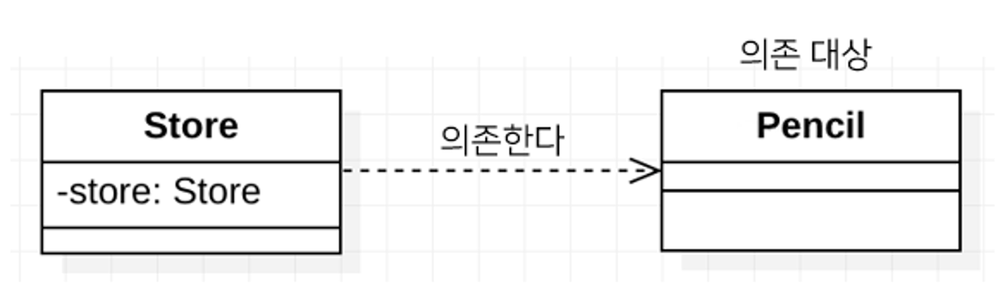
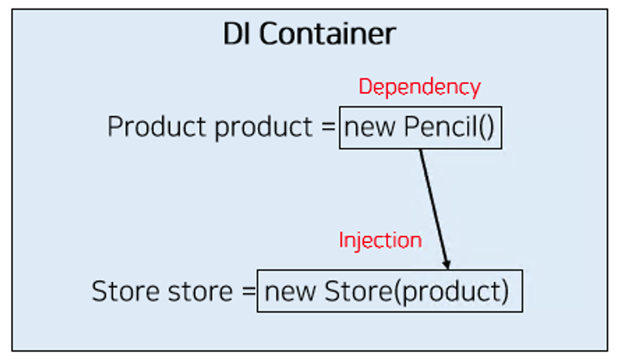

#### **의존성 주입(Dependency Injection) 이란?**

- Spring 프레임워크는 3가지 핵심 프로그래밍 모델 (DI/IoC, PSA, AOP) 을 지원하며, 그 중 하나가 의존성 주입(Dependency Injection, DI) 이다.
- **DI란 외부에서 두 객체 간의 관계를 결정해주는 디자인 패턴**으로, 인터페이스를 사이에 둬서 클래스 레벨에서는 의존관계가 고정되지 않도록 하고 런타임 시에 관계를 동적으로 주입하여 유연성을 확보하고 결합도를 낮출 수 있게 해준다.

---

**의존성**이란 한 객체가 다른 객체를 사용할 때 의존성이 있다고 한다.

```java
public class Store {
     private Pencil pencil;
}
```



---

그리고 두 객체 간의 관계(의존성)를 맺어주는 것을 **의존성 주입**이라고 하며 생성자 주입, 필드 주입, 수정자 주입 등 다양한 주입 방법이 있다.



#### **의존성 주입(Dependency Injection)이 필요한 이유**

```java
public class Store {
   private Pencil pencil;
   public Store() {
      this.pencil = new Pencil();
   }
}
```

### **1. 두 클래스가 강하게 결합되어 있음**

위와 같은 Store 클래스는 현재 Pencil 클래스와 **강하게 결합되어 있다**는 문제점을 가지고 있다.

다른 상품을 판매하고자 한다면 생성자에 변경이 필요하다. 즉, 유연성이 떨어진다.

### **2. 객체들 간의 관계가 아니라 클래스 간의 관계가 맺어짐**

객체들 간의 관계가 아니라 **클래스들 간의 관계가 맺어져 있다**는 문제가 있다.

객체들 간에 관계가 맺어졌다면 다른 객체의 구체 클래스를 전혀 알지 못하더라도, 인터페이스의 타입(Product)으로 사용할 수 있다.

> 결국 위와 같은 문제점이 발생하는 근본적인 이유는 Store에서 불필요하게 어떤 제품을 판매할 지에 대한 **관심이 분리되지 않았기 때문이다.** Spring에서는 DI를 적용하여 이러한 문제를 해결하고자 하였다.

#### **의존성 주입(Dependency Injection)을 통한 문제 해결**

- **외부에서 상품을 주입(Injection)**받아야 한다.
- **애플리케이션 실행 시점에 필요한 객체(빈)**를 생성
- **의존성이 있는 두 객체를 연결**하기 위해 한 객체를 다른 객체로 주입

#### **의존성 주입(Dependency Injection) 정리**

Spring은 의존성 주입을 도와주는 DI 컨테이너로써, 강하게 결합된 클래스들을 분리하고, 애플리케이션 실행 시점에 객체 간의 관계를 결정해 줌으로써 결합도를 낮추고 유연성을 확보해준다.

- **두 객체 간의 관계라는 관심사의 분리**
- **두 객체 간의 결합도를 낮춤**
- **객체의 유연성을 높임**
- **테스트 작성을 용이하게 함**
