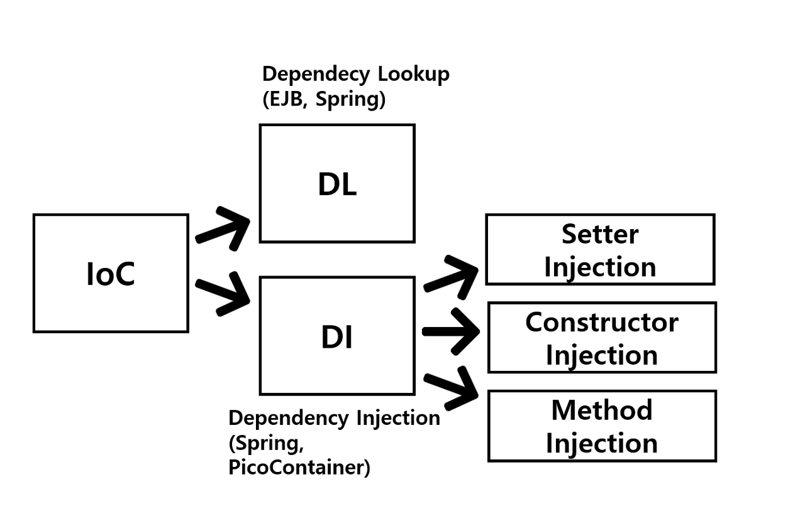

#### **IoC란?**

- IoC란 Inversion of Control의 줄임말이며, 제어의 역전이라고 한다.
- 스프링 애플리케이션에서는 오브젝트(빈)의 생성과 의존 관계 설정, 사용, 제거 등의 작업을 애플리케이션 코드 대신 스프링 컨테이너가 담당한다.
- 이를 스프링 컨테이너가 코드 대신 오브젝트에 대한 제어권을 갖고 있다고 해서 IoC라고 부른다.
- 따라서, 스프링 컨테이너를 IoC 컨테이너라고도 부른다.

#### **Bean과 스프링 IoC 컨테이너**

스프링 IoC 컨테이너가 관리하는 객체들을 **Bean** 이라고 부릅니다.

스프링은 이러한 Bean들의 의존성을 관리하고, 객체를 만들어 주며, Bean으로 등록을 해 주고, 이렇게 만들어진 것들을 관리합니다. 개발자가 이 부분까지 신경쓰지 않아도, 프레임워크가 알아서 해 주는 것입니다.

그리고 스프링 IoC 컨테이너가 위와 같은 관리를 해 줍니다. 이러한 Bean들을 담고 있는 스프링 IoC 컨테이너는 **ApplicationContext, BeanFactory**가 있습니다.

- **BeanFactory**: IoC 컨테이너의 최상위 인터페이스. Bean을 실제로 요청하는 시점에 생성한다(지연 로딩).
- **ApplicationContext**: BeanFactory를 상속받아 확장한 인터페이스로, 컨테이너가 시작될 때 Bean을 미리 다 생성해두고(즉시 로딩), 이벤트 발행이나 국제화(i18n) 같은 부가 기능도 함께 제공한다. 실무에서는 거의 항상 이쪽을 쓴다.



### 제어권이 역전된다는 게 무슨 의미인가

**IoC 적용 전 (직접 제어)**

```java
public class OrderService {
    private DiscountPolicy discountPolicy = new FixedDiscountPolicy(); // 직접 생성, 직접 결정
}
```

- `OrderService`가 어떤 `DiscountPolicy` 구현체를 쓸지 스스로 결정하고 직접 `new`로 생성한다. 구현체를 바꾸려면 `OrderService` 코드 자체를 고쳐야 한다.

**IoC 적용 후 (제어권을 컨테이너에 위임)**

```java
@Service
@RequiredArgsConstructor
public class OrderService {
    private final DiscountPolicy discountPolicy; // 생성도, 어떤 구현체를 쓸지도 컨테이너가 결정
}

@Configuration
public class AppConfig {
    @Bean
    public DiscountPolicy discountPolicy() {
        return new FixedDiscountPolicy(); // 이 부분만 바꾸면 OrderService는 그대로 둔 채 구현체 교체 가능
    }
}
```

- `OrderService`는 이제 "어떤 `DiscountPolicy`를 쓸지"를 스스로 결정하지 않는다. 그 결정과 생성을 `AppConfig`(스프링 컨테이너)가 대신 해주고 주입해준다.
- 원래 `OrderService`가 갖고 있던 "무엇을 사용할지 결정하는 제어권"이 컨테이너 쪽으로 넘어갔다는 뜻에서 **제어의 역전**이라고 부른다.
