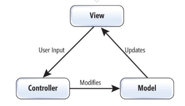

**MVC** 는 Model, View, Controller의 약자 입니다. 하나의 애플리케이션, 프로젝트를 구성할 때 그 구성요소를 세가지의 역할로 구분한 패턴입니다.



사용자가 **controller**를 조작하면 controller는 **model**을 통해서 데이터를 가져오고 그 정보를 바탕으로 시각적인 표현을 담당하는 **View**를 제어해서 사용자에게 전달하게 됩니다.

#### **모델, Model**

애플리케이션의 정보, 데이타를 나타냅니다. 데이타베이스, 처음의 정의하는 상수, 초기화값, 변수 등을 뜻합니다. 또한 이러한 DATA, 정보들의 가공을 책임지는 컴포넌트를 말합니다.

#### **뷰, View**

input 텍스트, 체크박스 항목 등과 같은 사용자 인터페이스 요소를 나타냅니다. 다시 말해 데이터 및 객체의 입력, 그리고 보여주는 출력을 담당합니다. 데이타를 기반으로 사용자들이 볼 수 있는 화면입니다.

#### **컨트롤러,Controller**

데이터와 사용자인터페이스 요소들을 잇는 다리역할을 합니다.

즉, 사용자가 데이터를 클릭하고, 수정하는 것에 대한 "이벤트"들을 처리하는 부분을 뜻합니다.

> 서로 분리되어 각자의 역할에 집중할 수 있게 하여 개발을 하고 그렇게 애플리케이션을 만든다면, **유지보수성**, 애플리케이션의 **확장성**, 그리고 **유연성**이 증가하고, 중복 코딩이라는 문제점 또한 사라지게 되는 것입니다. 그러기 위한 MVC패턴입니다.

### Spring MVC에서는 이렇게 매핑된다

```java
@Controller
public class BoardController {

    @Autowired
    private BoardService boardService;

    @GetMapping("/board/{id}")
    public String detail(@PathVariable Long id, Model model) {
        Board board = boardService.findById(id); // Model: 데이터 조회
        model.addAttribute("board", board);       // View에 데이터 전달
        return "board/detail";                     // View: 렌더링할 템플릿 이름 반환
    }
}
```

- **Controller** (`BoardController`): `/board/{id}` 요청을 받아 흐름을 조율한다. 직접 데이터를 가공하지 않고 Service/Model에 위임한다.
- **Model** (`Board`, `boardService`): 실제 데이터 조회/가공을 담당한다. Controller는 이 결과를 `Model` 객체에 담아 View로 넘긴다.
- **View** (`board/detail`): Controller가 반환한 문자열은 View의 이름이고, 실제 화면(JSP, Thymeleaf 등)은 이 이름으로 찾아서 렌더링된다.

이렇게 나눠두면 View를 JSP에서 Thymeleaf로 바꾸더라도 Controller/Model 코드는 그대로 재사용할 수 있고, 반대로 조회 로직이 바뀌어도 화면 코드는 건드릴 필요가 없다.
