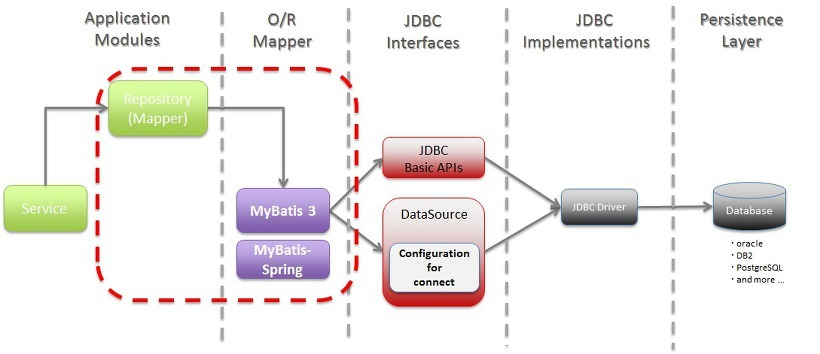
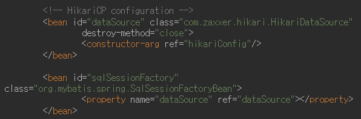
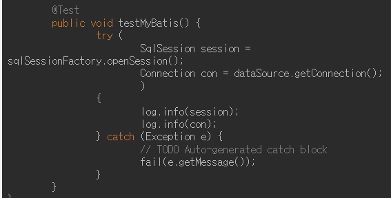
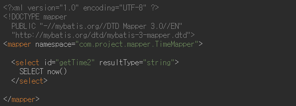
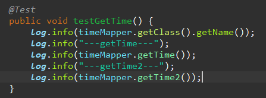

#### **MyBatis 란?**

객체 지향 언어인 자바의 관계형 데이터베이스 프로그래밍을 좀 더 쉽게 할 수 있게 도와 주는 개발 프레임 워크이다.



#### **특징**

- 복잡한 쿼리나 다이나믹한 쿼리에 강하다 - 반대로 비슷한 쿼리는 남발하게 되는 단점이 있다.
- 프로그램 코드와 SQL 쿼리의 분리로 코드의 간결성 및 유지보수성 향상
- resultType, resultClass등 Vo를 사용하지 않고 조회결과를 사용자 정의 DTO, MAP 등으로 맵핑하여 사용 할 수 있다.
- 빠른 개발이 가능하여 생산성이 향상된다.

#### SpringMVC > MyBatis 연동

**1. Mybatis 라이브러리 추가** (pom.xml) - version확인!

```xml
<dependency>
    <groupId>org.mybatis</groupId>
    <artifactId>mybatis-spring</artifactId>
    <version>2.1.1</version>
</dependency>
<dependency>
    <groupId>org.mybatis</groupId>
    <artifactId>mybatis</artifactId>
    <version>3.5.6</version>
</dependency>
```

**2. SQL SessionFactory 설정** (root-context.xml)

- SQL SessionFactory는 내부적으로 SQL Session을 생성하며, 개발에서는 SQL Session을 통해 Connection을 생성하거나 원하는 SQL을 전달하고 결과를 리턴받는 구조.

```xml
<!-- HikariCP configuration -->
<bean id="dataSource" class="com.zaxxer.hikari.HikariDataSource"
      destroy-method="close">
    <constructor-arg ref="hikariConfig"/>
</bean>

<bean id="sqlSessionFactory"
      class="org.mybatis.spring.SqlSessionFactoryBean">
    <property name="dataSource" ref="dataSource"></property>
</bean>
```



**3. sqlSessionFactoryBean**을 이용하여 **SqlSession을 생성 테스트**

```java
@Test
public void testMyBatis() {
    try {
        SqlSession session = sqlSessionFactory.openSession();
        Connection con = dataSource.getConnection();
        {
            log.info(session);
            log.info(con);
        }
    } catch (Exception e) {
        // TODO Auto-generated catch block
        fail(e.getMessage());
    }
}
```



**4. XML Mapper**

- Mapper는 쉽게 말해 SQL과 그에 대한 처리를 지정하는 역할을 합니다.

```xml
<?xml version="1.0" encoding="UTF-8" ?>
<!DOCTYPE mapper
  PUBLIC "-//mybatis.org//DTD Mapper 3.0//EN"
  "http://mybatis.org/dtd/mybatis-3-mapper.dtd">
<mapper namespace="com.project.mapper.TimeMapper">

  <select id="getTime2" resultType="string">
    SELECT now()
  </select>

</mapper>
```

- `namespace`는 이 SQL들을 사용할 Mapper 인터페이스의 전체 경로와 일치시켜야 한다. MyBatis가 이 namespace와 `id`(`getTime2`)를 보고 실제로 실행할 SQL을 찾는다.



**5. Mapper Test**

```java
@Test
public void testGetTime() {
    log.info(timeMapper.getClass().getName());
    log.info("---getTime---");
    log.info(timeMapper.getTime());
    log.info("---getTime2---");
    log.info(timeMapper.getTime2());
}
```

`timeMapper.getClass().getName()`을 찍어보면 우리가 만든 인터페이스가 아니라 MyBatis가 런타임에 생성한 프록시 클래스가 나온다. `TimeMapper` 인터페이스에는 구현체가 없는데도 호출이 되는 이유가 바로 이 동적 프록시 덕분이다 - MyBatis가 인터페이스와 XML Mapper(namespace + id)를 매칭해서 프록시 객체를 만들어주고, 이 프록시가 실제 SQL 실행을 대신 처리한다.



### Dynamic Query

```xml
<select id="getTest" resultType="board">

SELECT * FROM board

<where>
<if test="id != null">AND id = #{id} </if>
<if test="subject != null">AND subject = #{subject} </if>
</where>

</select>
```
