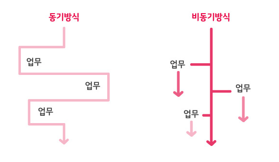
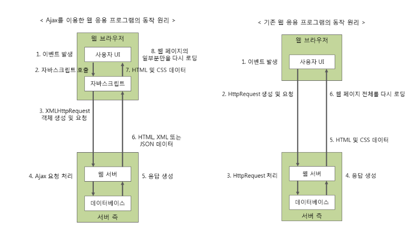

#### **REST 와 Ajax**

웹을 통해서 작업할 때 REST 방식이 가장 많이 쓰이는 형태는 Ajax와 같이 결합된 형태이다.

**Ajax**는 Asynchronous JavaScript and XML 의 약자로 **비동기** 방식으로 데이터를 주고 받는 방식을 말한다.



- 동기 방식은 순차적인 일을 실행하는데 적합하다. (어떤 업무가 끝나길 기다린 후 끝나면 다른 업무가 시작되는 형태)
- 비동기 방식은 처리한 결과를 기다리지 않고, 흐름이 지속된다.
- 비동기 방식의 특징은 처리된 일의 결과를 통보받은 형태로 처리된다는 점이다.



- REST방식과 Ajax를 이용하면 화면의 전환이나 깜빡임 없이 주어진 기능을 수행할 수 있다.

1. 쉽게 말하면 html의 빈 껍데기를 클라이언트에게 보내준다.
2. 어떤 이벤트가 발생하면 jQuery의 Ajax가 RestController의 메소드를 호출.
3. 서버측에서 요청한 기능(동작)을 수행하고 수정된 데이터를 json형태로 클라이언트에게 넘겨줌.
4. 클라이언트의 브라우저는 수정된 부분만 다시 로딩 함.

### 실제 코드로 보면

**서버 (RestController)**

```java
@RestController
@RequestMapping("/api/members")
public class MemberApiController {

    @Autowired
    private MemberService memberService;

    @GetMapping("/{id}")
    public Member getMember(@PathVariable Long id) {
        return memberService.findById(id); // 객체를 반환하면 자동으로 JSON 직렬화됨
    }
}
```

`@Controller` 대신 `@RestController`를 쓰면, 메서드가 반환하는 객체가 View 이름이 아니라 그대로 JSON으로 직렬화되어 응답 바디에 담긴다. (`@RestController`는 `@Controller` + `@ResponseBody`가 합쳐진 것이다.)

**클라이언트 (jQuery Ajax)**

```javascript
$.ajax({
    url: "/api/members/1",
    type: "GET",
    dataType: "json",
    success: function (data) {
        // 3에서 서버가 내려준 json을 여기서 그대로 받는다
        $("#memberName").text(data.name); // 4: 화면 전체가 아니라 이 부분만 갱신
    },
    error: function (xhr, status, error) {
        console.error(error);
    }
});
```

`success` 콜백이 호출되는 시점이 바로 위에서 말한 "처리된 일의 결과를 통보받는" 순간이다. 요청을 보낸 뒤에도 스크립트 실행은 멈추지 않고, 응답이 도착했을 때 콜백으로 결과를 넘겨받는 게 비동기 방식의 핵심이다.
