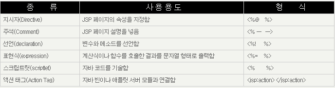
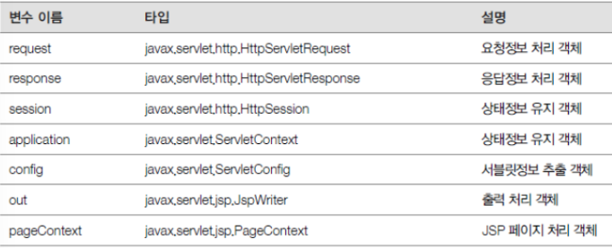
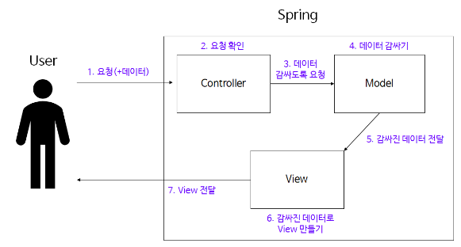
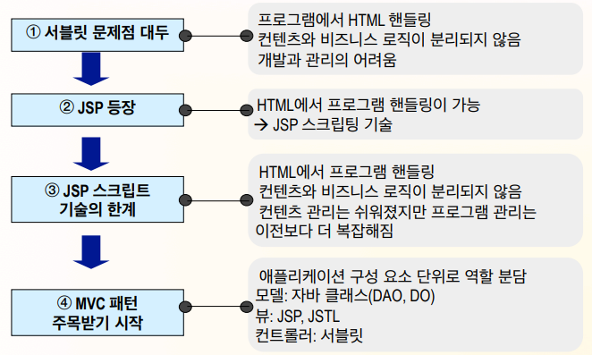

#### Servlet

- **서블릿이란 Dynamic Web Page를 만들 때 사용되는 자바 기반의 웹 애플리케이션 프로그래밍 기술입니다.**
- 웹을 만들때는 다양한 요청(Request)과 응답(Response)이 있고, 이 요청과 응답에는 규칙이 존재합니다.
- 서블릿은 이러한 웹 요청과 응답의 흐름을 간단한 메서드 호출만으로 체계적으로 다룰 수 있게 해주는 기술입니다.

### 특징

- 클라이언트의 Request에 대해 동적으로 작동하는 웹 애플리케이션 컴포넌트
- HTML을 사용하여 Response 한다.
- JAVA의 스레드를 이용하여 동작한다.
- MVC 패턴에서의 컨트롤러로 이용된다.
- HTTP 프로토콜 서비스를 지원하는 javax.servlet.http.HttpServlet 클래스를 상속받는다.
- HTML 변경 시 Servlet을 재 컴파일해야 하는 단점이 있다.

### 서블릿 컨테이너 주요기능

1. 생명주기 관리
2. 통신 지원
3. 멀티스레딩 관리
4. 선언적인 보안관리

### **init()**

서블릿이 처음으로 요청될 때 초기화를 하는 메서드입니다.

### **service()**

서블릿 컨테이너가 요청을 받고 응답을 내려줄 때 필요한 메서드입니다.

### **destroy()**

더 이상 사용되지 않는 서블릿 클래스는 주기적으로 서블릿 컨테이너가 destroy() 메서드를 호출하여 제거합니다.

(예시 코드)

```java
PrintWriter w = response.getWriter();
w.write("<html>\n" +
				"<head>\n" +
				" <meta charset=\"UTF-8\">\n" + "</head>\n" +
				"<body>\n" +
				"성공\n" +
				"<ul>\n" +
				"    <li>id="+member.getId()+"</li>\n" +
				"    <li>username="+member.getUsername()+"</li>\n" +
				" <li>age="+member.getAge()+"</li>\n" + "</ul>\n" +
				"<a href=\"/index.html\">메인</a>\n" + "</body>\n" +
				"</html>");
}
```

#### JSP

- **JSP는 Java Server Pages 의 약자이며 HTML 코드에 JAVA 코드를 넣어 동적 웹페이지를 생성하는 웹어플리케이션 도구이다.**
- JSP가 실행되면 자바 서블릿(Servlet)으로 변환되며 웹 어플리케이션 서버에서 동작되면서 필요한 기능을 수행하고 그렇게 생성된 데이터를 웹페이지와 함께 클라이언트로 응답한다.

### 기본 태그



### 내장 객체



(예시 코드)

```html
<th>age</th>
</thead>
<tbody>
<%
for (Member member : members) {
out.write("    <tr>");
out.write("       <td>" + member.getId() + "</td>");
out.write("       <td>" + member.getUsername() + "</td>");
out.write("       <td>" + member.getAge() + "</td>");
out.write("    </tr>");
}
%>
</tbody>
</table>
</body>
</html>
```

#### MVC

- **SpringMVC는 Spring에서 제공하는 웹 모듈로 Model, View, Controller 세가지 구성 요소를 이용해 사용자의 다양한 요청을 처리하고 응답할 수 있도록 하는Framework이다.**
- HTTP Request를 처리하는 Controller, 데이터를 처리해 정제된 데이터를 넣는 Model, 정제된 데이터를 활용해 사용자에게 보여지는 View에 대한 역할이 분리되어 있다.
- M. V. C 세가지 구성요소를 인터페이스를 사용해 규격화해 유연하고 확장성 있게 웹 애플리케이션을 설계할 수 있다.



**관심사 분리** : 컴퓨터 프로그램의 디자인 원칙으로, 분리시킬 수 있는 부분을 분리시키는 원칙이다.

관심사 분리가 되지 않을 경우 프로그램 내부의 코드 간 의존성이 커져 수정/변경이 어려워진다.

(예시 코드)

```java
@WebServlet(name = "mvcMemberListServlet", urlPatterns = "/servlet-mvc/members")
public class MvcMemberListServlet extends HttpServlet {

	private MemberRepository memberRepository = MemberRepository.getInstance();

	@Override
	protected void service(HttpServletRequest request, HttpServletResponse response) throws ServletException, IOException {
		List<Member> members = memberRepository.findAll();
		request.setAttribute("members", members);

		String viewPath = "/WEB-INF/views/members.jsp";
		RequestDispatcher dispatcher = request.getRequestDispatcher(viewPath);
		dispatcher.forward(request, response);
	}
}
```

#### 최종 정리

- JSP, MVC 모두 서블릿을 활용한 기술이다.
- 서블릿은 개발자가 웹 응답, 요청을 직접 처리해야 하고 자바 코드에 html을 동적으로 생성해야 하기 때문에 불편하였다.
- JSP는 서블릿의 단점을 보완하기 위해 만들어져 html코드 작성은 편해졌지만, 비즈니스 로직도 jsp파일에 같이 존재하게 된다. 즉 하나의 파일에서 여러가지 일을 하기 때문에 유연성이 떨어지며 유지 보수가 어렵다.
- MVC는 jsp의 문제점인 jsp파일의 여러 역할들을 분리한 것이다.


