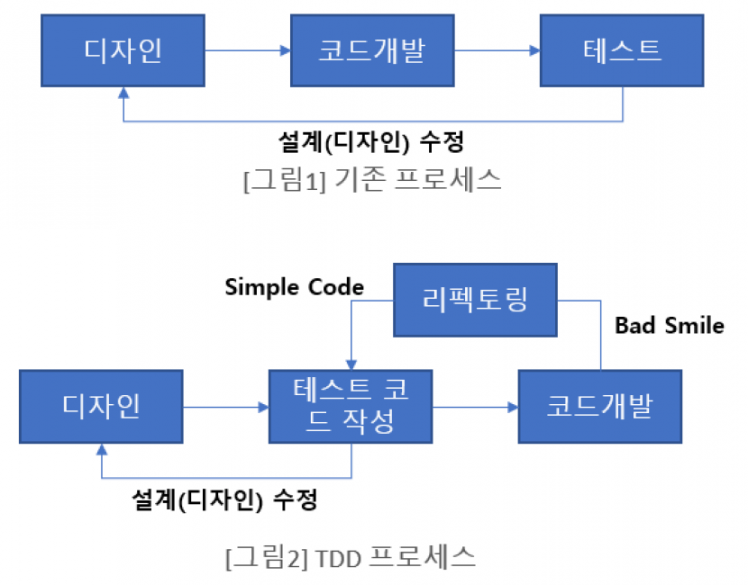
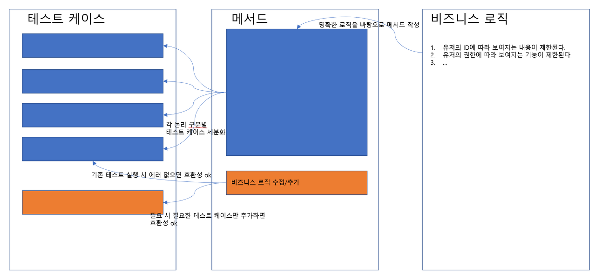

#### **TDD (Test Driven Development)**

TDD란 ‘테스트 주도 개발’을 의미한다.

테스트 주도 개발(TDD)은 설계 이후 코드 개발 및 테스트케이스를 작성하는 기존의 개발 프로세스[그림1]와 다르게 테스트케이스를 작성 한 후 실제 코드를 개발하여 리펙토링하는 절차(그림2)를 따른다. 이러한 이유로 TDD를 Test First Development라고도 한다.



#### Red - Green - Refactor

TDD는 보통 이 3단계를 짧은 주기로 계속 반복하는 식으로 진행된다.

1. **Red**: 아직 없는 기능에 대한 테스트를 먼저 작성한다. 구현이 없으니 당연히 실패(빨간불)한다.
2. **Green**: 그 테스트를 통과시키는 데 필요한 **최소한의 코드**만 작성한다. 완벽하지 않아도 되고, 일단 테스트만 통과시키면 된다.
3. **Refactor**: 테스트가 통과하는 걸 안전망 삼아 코드를 정리한다. 이 단계에서 테스트가 계속 통과한다는 건 리팩토링이 기존 동작을 깨지 않았다는 뜻이다.

```java
@Test
public void 사용자를_생성한다() throws Exception {
    // given: 테스트에 필요한 상태/mock 준비
    String testName = "test_name";
    User expected = User.builder().name(testName).type(UserType.NORMAL).build();
    given(userService.save(any(User.class))).willReturn(expected);

    // when: 실제로 검증하고 싶은 동작 실행
    User result = userService.save(new User(testName));

    // then: 결과 검증
    assertThat(result.getName()).isEqualTo(testName);
    assertThat(result.getType()).isEqualTo(UserType.NORMAL);
}
```

- **given**: 테스트 실행에 필요한 조건(mock 응답 등)을 준비하는 단계.
- **when**: 테스트하려는 실제 동작을 실행하는 단계.
- **then**: 실행 결과가 기대한 값과 일치하는지 검증(assert)하는 단계.

#### **필요성**

- 정확한 프로그램을 만들기 위해서 생각할 수 있는 최대한의 경우의 수를 테스트 해보는 것이 당연히 유리하다.
- 이러한 테스트를 하나의 기능별로 구분해서 진행해본다면, 개발자가 명확한 논리를 갖게 되고 테스트를 하는 것이 쉬워진다.
- 새로운 기능이 추가되거나 수정사항이 생기더라도 어떤 테스트에서 문제가 생겼는지 정확히 알 수 있고 유지보수 하기가 편해진다.


