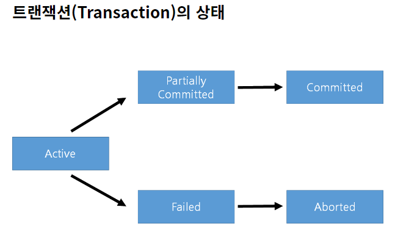
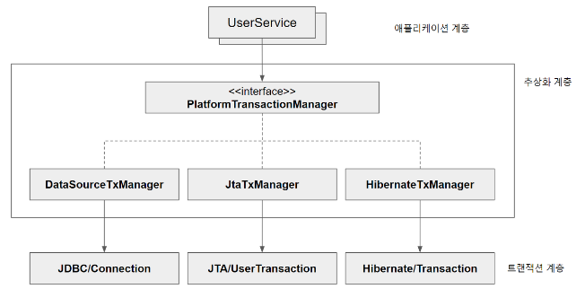

#### **트랜잭션 이란?**

데이터를 처리하는데 오류나 다양한 상황에 대하여 안정성을 확보하고 성공한 경우에만 반영을 해주는 것을 트랜잭션이라고 합니다.

**데이터베이스의 상태를 변경**하는 작업 또는 **한번에 수행되어야 하는 연산들**을 의미합니다.

즉, 병행 제어 시 처리되는 작업의 논리적 단위입니다.

Transaction은 하나의 흐름으로 하나의 실행이 성공하거나 실패하면 모든 연산들을 동일하게 처리합니다



#### 트랜잭션의 성질

**▶ 원자성(Atomicity)**

- 한 트랜잭션 내에서 실행한 작업들은 하나로 간주한다. 즉, 모두 성공 또는 모두 실패.

**▶ 일관성(Consistency)**

- 트랜잭션은 일관성 있는 데이타베이스 상태를 유지한다. (data integrity 만족 등.)

**▶ 독립성(Isolation)**

- 동시에 실행되는 트랜잭션들이 서로 영향을 미치지 않도록 독립적이어야 한다.

**▶ 영속성(Durability)**

- 트랜잭션을 성공적으로 마치면 결과가 항상 저장되어야 한다

#### **TransactionManager**

스프링은 트랜잭션 추상화를 반영했는데, 덕분에 특정 기술에 종속되지 않는 일관된 방식으로 트랜잭션을 적용할 수 있습니다.

PlatformTransactionManager가 바로 그 추상형으로, 스프링 트랜잭션 매니저의 핵심 인터페이스입니다.



- Platform TransactionManager 정의

```java
public interface PlatformTransactionManager extends TransactionManager {

TransactionStatus getTransaction(@Nullable TransactionDefinition definition)
throws TransactionException;

void commit(TransactionStatus status) throws TransactionException;

void rollback(TransactionStatus status) throws TransactionException;

}
```

### **TransactionManager 종류**

**✔️ DataSourceTransactionManager**

: JDBC 및 MyBatis 등의 JDBC 기반 라이브러리로 데이터베이스에 접근하는 경우에 이용합니다.

**✔️ HibernateTransactionManager**

: 하이버네이트를 이용해 데이터베이스에 접근하는 경우에 이용합니다.

**✔️ JpaTransactionManager**

: JPA로 데이터베이스에 접근하는 경우에 이용합니다.

**✔️ JtaTransactionManager**

: 하나 이상의 DB 나 글로벌 트랜잭션을 적용하려면 JTA 이용할 수 있습니다.

### 실전에서는 @Transactional로 쓴다

위의 TransactionManager들을 직접 다룰 일은 거의 없고, 실무에서는 `@Transactional` 애너테이션 하나로 선언적으로 트랜잭션을 적용한다.

```java
@Service
public class MemberService {

    @Transactional
    public void register(Member member) {
        memberRepository.save(member);
        historyRepository.save(new History(member)); // 하나라도 실패하면 둘 다 롤백
    }
}
```

내부적으로는 Spring AOP가 이 메서드를 프록시로 감싸서, 메서드 시작 시 트랜잭션을 열고 정상 종료되면 commit, 예외(기본은 RuntimeException/Error)가 터지면 rollback을 자동으로 처리해준다.

**주의할 점 - 자기 호출(self-invocation) 문제**

```java
@Service
public class MemberService {

    public void outerMethod() {
        this.innerMethod(); // 프록시를 거치지 않고 직접 호출됨
    }

    @Transactional
    public void innerMethod() {
        // 여기의 @Transactional은 적용되지 않는다!
    }
}
```

`@Transactional`은 스프링이 만든 프록시 객체를 통해 호출될 때만 동작한다. 그런데 같은 클래스 안에서 `this.innerMethod()`처럼 자기 자신을 호출하면, 프록시를 거치지 않고 원본 객체의 메서드가 직접 실행되기 때문에 트랜잭션이 적용되지 않는다. 이걸 피하려면 트랜잭션이 필요한 로직을 별도 빈(클래스)으로 분리해서 외부에서 호출하도록 구조를 바꿔야 한다.
