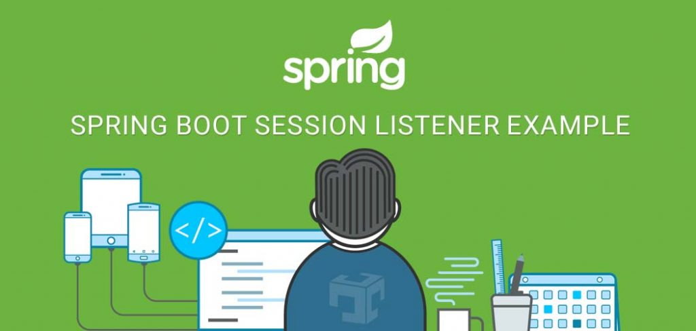

> Listener : 특정 이벤트가 발생하기를 기다리다 이벤트 발생 시 실행되는 컴포넌트.



## WebListener

@WebListener는 ServletListener를 정의하는데 사용된다.

**ServletListener**란? <u>웹 애플리케이션의 특정 이벤트(시작 세션 생성/소멸 등)를 감지하고 이에 반응하는 컴포넌트</u>이다.

- 클래스를 Listener로 등록하게 되면 서버가 종료될 때 까지 백그라운드 상태에서 동작하는 데몬(daemon)이 되기 때문에 간단한 값을 공유할 수 있다.
- 추가로 ServletContextListener인터페이스를 상속받으면 서버가 실행/종료 될 때 특정 동작을 수행할 수 있다.

**사용 예시**:

```java
import javax.servlet.ServletContextEvent;
import javax.servlet.ServletContextListener;
import javax.servlet.annotation.WebListener;

@WebListener
public class MyAppListener implements ServletContextListener {

    // 애플리케이션이 시작될 때 실행
    @Override
    public void contextInitialized(ServletContextEvent sce) {
        System.out.println("애플리케이션 시작됨");
        // 초기화 작업 수행 가능
    }

    // 애플리케이션이 종료될 때 실행
    @Override
    public void contextDestroyed(ServletContextEvent sce) {
        System.out.println("애플리케이션 종료됨");
        // 리소스 정리 등 수행 가능
    }
}
```

---

## HttpSessionListener

**HttpSessionListener**란? Servlet API에서 제공하는 인터페이스로, <u>HTTP 세션의 생성과 소멸을 감지하여 특정 작업을 수행할 수 있게 해주는 Servlet Listener</u>이다. 즉, 세션 관련 이벤트를 처리할 수 있게 해준다.

HttpSessionListener인터페이스를 상속받으면 sessionCreated()와 sessionDestroyed() 메서드를 Override할 수 있다.

- **sessionCreated**() : 세션이 생성될 때 실행됨.
- **sessionDestroyed**() : 세션이 소멸될 때 실행됨. (시간이 만료되어 자연 소멸되는 경우 이벤트가 발생하지 않음)

**사용 예시**:

```java
import javax.servlet.http.HttpSessionEvent;
import javax.servlet.http.HttpSessionListener;
import javax.servlet.annotation.WebListener;

@WebListener
public class MySessionListener implements HttpSessionListener {

    // 세션이 생성될 때 호출
    @Override
    public void sessionCreated(HttpSessionEvent se) {
        System.out.println("새로운 세션 생성됨: " + se.getSession().getId());
        // 예: 세션 카운터 증가
    }

    // 세션이 소멸될 때 호출
    @Override
    public void sessionDestroyed(HttpSessionEvent se) {
        System.out.println("세션이 소멸됨: " + se.getSession().getId());
        // 예: 세션 데이터 정리
    }
}
```

#### **HttpSessionListener로 중복 로그인 방지 로직 구현**

```java
@WebListener
public class SessionConfig implements HttpSessionListener{
	
    private static final Map<String, HttpSession> sessions = new ConcurrentHashMap<>();

    //중복로그인 지우기
    public synchronized static boolean getSessionidCheck(String userId, HttpSession hs, boolean loginCheck){
        
	 // 중복 체크
     if(sessions.get(userId) != null) {
	   if(loginCheck) {
		 // loginCheck가 true면 confirm을 받고온 것이기 때문에 세션 제거
		 removeSessionForDoubleLogin(userId);
	   }else {
		 return false;
	   }
     }
     sessions.put(userId, hs);
     return true;
    }
    
    private static void removeSessionForDoubleLogin(String userId){    	
        if(userId != null && userId.length() > 0){
            sessions.get(userId).invalidate();
            sessions.remove(userId);    		
        }
    }

    @Override
    public void sessionCreated(HttpSessionEvent hse) { // 세션이 생성될 때 동작
        //System.out.println(hse);
        //sessions.put(hse.getSession().getId(), hse.getSession());
    }

    @Override
    public void sessionDestroyed(HttpSessionEvent hse) { // 세션이 소멸될 때 동작
        //if(sessions.get(hse.getSession().getId()) != null){
        //    sessions.get(hse.getSession().getId()).invalidate();
        //    sessions.remove(hse.getSession().getId());	
        //}
    }
}
```

*sessionCreated, Destroyed는 자연소멸 (시간만료)의 경우에는 동작하지 않기 때문에 사용 권장하지 않는다.*
