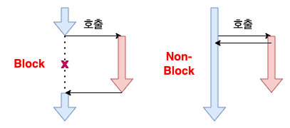
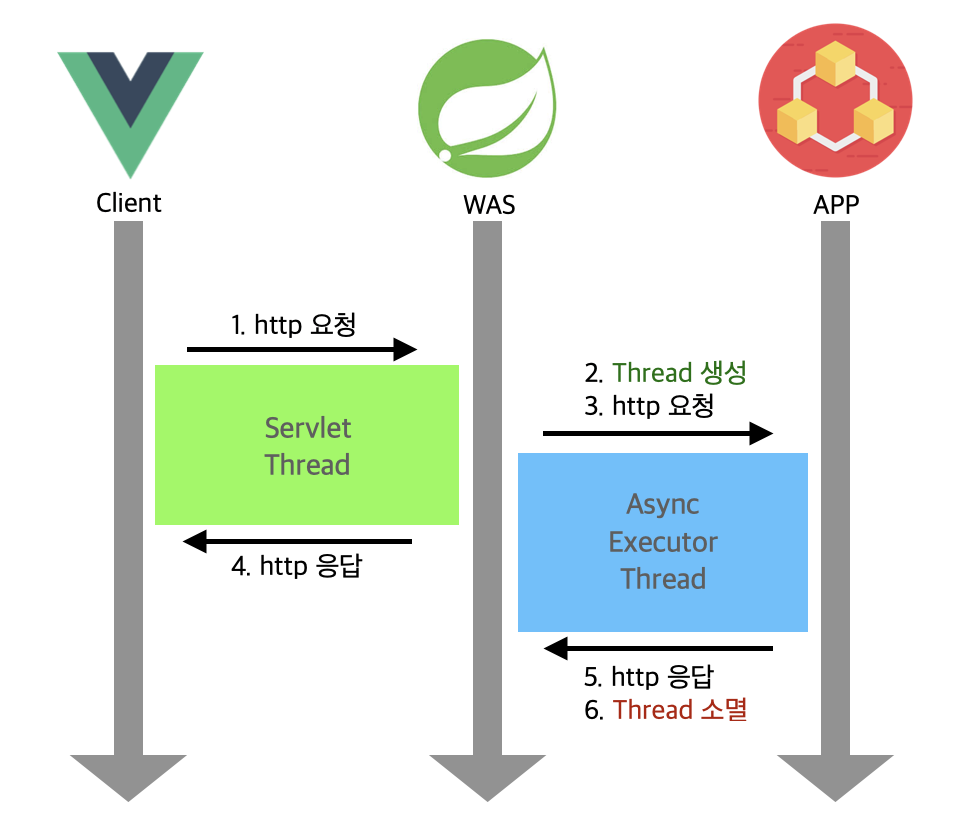

> WAS에서 비동기로 처리하는 방법



Spring은 주로 웹 개발에 사용되기 때문에 비동기 처리가 필요한 경우는 보통 UX개선으로 화면의 블로킹 현상을 방지하기 위해 Client(js)에서 Axios등을 사용하여 비동기로 HTTP 요청을 보내는 방식으로 처리한다.

하지만 아래와 같이 서버(WAS)에서 비동기 처리가 필요한 경우도 있다.

- **무거운 연산 또는 I/O 작업 처리**
  - 데이터베이스 쿼리, 대용량 파일 처리, 외부 API 호출 등으로 인해 응답 시간이 길고, 클라이언트가 기다리기 어려운 경우
  - 서버에서 비동기로 처리해 자원 낭비와 블로킹을 줄임
- **서버 자원 제한 및 동시성 처리 필요**
  - 제한된 쓰레드 풀에서 다수 요청을 효율적으로 처리해야 할 때
  - 서버 쓰레드가 블로킹 되면 전체 처리량이 떨어지므로 비동기 처리로 극복
- **실시간 처리 및 이벤트 기반 아키텍처**
  - 메시지 큐, 이벤트 스트리밍, WebSocket 등 비동기 이벤트 처리 시 서버에서 비동기 로직 필요
- **장기 실행 작업(배치, 작업 큐)**
  - 클라이언트 요청에 즉시 응답하지 않고 백그라운드 작업으로 처리하는 경우 (예: 이메일 발송, 영상 인코딩)

이 외에도 다양한 상황이 있지만 애플리케이션 서버를 호출하여 장기 실행 작업을 처리해야 하는 경우에 대해 작성하였다.

---

### 비동기 처리

| **방식** | **목적** | **사용 환경** |
| --- | --- | --- |
| **@Async** | 간단한 비동기 호출 | 메서드 단위 비동기 처리 |
| **WebFlux** | 고성능 논블로킹 처리 | REST API, 스트림 처리 |
| **CompletableFuture** | 명시적 비동기 조합 처리 | 비즈니스 로직 분기, 계산 병렬화 등 |
| **메시지 큐 기반** | 비동기 이벤트 기반 아키텍처 | Kafka, RabbitMQ 사용 시 |
| **스케줄러** | 타이머 기반 작업 | 정기적인 작업 수행 |

비동기 처리에도 다양한 방식이 있지만 이번 개발 요구사항은 간단히 모듈을 호출해주기만 하면 되는 것이기 때문에 Async 어노테이션을 사용하여 구현하였다. (모듈에 대한 상태나 처리 결과는 DB 데이터를 통해 확인)

---

### 처리 프로세스



---

### @Async 구현 방법

**#Controller**

```java
@RestController
public class MyController {

    @Autowired
    private MyService service;

    @GetMapping("/test")
    public ResponseEntity<String> test() {
        service.asyncTask(); // 비동기 실행
        return ResponseEntity.ok("요청 완료");
    }
}
```

**#Service**

```java
@Service
public class MyService {
    @Async
    public void asyncTask() {
        // 비동기 작업
    }
}
```

**⚠️ 주의사항**

- Configuration 또는 Application 클래스에 <u>@EnableAsync 선언</u>해줘야 한다.
- @Async는 <u>public 메서드</u>에 사용하며, <u>외부 클래스에서 호출</u>해야 한다.

**Custom TaskExecutor**

간단하게 사용할거라면 여기까지 구현해도 문제없지만 자세한 설정이 필요한 경우 Custom TaskExecutor를 등록하여 사용할 수 있다.

```java
@Configuration
@EnableAsync
public class AsyncConfig {

    @Bean(name = "customExecutor")
    public Executor taskExecutor() {
        ThreadPoolTaskExecutor executor = new ThreadPoolTaskExecutor();
        executor.setCorePoolSize(5); // 최소 스레드 수
        executor.setMaxPoolSize(10); // 최대 스레드 수
        executor.setQueueCapacity(100); // 작업 큐 용량
        executor.setThreadNamePrefix("Async-"); // 스레드명 접두사(Async-1)
        executor.initialize(); // Executor 초기화
        return executor;
    }
}
```

```java
@Service
public class MyService {

    @Async("customExecutor")
    public void runAsyncTask() {
        // 커스텀 executor로 비동기 실행됨
    }
}
```

**✔️ 비동기 처리 확인하기**

실제로 비동기처리가 정상적으로 동작하는지 확인하려면 @Async 메서드 내부에서 로그로 현재 스레드명을 출력해보면 된다.

```
System.out.println("Thread: " + Thread.currentThread().getName());
```

- 동기 실행: http-nio-8080-exec-1 등
- 비동기 실행: task-1, Async- 등 (Executor 설정에 따라 다름)

> 서버에서는 동시성 향상, 성능 개선 등을 위해 비동기처리가 필요하기도 하다.
> 상황에 따라 적절한 방법을 사용하여 개발하자..
