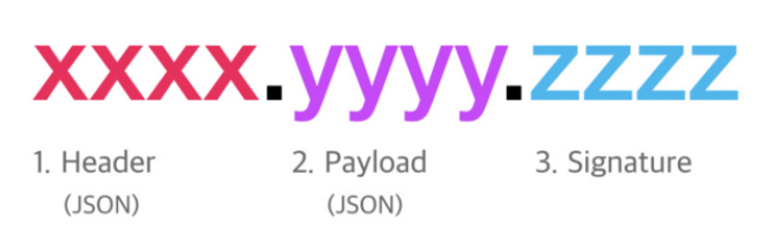
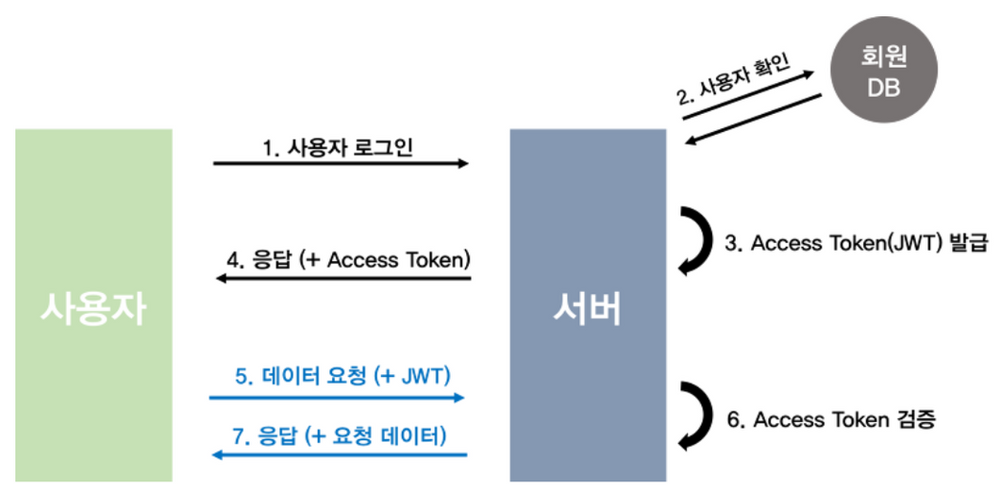

#### **Access Token을 이용한 인증**

### JWT

- JSON Web Token의 약자
- 인증에 필요한 정보들을 암호화시킨 토큰을 말하며 Access Token으로 사용됨
- JWT를 생성하기 위해선 Header, Payload, Verify Signature 객체를 필요로 함

### Header

- 토큰의 타입을 나타내는 typ와 암호화할 방식을 정하는 alg로 구성됨

```
{
  'alg': 'HS256',
  'typ': 'JWT'
}
```

### Payload

- 토큰에 담을 정보를 포함
- 하나의 정보 조각을 클레임이라 부름
- 클레임의 종류 → Registered, Public, Private 3가지 존재
- 보통 만료 일시, 발급 일시, 발급자, 권한 정보 등을 포함

```
{
  'sub': '1234567890',
  'name': 'John Doe',
  'admin': true,
  'iat': 1516239022
}
```

### Verify Signature

- Payload가 위변조되지 않았다는 사실을 증명하는 문자열
- Base64 방식으로 인코딩한 Header, Payload 그리고 Secret Key를 더한 후 서명됨

```
HMACSHA256 {
  base64UrlEncode(header) + '.' +
  base64UrlEncode(payload),
  your-256-bit-secret
}
```

### 완성된 토큰



- Header, Payload는 인코딩될 뿐, 따로 암호화되지 않음→ 하지만 Verify Signature는 Secret Key를 알지 못하면 위조할 수 없음
- → 따라서 Header, Payload는 누구나 디코딩하여 확인할 수 있기에 정보가 쉽게 노출될 수 있음
- 만약 해커가 사용자의 토큰을 훔쳐 Payload의 데이터를 변경하여 토큰을 서버로 보낸다면, 서버에서 Verify Signature를 검사하게 됨→ 이를 통해 사용자의 Secret Key를 알지 못하면 토큰을 조작할 수 없음
- → 여기서 Verify Signature는 해커의 정보가 아닌 사용자의 정보를 기반으로 암호화되었기 때문에 해커가 변경한 정보로 보낸 토큰은 유효하지 않은 토큰으로 간주함

### 인증 순서



1. 사용자가 로그인을 함
2. 서버에서는 계정 정보를 읽어 사용자 확인 후, 사용자의 고유한 ID값을 부여하고 Payload에 정보를 넣음
3. JWT 토큰의 유효기간 설정
4. Secret Key를 통해 암호화된 Access Token을 HTTP 응답 헤더에 실어 보냄
5. 사용자는 Access Token을 받아 저장 후, 인증이 필요한 요청마다 토큰을 HTTP 요청 헤더에 실어 보냄
6. 서버에서는 Secret Key로 Verify Signature를 재계산하여 토큰에 담긴 값과 비교한 후, 조작 여부, 유효 기간을 확인
7. 검증이 완료된다면, Payload를 디코딩하여 사용자의 ID에 맞는 데이터를 가져옴

### 장점

- 간편함
- 세션과 쿠키를 이용한 인증은 별도의 세션 저장소의 관리가 필요함. 그러나 JWT는 발급 후 검증만 거치면 되기 때문에 추가 저장소가 필요없음
- 확장성이 뛰어남. 토큰 기반으로 하는 다른 인증 시스템에 접근이 가능함

### 단점

- JWT는 한 번 발급되면 유효기간이 완료될 때까지는 계속 사용이 가능하며 중간에 삭제가 불가능⇒ 해결책 : Refresh Token을 추가적으로 발급하여 해결하는 방식
- → 따라서 해커에 의해 정보가 털린다면 대처 방법 없음
- Payload 정보가 디코딩하면 누구나 접근할 수 있기에 중요한 정보들을 보관할 수 없음
- JWT의 길이가 길기 때문에 인증 요청이 많아지면 서버의 자원낭비가 발생

> [Refresh Token] : 일정 기간동안 Access Token이 만료될 때 마다 재발급 해주는 기술
