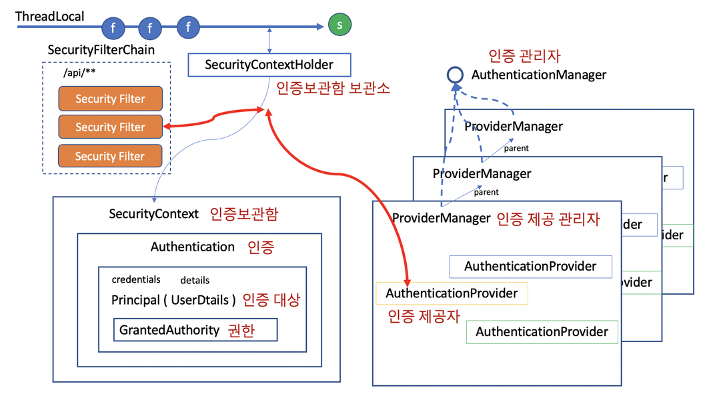

#### **Authentication (인증)의 기본 구조**

- 필터들 중에 일부 필터는 인증 정보에 관여한다.
- 이들 필터가 하는 일은 AuthenticationManager 를 통해 Authentication 을 인증하고 그 결과를 SecurityContextHolder 에 넣어주는 일이다.

#### **Authentication에 들어가는 내용**

- `Set<GrantedAuthority>` **authorities** : 인증된 권한 정보 목록
- **principal** : 인증 대상에 관한 정보로 사용자의 아이디 혹은 User객체가 저장된다.
- **credentials** : 인증 확인을 위한 정보로 주로 비밀번호가 온다. (※ 인증 후에는 보안을 위해 삭제한다.)
- **details** : 그 밖에 필요한 정보로 IP, 세션정보, 기타 인증요청에서 사용했던 정보들이 들어간다.
- boolean **authenticated** : 인증이 되었는지를 체크한다.

#### **인증 토큰(Authentication)을 제공하는 필터들**

- **UsernamePasswordAuthenticationFilter** : 폼 로그인 -> UsernamePasswordAuthenticationToken
- **RememberMeAuthenticationFilter** : remember-me 쿠키 로그인 -> RememberMeAuthenticationToken
- **AnonymousAuthenticationFilter** : 로그인하지 않았다는 것을 인증함 -> AnonymousAuthenticationToken
- **SecurityContextHolderFilter** : 기존 로그인을 유지함(기본적으로 session 을 이용함). Spring Security 5.7부터 기존 `SecurityContextPersistenceFilter`가 이 필터로 대체됐다.
- **BearerTokenAuthenticationFilter** : JWT 로그인
- **BasicAuthenticationFilter** : HTTP Basic 인증(`Authorization: Basic base64(id:pw)` 헤더) -> UsernamePasswordAuthenticationToken. AJAX 요청 전용은 아니고, 이 헤더 방식 자체를 처리하는 필터다.
- **OAuth2LoginAuthenticationFilter** : 소셜 로그인 -> OAuth2LoginAuthenticationToken, OAuth2AuthenticationToken
- **Saml2WebSsoAuthenticationFilter** : SAML2 로그인

> 예전 OpenID(1.0/2.0) 프로토콜을 처리하던 `OpenIDAuthenticationFilter`는 OpenID 프로토콜 자체가 사실상 폐기되면서 최신 Spring Security에서 제거됐다. 지금 "OpenID"라고 하면 대부분 OpenID Connect(OIDC)를 말하는데, 이건 위의 `OAuth2LoginAuthenticationFilter`가 처리한다.
