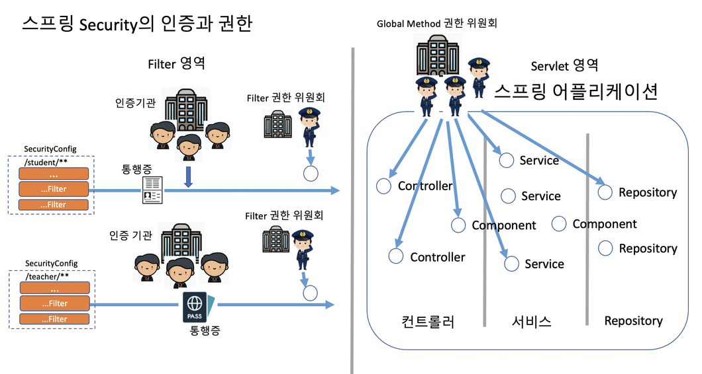
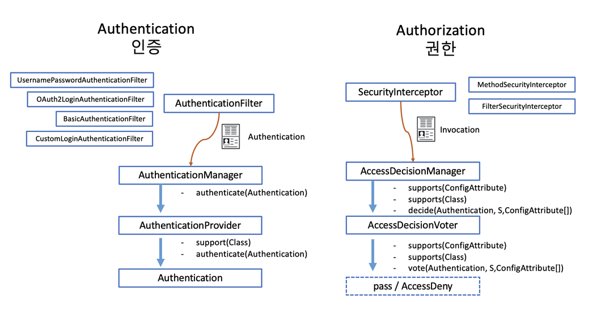
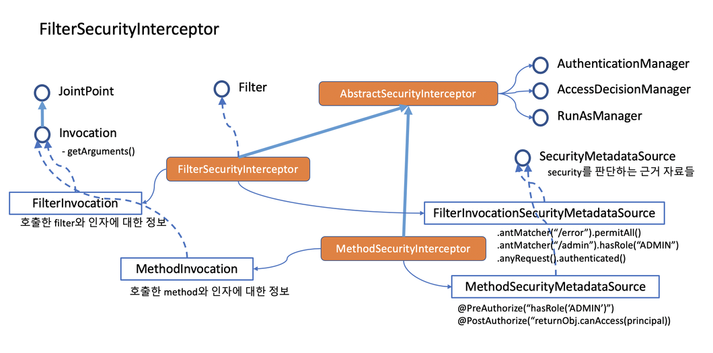

- SecurityFilterChain 당 한개의 FilterSecurityInterceptor를 둘 수 있고, 각 SecurityInterceptor당 한개의 AccessDecisionManager 를 둘 수 있다. 반면 Method 권한 판정은 Global 한 권한 위원회를 둔다. 그래서 GlobalMethodSecurityConfiguration 을 통해 AccessDecisionManager 를 설정한다.
- 인증이 모든 요청에 대해 공통적으로 처리해야 하는 것인데 반해 권한은 상황상황에 맞게 처리해야 하는 특징이 있다.
- 그래서 인증을 처리하는 코드는 필터와 어울리고, 권한은 interceptor 와 어울려 동작한다. 필터는 servlet container 가 제공하는 구조를 스프링이 자체 filterchain 을 만들어서 관리하는 방식으로 처리하고 있고, interceptor 는 스프링이 빈을 등록하고 프락시 객체를 가지고 엮어주는 과정에서 각 PointCut에 의해 구분된 JoinPoint에 interceptor 가 Advice 하는 메커니즘으로 작동한다.
- 필터 위에 상주하는 Interceptor 를 FilterSecurityInterceptor라 하고 Method 위에 annotation의 형태로 상주하는 Interceptor 를 MethodSecurityInterceptor 라고 한다. FilterInterceptor 는 필터 설정에서 설정하고 MethodInterceptor 는 annotation 으로 설정한다. @EnableGlobalMethodSecurity 를 설정해줘야 MethodSecurityInterceptor 가 동작한다.

> **권한 처리에 관여하는 것들**

그런데 권한을 체크하려면 다음과 같은 고민을 해봐야 한다.

- 접근하려고 하는 사람이 어떤 접근 권한을 가지고 있는가?
  - GrantedAuthority
    - Role Based
    - Scope Based
    - User Defined
- 접근하려고 하는 상황에서는 체크해야 할 내용은 무엇인가?
  - SecurityMetadataSource, ConfigAttribute
  - 정적인 경우와 동적인 경우
  - AccessDecisionVoter 가 vote 해줌
- 여러가지 판단 결과가 나왔을 때 취합은 어떤 방식으로 할 것인가?
  - AccessDecisionManager : 권한 위원회
    - AffirmativeBased : 긍정 위원회
    - ConsensusBased : 다수결 위원회
    - UnanimousBased : 만장일치 위원회

> **인증과 권한의 구조**

- 인증이 AuthenticationFilter 를 가지고 Authentication을 발급해주는 관계였다면, 권한은 SecurityInterceptor 에서 Access Granted 와 Denied 를 판정하는 결과를 만들어 내는 대응 관계를 가지고 있다.
- 인증이 제공해 주는 권한과 각 Interceptor가 위치한 포인트의 조건들(ConfigAttribute) 들을 가지고 판정을 내려주는 Voter 들에 따라 Granted / Denied 가 구분이 된다. 그렇지만 권한은 인증보다 훨씬 상황이 다양하다고 볼 수 있다.
- AccessDecisionManager 는 인터페이스다. 반드시 Voter 를 구현해서 처리해야 할 필요는 없다. 솔직히 Application을 구현한다면 Voter 없이 구현하는 것이 간단할 수 있다.

> **권한 처리 클래스**

