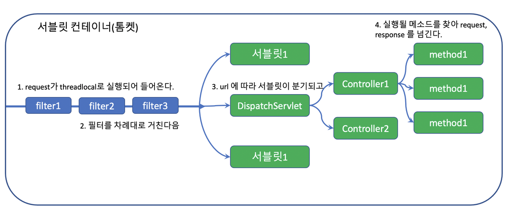
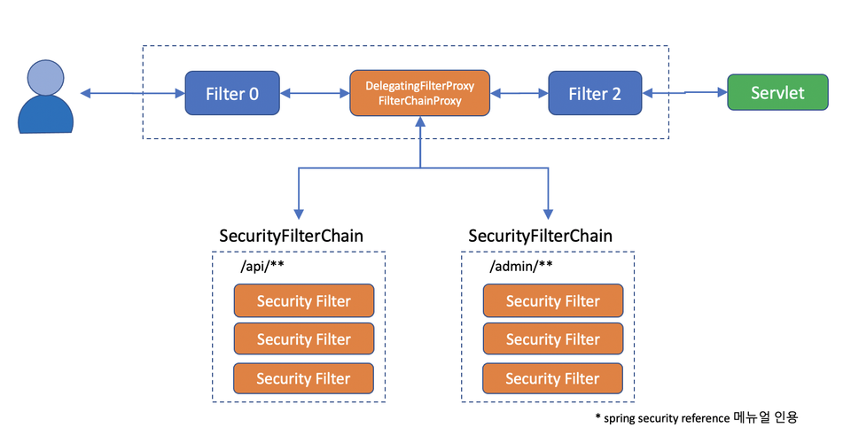
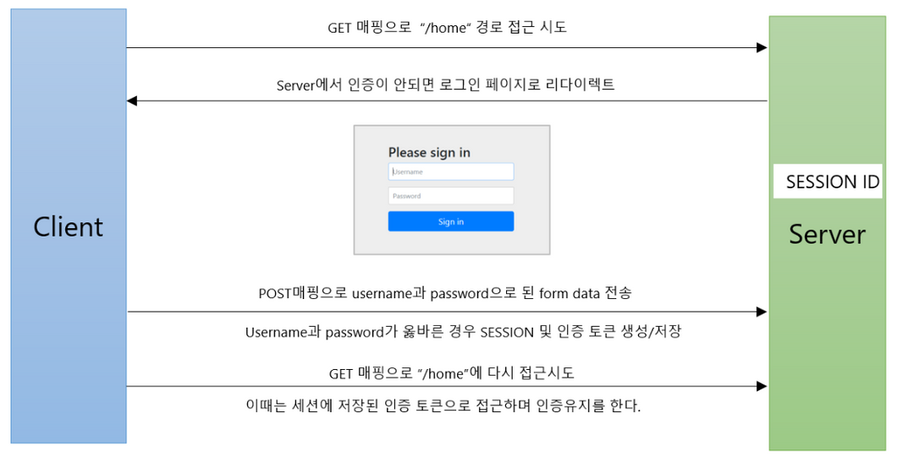

#### **서블릿 컨테이너**

- 톰켓과 같은 웹 애플리케이션을 서블릿 컨테이너라고 부르는데, 이런 웹 애플리케이션(J2EE Application)은 기본적으로 필터와 서블릿으로 구성되어 있다.

> 필터는 체인처럼 엮여있기 때문에 filter chain이라고도 불리는데, 모든 request 는 이 필터 체인을 반드시 거쳐야만 서블릿 서비스에 도착하게 된다.

- 그래서 스프링 시큐리티는 **DelegatingFilterProxy** 라는 필터를 만들어 메인 필터체인에 끼워넣고, 그 아래 다시 **SecurityFilterChain** 그룹을 등록한다.

> 이 필터체인은 반드시 한개 이상이고, url 패턴에 따라 적용되는 필터체인을 다르게 할 수 있다. 본래의 메인 필터를 반드시 통과해야만 서블릿에 들어갈 수 있는 단점을 보완하기 위해서 필터체인 Proxy 를 두었다.

#### **각각의 필터는 서로 다른 관심사를 해결한다. (단일 책임)**

- **HeaderWriterFilter** : Http 헤더를 검사한다. 써야 할 건 잘 써있는지, 필요한 헤더를 더해줘야 할 건 없는가?
- **CorsFilter** : 허가된 사이트나 클라이언트의 요청인가?
- **CsrfFilter** : 내가 내보낸 리소스에서 올라온 요청인가?
- **LogoutFilter** : 지금 로그아웃하겠다고 하는건가?
- **UsernamePasswordAuthenticationFilter** : username / password 로 로그인을 하려고 하는가? 만약 로그인이면 여기서 처리하고 가야 할 페이지로 보내 줄께.
- **ConcurrentSessionFilter** : 여기저기서 로그인 하는걸 허용할 것인가?
- **BearerTokenAuthenticationFilter** : Authorization 헤더에 Bearer 토큰이 오면 인증 처리 해줄께.
- **BasicAuthenticationFilter** : Authorization 헤더에 Basic 토큰을 주면 검사해서 인증처리 해줄께.
- **RequestCacheAwareFilter** : 방금 요청한 request 이력이 다음에 필요할 수 있으니 캐시에 담아놓을께.
- **SecurityContextHolderAwareRequestFilter** : 보안 관련 Servlet 3 스펙을 지원하기 위한 필터라고 한다.(?)
- **RememberMeAuthenticationFilter** : 아직 Authentication 인증이 안된 경우라면 RememberMe 쿠키를 검사해서 인증 처리해줄께
- **AnonymousAuthenticationFilter** : 아직도 인증이 안되었으면 너는 Anonymous 사용자야
- **SessionManagementFilter** : 서버에서 지정한 세션정책을 검사할께.
- **ExceptionTranslationFilter** : 나 이후에 인증이나 권한 예외가 발생하면 내가 잡아서 처리해 줄께.
- **FilterSecurityInterceptor** : 여기까지 살아서 왔다면 인증이 있다는 거니, 니가 들어가려고 하는 request 에 들어갈 자격이 있는지 그리고 리턴한 결과를 너에게 보내줘도 되는건지 마지막으로 내가 점검해 줄께.
- 그 밖에... OAuth2 나 Saml2, Cas, X509 등에 관한 필터들도 있다.
