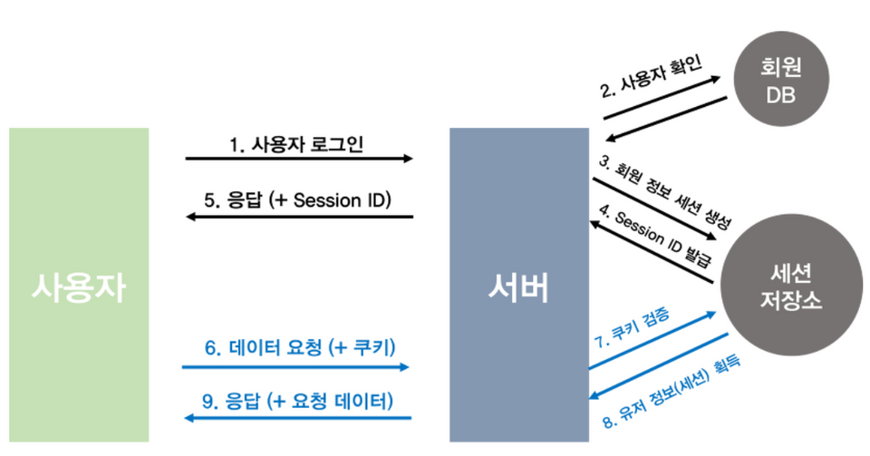

#### **세션과 쿠키를 이용한 인증**

### 인증 순서

1. 사용자가 로그인을 함
2. 서버에서 계정 정보를 읽어 사용자 확인
3. 사용자에게 고유한 ID 값 부여하여 세션 저장소에 저장
4. 이와 연결되는 Session ID를 발급
5. 서버에서는 HTTP 응답 헤더에 발급된 Session ID를 같이 보냄
6. 이후 매 요청마다 HTTP 요청 헤더에 Session ID가 담긴 쿠키를 같이 보냄
7. 서버에서는 쿠키를 받아 세션 저장소에서 대조를 한 후
8. 대응되는 정보를 가져옴
9. 인증이 완료되고 서버는 사용자에 맞는 데이터를 보내줌

### 장점

- 사용자의 정보는 세션 저장소에 저장되고, 쿠키는 그 저장소를 통과할 수 있는 출입증 역할을 함
- → 쿠키가 담긴 HTTP 요청이 도중에 노출되더라도 쿠키 자체에는 유의미한 값을 갖고 있지 않아서 쿠키에 사용자 정보를 담아 인증을 거치는 것보다 안전함
- 각각의 사용자는 고유의 Session ID를 발급 받기 때문에 일일이 회원 정보를 확인할 필요가 없어 서버 자원에 접근하기 용이함

### 단점

- 쿠키에 사용자 정보를 담아 인증을 거치는 것보다 안전하지만, 해커가 쿠키를 탈취한 후 그 쿠키를 이용해 HTTP 요청을 보내면 서버는 사용자로 오인해 정보를 전달하게 됨 ⇒ 해결책 : HTTPS 프로토콜 사용과 세션에 만료 시간을 넣어주기
- → 이를 세션 하이재킹 공격이라함
- 서버에서 세션 저장소를 사용하기 때문에 추가적인 저장공간을 필요로 함
- 서버를 여러 대로 확장(scale-out)하면, 로그인했던 서버가 아닌 다른 서버로 요청이 가는 순간 그 서버의 메모리에는 세션 정보가 없어서 인증이 깨질 수 있다. 그래서 세션 기반 인증은 서버를 늘릴수록 **로드밸런서에서 같은 사용자를 항상 같은 서버로 보내는 sticky session 설정**을 하거나, **Redis 같은 외부 저장소에 세션을 모아두고 모든 서버가 공유**하는 방식으로 풀어야 한다. 이런 부담 때문에 서버를 여러 대로 쉽게 늘려야 하는 환경에서는 세션 대신 JWT 같은 stateless 토큰 방식을 선호하기도 한다.
