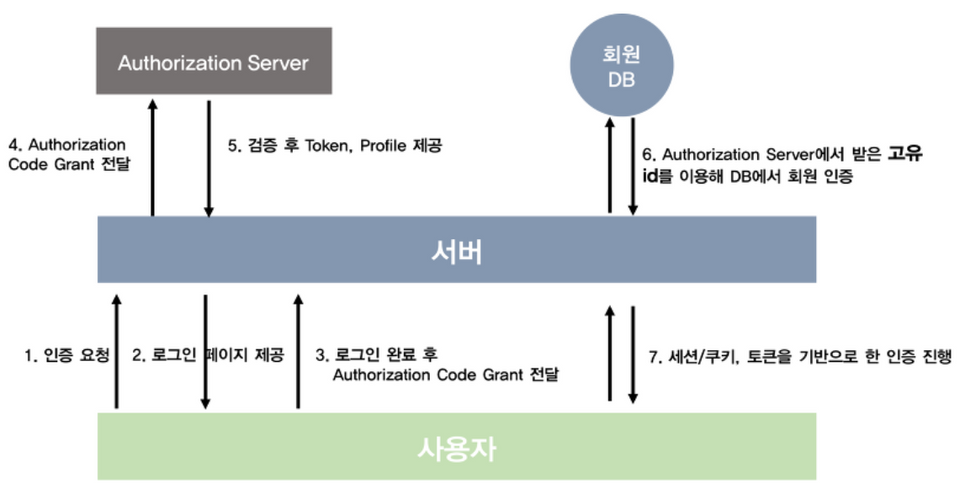

#### **SNS 로그인**

### 인증 순서

1. 사용자가 서버에게 로그인을 요청
2. 서버는 특정 쿼리들을 붙인 페이스북 로그인 URL을 사용자에게 보냄
3. 사용자는 해당 URL로 접근하여 로그인을 진행한 후 권한 증서를 담아 서버에게 보냄
4. 서버는 해당 권한 증서(authorization code)를 들고 Facebook의 Authorization Server에 토큰 발급을 요청
5. Facebook의 Authorization Server는 권한 증서를 확인 후, Access Token, Refresh Token, 유저의 정보를 우리 서버로 돌려줌
6. 받은 고유 ID를 Key값으로 해서 DB에 유저가 있다면 로그인, 없다면 회원가입 진행
7. 로그인이 완료되었다면 세션과 쿠키, 토큰 기반 인증 방식을 통해 사용자의 인증을 처리

### 참고사항

- 개발자 사이트에서 웹 어플리케이션을 등록 후 APP\_ID와 CLIENT\_ID 등을 보내야 OAuth 에서는 어느 서비스인지를 알 수 있음
- 페이스북 로그인을 인증을 이용하는 경우, 대부분은 Resource Server(페이스북 자체 API)를 사용하지 않음
- 따라서 Access Token, Refresh Token은 실제로 쓰이지 않음. 우리의 서버에서 Access token을 검증할 수도 없을 뿐더러 인증의 수단으로 활용하기엔 부족한 점이 많음
- 따라서 보통 Authorization Server로부터 얻는 고유 ID값을 활용해서 DB에 회원관리를 진행
