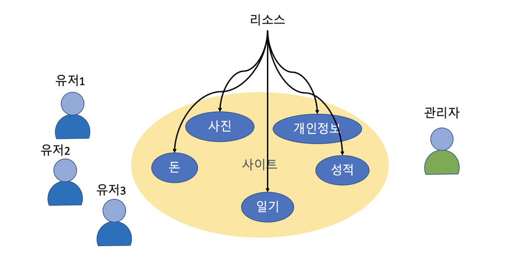
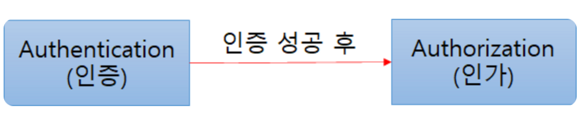

#### **필요 이유**

- 웹사이트는 각종 서비스를 하기 위한 리소스와 서비스를 사용하는 유저들의 개인 정보를 가지고 있다.
- 이들 리소스를 보호하기 위해서 일반적으로 웹 사이트는 두가지 보안 정책을 설정해야 한다.

[서버 리소스, 유저들의 개인정보]



#### **인증 (Authentication)**

- 사이트에 접근하는 사람이 누구인지 시스템이 알아야 한다.
- 익명사용자(anonymous user)를 허용하는 경우도 있지만, 특정 리소스에 접근하거나 개인화된 사용성을 보장 받기 위해서는 반드시 로그인하는 과정이 필요하다.
- 로그인은 보통 username / password 를 입력하고 로그인하는 경우와 sns 사이트를 통해 인증을 대리하는 경우가 있다.

[UsernamePassword 인증]

- Session 관리
- 토큰 관리 (sessionless)

[SNS 로그인 (소셜 로그인)]

- 인증 위임

#### **인가 혹은 권한(Authorization)**

- 사용자가 누구인지 알았다면 사이트 관리자 혹은 시스템은 로그인한 사용자가 어떤 일을 할 수 있는지 권한을 설정한다.
- 권한은 특정 페이지에 접근하거나 특정 리소스에 접근할 수 있는 권한여부를 판단하는데 사용된다.
- 개발자는 권한이 있는 사용자에게만 페이지나 리소스 접근을 허용하도록 코딩해야 하는데, 이런 코드를 쉽게 작성할 수 있도록 프레임워크를 제공하는 것이 **스프링 시큐리티** 프레임워크(Spring Security Framework) 이다.

메서드 단위로 권한을 체크할 때는 애너테이션을 붙이는 것만으로 처리할 수 있다.

```java
@Secured("ROLE_ADMIN") // 단순 role 체크만 가능, 지금은 사실상 레거시 취급
public void oldWay() { }

@PreAuthorize("hasRole('ADMIN') and #id == authentication.principal.id") // SpEL로 세밀한 조건 표현 가능
public void newWay(Long id) { }
```

`@Secured`는 문자열로 된 role 하나만 단순 비교하는 방식이라 표현력이 떨어져서 지금은 잘 쓰지 않고, SpEL(Spring Expression Language)로 훨씬 세밀한 조건을 쓸 수 있는 `@PreAuthorize`/`@PostAuthorize`가 사실상 표준으로 자리잡았다. 이 애너테이션들은 내부적으로 **AOP**로 구현되어 있어서, 메서드 호출 전(`@PreAuthorize`)/후(`@PostAuthorize`)에 프록시가 가로채서 권한을 검사한 뒤 실제 메서드 실행 여부를 결정한다.


