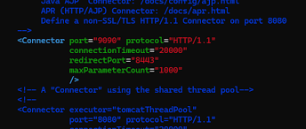

> WAS 중 가장 많이 사용되는 Tomcat의 네트워크 연결 및 성능 관련 커스텀 설정 알아보기



> 톰캣의 네트워크를 설정하려면 server.xml 파일을 확인해야 한다.

```
[Tomcat 설치 경로]/conf/server.xml
```

**server.xml**은 Tomcat 서버의 핵심 설정 파일로, 서버 동작 방식과 네트워크 통신 방식을 정의한다.

그중 **`<Connector>`** 태그는 <u>클라이언트와 서버 간의 연결을 관리하는 핵심 요소</u>로, 클라이언트 요청을 수신하고 응답을 반환하는 역할을 담당한다.

`<Connector>`는 특정 프로토콜(HTTP, HTTPS, AJP 등) 을 통해 클라이언트 요청을 처리할 포트(Port) 를 지정하고 다양한 속성을 통해 <u>성능, 보안, 연결 관리 등 세부 동작을 조정</u>할 수 있다.

Tomcat은 <u>포트 단위로 Connector를 관리</u>한다. 즉, 사용하는 포트마다 별도의 `<Connector>` 설정이 필요하다.

## Connector 주요 속성 및 설정 방법 ⚙️

> SSL을 통한 HTTPS 설정 예시

```
<Connector port="8443" protocol="org.apache.coyote.http11.Http11NioProtocol"
           maxThreads="150" SSLEnabled="true" scheme="https" secure="true"
           keystoreFile="/path/to/keystore.jks" keystorePass="changeit"
           clientAuth="false" sslProtocol="TLS" />
```

위와 같이 SSL을 적용해야 한다던가 네트워크 관련 설정을 변경해야 할 경우 이런 식으로 다양한 속성들을 활용하여 설정해줄 수 있다.

#### [ **HTTPS**관련 주요 속성 ]

1. **SSLEnabled**- <u>HTTPS 연결을 활성화</u>하려면 true로 설정
2. **keystoreFile**- SSL 인증서를 저장한 <u>키스토어 파일의 경로</u> 지정 - 키스토어는 서버가 SSL 인증을 할 때 사용하는 인증서와 비밀 키를 포함하고 있다.
3. **keystorePass**- 키스토어 파일에 접근하기 위한 <u>비밀번호</u>를 지정
4. **clientAuth**- true로 설정하면 <u>클라이언트 인증</u>(즉, 서버가 클라이언트 인증서를 요구하는 방식)이 활성화 - 보통은 false로 설정하여 서버가 클라이언트 인증서를 요구하지 않도록 한다.
5. **sslProtocol**- <u>SSL/TLS 버전</u>을 지정한다. (일반적으로 TLS를 사용)
6. **secure**- true로 설정하면 커넥터가 <u>보안 연결</u>(HTTPS)을 처리한다고 표시
7. **scheme**- 클라이언트에 <u>반환되는 스킴</u>을 지정 - HTTPS를 사용하고 있음을 나타내기 위해 https로 설정한다.

#### [ **성능** 및 **연결** 관리 속성 ]

Tomcat에서 성능과 연결 관리를 커스텀하기 위해 다양한 속성들이 제공된다.

1. **maxThreads**- 이 커넥터가 동시에 처리할 수 있는 <u>최대 요청 수</u>를 지정 - 이 값을 늘리면 더 많은 요청을 동시에 처리할 수 있다. (기본값 200)
2. **minSpareThreads**- <u>항상 대기 중인 최소한의 스레드 수</u>를 지정 이 스레드들은 새로운 요청이 들어올 때 빠르게 처리할 수 있도록 대기한다.
3. **maxConnections**- 커넥터가 <u>동시에 처리할 수 있는 최대 연결 수</u>를 설정 - 기본적으로는 무제한(-1)이지만, 이 값을 조정하여 서버 부하를 관리할 수 있다.
4. **enableLookups**- true로 설정하면 클라이언트의 <u>IP 주소를 호스트 이름으로 역방향 조회</u> - 보통 성능상의 이유로 false로 설정한다.
5. **compression**- <u>응답에 대한 압축을 설정</u>하여 클라이언트와 서버 간의 네트워크 트래픽을 줄이기 위해 사용한다. - 서버 성능에 문제가 없지만 클라이언트에서 데이터를 응답받을 때 네트워크 지연이 발생한다면 압축을 고려할 수 있다.

```
compression="on" #압축 설정
    compressionMinSize="1024" #1kb 이상 데이터만 압축
    compressableMimeType="application/json" #json 타입만 압축
```

> 응답 데이터가 너무 크면 네트워크 전송 시 여러개의 패킷으로 분할하여 전송해야 하기 때문에 트래픽이 증가하여 전송 지연 발생

---

## 보안 취약점 방지를 위한 설정

#### [ 서버명, 버전 노출 방지 ]

Tomcat과 같은 WAS는 기본적으로 따로 설정을 하지 않으면 HTTP 응답에 서버명(Server Name)과 버전(Server Version)이 노출되는데 이러한 정보가 클라이언트에 노출되는 것은 보안 측면에서 취약점이 될 수 있다.

서버 정보가 노출되면 공격자가 해당 정보에 기반하여 특정 취약점을 노린 공격을 시도할 수 있으므로 보여주지 않는 것이 바람직하다.

```
# server 속성을 설정하지 않은 경우
Server: Apache-Coyote/1.1
```

1️⃣ **server.xml) 서버명 노출 제한**

- **목적**: HTTP 응답 헤더에서 서버 정보가 노출되는 것을 방지
- **설정 방법**: server 속성 지정 (빈값 = " ")

```
<Connector port="8080" protocol="HTTP/1.1"
           connectionTimeout="20000"
           redirectPort="8443"
           server=" " />
```

2️⃣ **web.xml) 서버 버전 노출 제한**

- **목적**: Tomcat의 기본 오류 페이지에서 서버 정보를 노출하지 않도록 함
- **설정 방법**: `<init-param>` 태그의 showServerInfo 속성을 false로 설정

```
<init-param>
    <param-name>showServerInfo</param-name>
    <param-value>false</param-value>
</init-param>
```

#### [ 물리적 경로 노출 방지 ]

Tomcat은 따로 설정하지 않을 경우 기본 경로(docBase)를 *TOMCAT\_HOME/webapps/* 로 잡고, 그 안의 애플리케이션의 경로(path)는 애플리케이션 디렉토리 이름을 사용한다.

애플리케이션 디렉토리 이름이 'myApp'이라고 가정하면 이렇게 유추가 가능하다.

- URL: http://localhost:8080/myApp
- 물리적 경로: TOMCAT\_HOME/webapps/myApp

이를 통해 공격자가 Tomcat의 디렉토리 구조를 유추할 가능성이 있기 때문에 기본 경로(docBase)를 Tomcat의 외부 경로로 이동시키고, 클라이언트 요청 시 매핑되는 경로(path)는 애플리케이션의 물리적 경로와 관련이 없는 경로로 변경해주는 것이 비교적 안전하다.

```html
<!-- server.xml -->
<Host name="localhost" appBase="webapps" allowLinking="false">
    <Context path="/secureApp" docBase="/opt/tomcat_apps/myApp" reloadable="true" />
</Host>
```

*/secureApp 경로로 요청 시 /opt/tomcat_apps/myApp/ 경로에 있는 애플리케이션으로 매핑된다.*

> **path:** 클라이언트 요청 경로
> **docBase:** 해당 Context의 실제 파일이 위치한 물리적 경로. appBase(webapps) 밑의 하위 경로일 수도 있고, 위 예시처럼 appBase 바깥의 외부 경로로 지정할 수도 있다.

> 논리적 경로 지정은 보안적 측면 이외에도 유용하게 활용할 수 있다.

**유지 관리 및 관리 편의성**

Context 설정을 통해 여러 애플리케이션을 운영할 때, 각 애플리케이션에 대한 설정을 일관되게 유지할 수 있다. 이는 특히 여러 프로젝트를 동시에 관리할 때 유리하게 사용할 수 있다.

**설정 변경의 유연성**

나중에 URL 구조를 변경해야 할 경우, Context 설정만 수정하면 된다. 예를 들어, /myApp를 /app으로 변경하려면 Context의 path만 수정하면 된다. 물리적 경로를 변경하면 파일 시스템에서 해당 디렉토리를 이동하거나 이름을 바꿔야 하므로 더 복잡할 수 있지만 논리적 경로를 지정하여 쉽게 설정하고 관리할 수 있다.

*- 끝 -*
